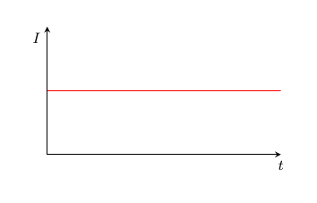
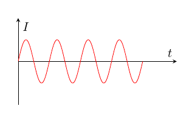
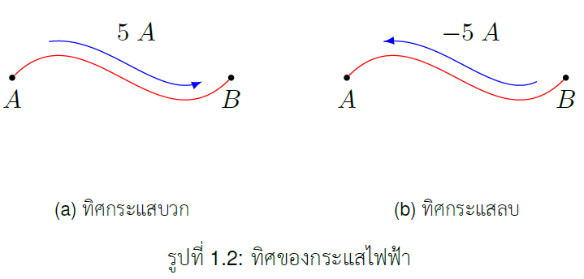

## ประจุ

ประจุเป็นคุณสมบัติพื้นฐานของวัสดุมีหน่วยวัดเป็นคูลอมบ์ (C) อย่างที่ทราบกันดีว่าสสารทุกชนิดประกอบด้วยอะตอม ขณะที่อะตอมประกอบด้วยนิวตรอน โปรตรอนและอิเลคตรอน ซึ่งนิวตรอนไม่มีประจุ ขณะที่โปรตรอนมีประจุเป็นบวกส่วนอิเลคตรอนมีประจุเป็นลบ ขนาดของประจุของอิเลคตรอนคือ $1.602\times 10^{-19}$ C 

### ข้อสำคัญเกี่ยวกับประจุไฟฟ้า
1. ประจุขนาด 1 คูลอมบ์เป็นขนาดที่ใหญ่มาก โดยทั่วไปค่าที่พบเจอจะเป็นขนาด pC, nC, $\mu$C
1. ประจุที่พบจะมีขนาดเป็นจำนวนเท่าของประจุของอิเลคตรอน

1. กฏอนุรักษ์ประจุกล่าว ประจุไม่สามารถถูกทำลาย หรือ สร้างขึ้นใหม่ได้ แต่สามารถถ่ายโอนได้

## กระแส

ในปัจจุบันเราทราบแล้วว่าโปรตรอนเคลื่อนที่ไม่ได้แต่อิเลคตรอนเคลื่อนที่ได้ แต่ในอดีตเมื่อเริ่มค้นพบปรากฏการณ์ใหม่ๆ นักวิทยาศาสตร์คิดว่าเป็นประจุบวกที่เคลื่อนที่ได้ แต่เมื่อภายหลังทราบความจริงแล้ว แต่เรายังก็กำหนดให้ประจุบวกเคลื่อนที่ได้ ดังนั้นทิศการเคลื่อนทีของกระแสจึงตรงกันข้ามกับทิศของอิเลคตรอน



กระแสไฟฟ้าคืออัตราการเคลื่อนที่ของประจุสุทธิต่อหน่วยเวลา 
$$
  \begin{equation}
    i\equiv \frac{dq}{dt} 
  \end{equation}
$$



## ความสัมพันธ์ของประจุกับกระแสไฟฟ้า

ถ้าเราทราบขนาดกระแส (ซึ่งมีหน่วยวัดเป็นแอมแปร์) เราสามารถหาปริมาณประจุที่เคลื่อนที่ผ่านในช่วงเวลา $t_o$ ถึง $t_1$ ได้ดังนี้
$$
  \begin{equation}
     Q=\int_{t_{0}}^{t_{1}}i \\, dt
  \end{equation}
$$


$1.602\times 10^{-19}$ C 


## ประเภทของกระแสไฟฟ้า

  1. ไฟกระแสตรง เป็นกระแสไฟที่มีขนาดคงที่ตลอดเวลา
  1. ไฟกระแสสลับ เป็นกระแสไฟที่มีขนาดเปลี่ยนแปลงตามเวลา ซึ่งการเปลี่ยนแปลงจะเป็นฟังก์ชันตระกูลซายน์

DC current  |  AC current
:-------------------------:|:-------------------------:
  |  
รูปที่ ๑ ไฟตรง      |  ไฟสลับ

## ทิศของกระแสไฟฟ้า

การบอกทิศของกระแสไฟฟ้าสามารถบอกได้โดยใช้ทิศของหัวลูกศร

ตัวอย่าง 1.1 จงคำนวณขนาดประจุของอิเลคตรอน $400$ ตัว

คำตอบ 

\\[
\\begin{align*}
\\text{จำนวนประจุของอิเลคตรอน} \\;400\\;\\text{ตัว} &= 400\times - 1.602 \times 10^{-19} \\\\
       &= -6.408 \times 10^{-17} \\\\
      &= -64.08\times 10^{-18} \\\\
      Q_{400} &= -64.08\\;aC \\;\text{(atto coulomb)}
    \\end{align*}
\\]


อย่าลืมว่าอิเลคตรอนมีประจุเป็นลบ และการตอบต้องให้ค่ามากกว่า 1 
    และต้องอยู่ในเลขกำลังตามตารางสัญกรณ์เติมหน้า



  
ตัวอย่าง 1.2 กำหนดให้ $  q=\sin 4\pi t \\;mC\\;จงหากระแสที่ \\; t = 0.5  \\;s$

คำตอบ
$$
\\begin{align*}
i(t) &= \\dfrac{\\mathrm{d} q}{\\mathrm{d} t}=\\dfrac{\\mathrm{d} }{\\mathrm{d} t}(\\sin 4\\pi t)=4\\pi\\cos 4\\pi t\\\\
       i(t=0.5s)&= 4\\pi(\\cos 4\\pi (0.5))=4\\pi(\\cos 2\\pi) =12.57\\;mA
    \\end{align*}
$$

ตัวอย่าง 1.3 จงหาจำนวนประจุ ระหว่าง $t = 1\\;s$ และ $t= 2\\;s$ ถ้ากระแสคือ $i=3t^{2}-t \\;\\text{A}$ 

คำตอบ
$$
\\begin{align*}
Q &= \\mathop{\\int_{t=1}^{t=2}}i \\;dt=\\mathop{\\int_{1}^{2}}(3t^{2}-t)\\;dt\\\\
       &= \\left ( t^{3}-\\frac{t^{2}}{2} \\right )\\bigg\\rvert_{1}^{2} =(8-2)-\\left(1-\\dfrac{1}{2}\\right)=5.5\\;\\text{C}
    \\end{align*}
$$

