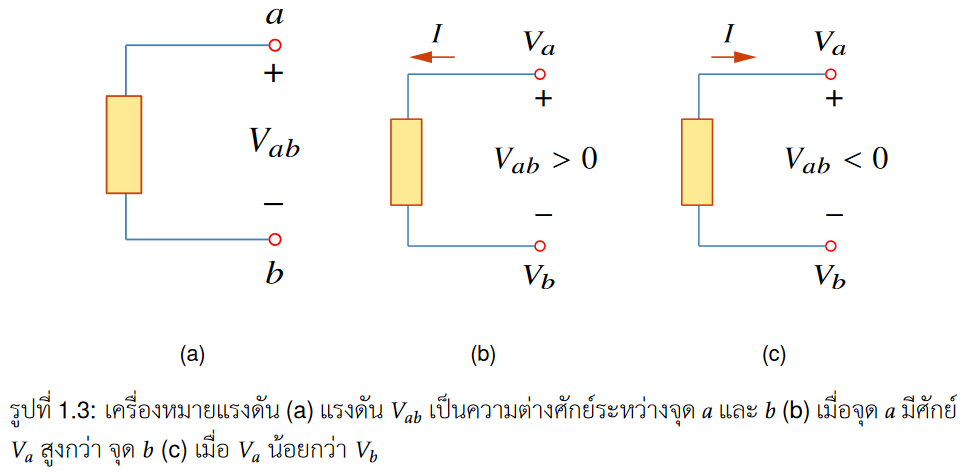
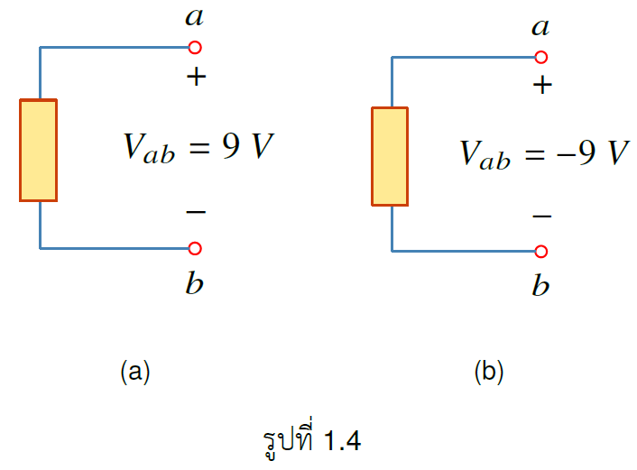
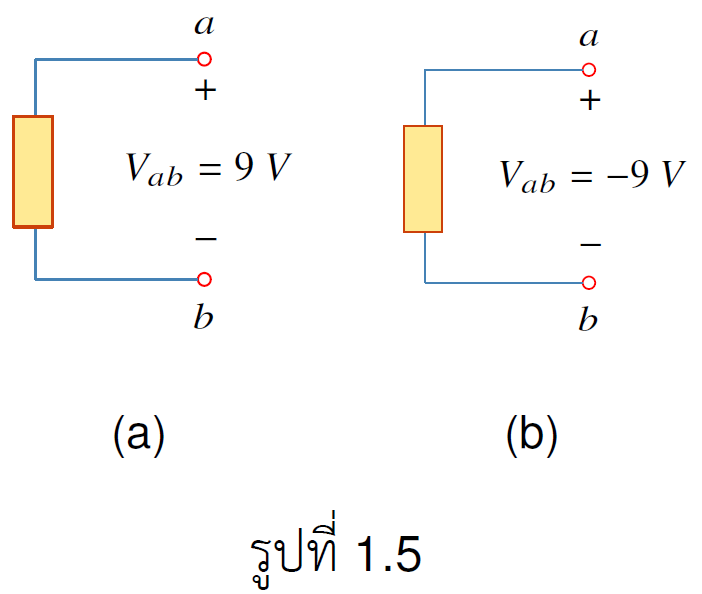

อิเลคตรอนเคลื่อนที่ได้ต้องมีพลังงานกระทำต่อมัน พลังงานดังกล่าวได้มาจากแหล่งจ่ายภายนอก อาทิเช่น แบตเตอรี ซึ่งแบตเตอรี จะสร้าง แรงดัน ในการผลักอิเลคตรอนให้เคลื่อนที่ แรงดันอาจเรียกอีกอย่างว่าความต่างศักย์ ซึ่งเป็นการวัดผลต่างแรงดันระหว่างสองจุด

👉**แรงดัน $v_{ab}$** ระหว่างจุด $a$ และ  $b$ คือพลังงานที่ต้องใช้ในการเคลื่อนประจุหน่วย จากจุด $b$ ไป  $a$ ซึ่งแสดงได้ดังสมการ
$$
  \\begin{equation}
    v_{ab}\\equiv \\frac{dw}{dq}
  \\end{equation} \tag{1.3}
$$
$w$ เป็นพลังงาน หน่วย จูล ($J$) $q$ คือประจุ หน่วย คูลอมบ์ (C)  


## เครื่องหมายแรงดัน

การกำหนดเครื่องหมายแรงดันมีผลต่อทิศการไหลของกระแส โดยที่กระแสไหลจากแรงดันศักย์สูง (แรงดันมีเครื่องหมายบวก) ไปแรงดันศักย์ต่ำ (แรงดันมีเครื่องหมายลบ) เสมอ

- กำหนดให้ วงจรมีจุด a และ b ตามรูป ถ้าแรงดันที่จุด a มากกว่า แรงดันที่ b แรงดัน $V_{ab}$ มีค่าเป็นบวก 
- ในทางกลับกัน ถ้าแรงดันที่จุด a มีค่าน้อยกว่า แรงดันที่จุด b แรงดัน $V_{ab}$ มีค่าเป็นลบ 

### สมการแสดงความสัมพันธ์ระหว่างแรงดันสองจุด

ถ้า กำหนดให้จุด a มีแรงดัน $v_{a}$ และ จุด b มีแรงดัน $v_{b}$ ความต่างศักย์ระหว่างจุด a และ จุด b คือ $v_{ab}$ มีความสัมพันธ์ดังนี้

$$
\\begin{equation}
    v_{ab} = v_{a} - v_{b} 
\\end{equation} \tag{1.4}
$$
ถ้า ต้องการหา $v_{ba}$ ซึ่งเป็นความต่างศักย์ระหว่าง จุด b และ จุด a
$$
\\begin{equation}
    v_{ba} = v_{b} - v_{a} 
\\end{equation} \tag{1.5}
$$

### $v_{ab}$ มีความสัมพันธ์อย่างไรกับ $v_{ba}$
$$
\\begin{equation}
    v_{ba} = -v_{ab} 
\\end{equation} \tag{1.6}
$$

ตัวอย่าง 1.4 จงหา $V_{ab}$ และ $V_{ba}$  โดยกำหนดให้ $V_a=9$ และ $V_b=3$

คำตอบ

$$
\\begin{align*}
V_{ab} &= V_a - V_b = 9 - 3=6\\;V\\\\
       V_{ba}&= V_b - V_a = 3 - 9 = -6\\;V = -V_{ab}
    \\end{align*}
$$

ตัวอย่าง 1.5 

(a) จากรูป 1.5(a) จงหา $V_a$ ถ้า $V_b=4\\;V$
 
(b) จากรูป 1.5(b) จงหา $V_b$ ถ้า $V_a=-3\\;V$

คำตอบ

(a)
$$
\begin{align*}
V_{ab} = V_a - V_b \rightarrow V_a = V_{ab} + V_b = 9 + 4 = 13\;V
    \end{align*}
$$

(b)
$$
\begin{align*}
V_{ab} = V_a - V_b \rightarrow V_b = V_a - V_{ab} = -3 + -9 = -12\\;V
    \end{align*}
$$

