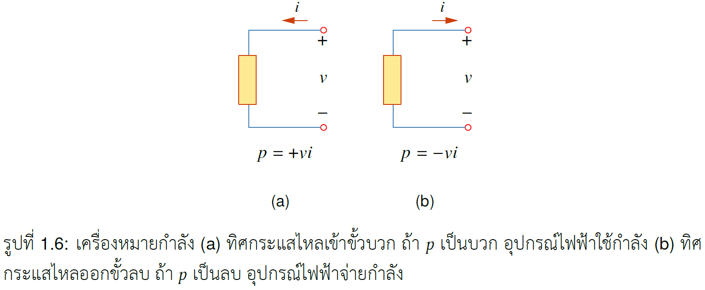
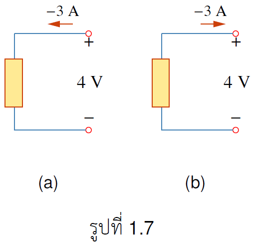
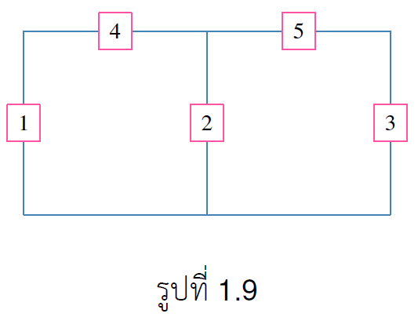


นิยาม 1.3
กำลัง คืออัตราการใช้พลังงานต่อหน่วยเวลา มีหน่วยวัดเป็น Watt ซึ่งแสดงได้ดังสมการ
$$
  \begin{equation}
    p\equiv \frac{dw}{dt}
  \end{equation} \tag{1.7}
 $$
  จัดรูปใหม่เป็น
$$  
    \begin{equation}
   p\equiv \frac{dw}{dq} \cdot \frac{dq}{dt}=v \cdot i
  \end{equation} \tag{1.8}
$$


## เครื่องหมายของกำลัง

อุปกรณ์ไฟฟ้าแบ่งสองประเภทคืออุปกรณ์ที่จ่ายกำลังและอุปกรณ์ไฟฟ้าที่ใช้กำลัง ในการบอกว่าเป็นอุปกรณ์ประเภทไหนให้ดูเครื่องหมายจากการคำนวณค่ากำลังตามสูตรดังนี้
1. กรณีที่กระแสไหลเข้าขั้วบวกของอุปกรณ์ดังรูป 1.6(a)
$$
\begin{equation}
    p=vi
\end{equation} \tag{1.9}
$$
ถ้าค่า $p>0$ แสดงว่าอุปกรณ์ไฟฟ้าเป็นตัวใช้กำลังแต่ถ้า $p<0$ อุปกรณ์ไฟฟ้าเป็นตัวจ่ายกำลัง

2. กรณีที่กระแสไหลออกจากขั้วบวกดังรูป 1.6(b) ให้ใช้สูตร
$$
\begin{equation}
    p=-vi
\end{equation} \tag{1.10}
$$
ถ้าค่า $p>0$ แสดงว่าอุปกรณ์ไฟฟ้าเป็นตัวใช้กำลังแต่ถ้า $p<0$ อุปกรณ์ไฟฟ้าเป็นตัวจ่ายกำลัง

 

ตัวอย่าง 1.6 จงบอกว่าอุปกรณ์ไฟฟ้าเป็นตัวใช้กำลัง หรือจ่ายกำลัง

คำตอบ

(a) เนื่องจากกระแสไหลเข้าขั้วบวกดังนั้นให้ใช้สูตร $p=+vi=4(-3)=-12<0$ แสดงว่าอุปกรณ์ไฟฟ้าเป็นตัวจ่ายกำลัง
 
(b) เนื่องจากกระแสไหลออกขั้วบวก ให้ใช้สูตร $p=-vi=-(-3)(4)=12>0$ แสดงว่าอุปกรณ์ไฟฟ้าเป็นตัวใช้กำลัง

ตัวอย่าง 1.7 จงบอกว่าอุปกรณ์ไฟฟ้าเป็นตัวใช้กำลัง หรือจ่ายกำลัง

คำตอบ

(a) เนื่องจากกระแสไหลเข้าขั้วบวกดังนั้นให้ใช้สูตร $p=+vi=4(-3)=-12<0$ แสดงว่าอุปกรณ์ไฟฟ้าเป็นตัวจ่ายกำลัง
 
(b) เนื่องจากกระแสไหลออกขั้วบวก ให้ใช้สูตร $p=-vi=-(-3)(4)=12>0$ แสดงว่าอุปกรณ์ไฟฟ้าเป็นตัวใช้กำลัง

## กฎอนุรักษ์พลังงาน

เนื่องจากประจุไม่สามารถถูกทำลายได้ แต่สามารถถ่ายโอนให้กันได้ ดังนั้น กฏอนุรักษ์คือผลรวมกำลังในวงจรไฟฟ้าต้องเป็น 0 หรือกล่าวอีกนัยหนึ่งว่า

$$
\begin{align}
\text{กำลังที่จ่าย}&=\text{กำลังที่ใช้} \notag\\\\
\sum p&=0 \tag{1.11}
\end{align} 
$$

ตัวอย่าง 1.8 กำหนดให้ p1 = -205 W, p2 = 60 W, p4 = 45 W, p5 = 30 W จงคำนวณหาค่ากำลัง p3 โดยตอบด้วยว่า อุปกรณ์ 3 เป็นตัวจ่ายกำลัง หรือ ตัวใช้กำลัง

คำตอบ

จากเครื่องหมายของกำลัง
p1 เป็นตัวจ่ายกำลัง ส่วน p2, p4, p5 เป็นตัวใช้กำลัง
 
จากกฏอนุรักษ์กำลัง
$$
    \begin{align*}
    \text{กำลังที่จ่าย}&=\text{กำลังที่ใช้}\\\\
    p1&=p2+p4+p5+p3\\\\
    205&=60+45+30+p3\\\\
    p3&=205-60-45-30=70 > 0 
    \end{align*}
    $$
  ดังนั้นอุปกรณ์ 3 เป็นตัวใช้กำลัง

## ค่าไฟฟ้า

ในการคำนวณค่าไฟ้ฟ้า หน่วยที่ใช้คือ Watt-hour (Wh) สาเหตุที่ใช้หน่วยนี้เนื่องจากหน่วย Joule เป็นหน่วยที่เล็กมาก ซึ่งทำให้ยากต่อการบันทึกหรือจดจำ โดยที่หน่วย Wh มีความสัมพันธ์กับ Joule ดังนี้
$$
\begin{equation*}
    1\\; \text{Wh} = 3,600\\;\text{J}
\end{equation*}
$$

ตัวอย่าง 1.9 หลอดไฟขนาด 100 W ถ้าเปิดใช้งานเป็นเวลา 2 ชั่วโมง จะใช้พลังงานเท่าไร 

คำตอบ

$$
\begin{equation*}
    \text{พลังงานในหน่วย Wh}=(100\\;\text{W})(2\\;\text{h})=200\\;\text{Wh}
\end{equation*}
$$

แต่หน่วย Wh ก็ยังมีขนาดเล็กดังนั้น การไฟฟ้าคิดค่าไฟในหน่วย  kWh โดยที่ 
$$
1\\;\text{kWh}=1\times1000\\;\text{Wh}=1000\\;\text{Wh} \notag
$$ 

จากตัวอย่าง 1.9 ค่าพลังงานในหน่วย kWh คือ $\dfrac{200}{1000}=0.2\\;\text{kWh}$
