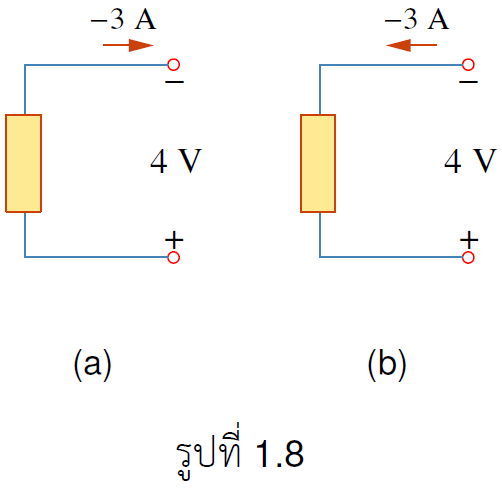


นิยาม 1.3
กำลัง คืออัตราการใช้พลังงานต่อหน่วยเวลา มีหน่วยวัดเป็น Watt ซึ่งแสดงได้ดังสมการ
$$
  \begin{equation}
    p\equiv \frac{dw}{dt}
  \end{equation} \tag{1.7}
 $$
  จัดรูปใหม่เป็น
$$  
    \begin{equation}
   p\equiv \frac{dw}{dq} \cdot \frac{dq}{dt}=v \cdot i
  \end{equation} \tag{1.8}
$$


## เครื่องหมายของกำลัง

อุปกรณ์ไฟฟ้าแบ่งสองประเภทคืออุปกรณ์ที่จ่ายกำลังและอุปกรณ์ไฟฟ้าที่ใช้กำลัง ในการบอกว่าเป็นอุปกรณ์ประเภทไหนให้ดูเครื่องหมายจากการคำนวณค่ากำลังตามสูตรดังนี้
1. กรณีที่กระแสไหลเข้าขั้วบวกของอุปกรณ์ดังรูป 1.6(a)
$$
\begin{equation}
    p=vi
\end{equation}
$$
ถ้าค่า $p>0$ แสดงว่าอุปกรณ์ไฟฟ้าเป็นตัวใช้กำลังแต่ถ้า $p<0$ อุปกรณ์ไฟฟ้าเป็นตัวจ่ายกำลัง

2. กรณีที่กระแสไหลออกจากขั้วบวกดังรูป 1.6(b) ให้ใช้สูตร
$$
\begin{equation}
    p=-vi
\end{equation}
$$
ถ้าค่า $p>0$ แสดงว่าอุปกรณ์ไฟฟ้าเป็นตัวใช้กำลังแต่ถ้า $p<0$ อุปกรณ์ไฟฟ้าเป็นตัวจ่ายกำลัง

 

ตัวอย่าง 1.6 จงบอกว่าอุปกรณ์ไฟฟ้าเป็นตัวใช้กำลัง หรือจ่ายกำลัง

คำตอบ

(a) เนื่องจากกระแสไหลเข้าขั้วบวกดังนั้นให้ใช้สูตร $p=+vi=4(-3)=-12<0$ แสดงว่าอุปกรณ์ไฟฟ้าเป็นตัวจ่ายกำลัง
 
(b) เนื่องจากกระแสไหลออกขั้วบวก ให้ใช้สูตร $p=-vi=-(-3)(4)=12>0$ แสดงว่าอุปกรณ์ไฟฟ้าเป็นตัวใช้กำลัง

ตัวอย่าง 1.7 จงบอกว่าอุปกรณ์ไฟฟ้าเป็นตัวใช้กำลัง หรือจ่ายกำลัง

คำตอบ

(a) เนื่องจากกระแสไหลเข้าขั้วบวกดังนั้นให้ใช้สูตร $p=+vi=4(-3)=-12<0$ แสดงว่าอุปกรณ์ไฟฟ้าเป็นตัวจ่ายกำลัง
 
(b) เนื่องจากกระแสไหลออกขั้วบวก ให้ใช้สูตร $p=-vi=-(-3)(4)=12>0$ แสดงว่าอุปกรณ์ไฟฟ้าเป็นตัวใช้กำลัง

## กฎอนุรักษ์พลังงาน

เนื่องจากประจุไม่สามารถถูกทำลายได้ แต่สามารถถ่ายโอนให้กันได้ ดังนั้น กฏอนุรักษ์คือผลรวมกำลังในวงจรไฟฟ้าต้องเป็น 0 หรือกล่าวอีกนัยหนึ่งว่า

$$
\begin{align}
\text{กำลังที่จ่าย}&=\text{กำลังที่ใช้}\\\\
\sum p&=0 
\end{align}
$$