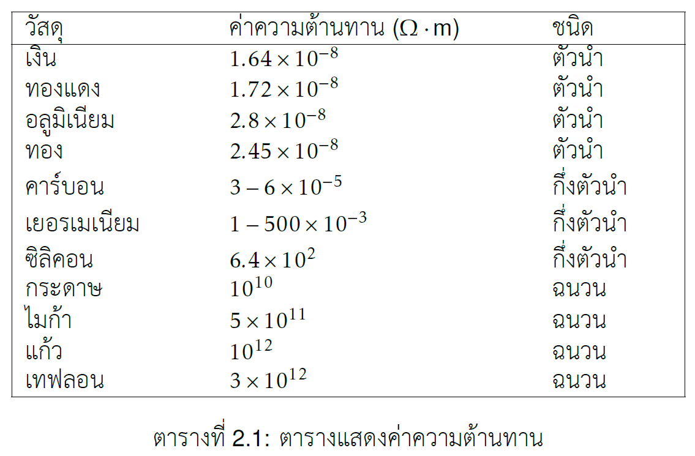
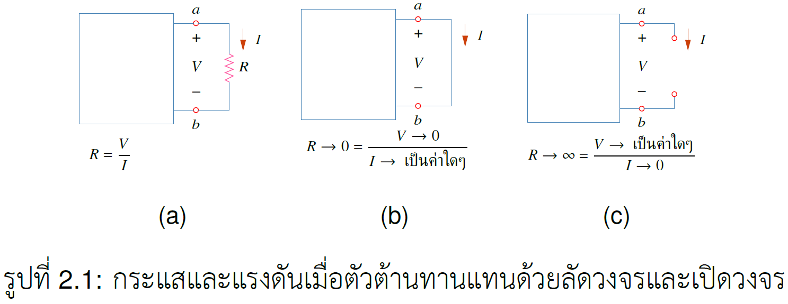
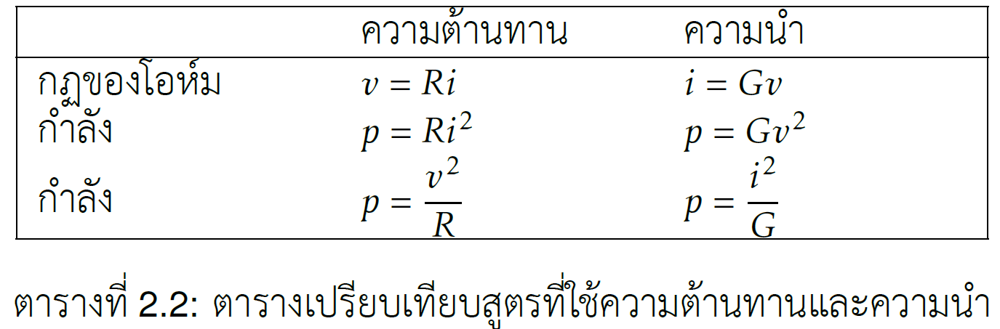
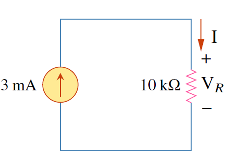

การใช้ประโยชน์จากอิเลคตรอน จำเป็นต้องทราบค่าต่างๆ ในวงจร
ค่าที่ต้องทราบคือ ค่า กระแส แรงดัน พลังงาน และ กำลัง
กฎพื้นฐานช่วยคำนวณค่าต่างๆในวงจรไฟฟ้า

กฎของโอห์มบอกความสัมพันธ์ของ กระแส แรงดัน และ ค่าความต้านทาน

กฎเคอร์ชอฟ์ฟมี ๒ กฎหลักคือ
1. KVL บอกความสัมพันธ์ของแรงดันในวงจรไฟฟ้า
2. KCL บอกความสัมพันธ์ของกระแสไฟฟ้าของโหนด (Node) โดยที่โหนด คือจุดเชื่อมต่อของอุปกรณ์ไฟฟ้า

กฎการแบ่งแรงดัน ช่วยหาแรงดันในวงจรอนุกรม

กฎการแบ่งกระแส ช่วยหากระแสในวงจรขนาน

การแปลง วาย-เดลต้า ช่วยแปลงวงจรให้ง่ายต่อการคำนวณ

## คุณสมบัติความต้านกระแสของวัสดุ

วัสดุมีคุณสมบัติต้านการไหลของประจุไฟฟ้า  คุณสมบัติการต้านการไหลของกระแส มีชื่อเรียกว่า ความต้านทาน
 โลหะ เช่น ทองแดง อลูมิเนียม มีค่าความต้านทานต่ำ
 ฉนวน เช่น เทฟลอน ไมก้า กระดาษ มีค่าความต้านทานสูง
อุปกรณ์ไฟฟ้าที่นำคุณสมบัติต้านการไหลของกระแส มาใช้คือ ตัวต้านทานโดยที่ ตัวต้านทานทำจากอัลลอยด์ของโลหะ หรือ สารประกอบคาร์บอน

หน้าที่ของตัวต้านทาน คือ การใช้เพื่อกำหนดปริมาณกระแสให้ได้ค่าตามต้องการ

### ความต้านทาน

วัสดุโดยทั่วไปมีคุณสมบัติการต้านการไหลของกระแสไฟฟ้า
ความต้านทานหาได้จาก
$$
\begin{equation}
    R=\rho \frac{l}{A}   \tag{2.1}
\end{equation}
$$
โดยที่ $\rho$ คือค่าความต้านทานของวัสดุ $l$ คือความยาว และ $A$ คือพื้นที่หน้าตัด

### ค่าความต้านทานของวัสดุที่พบบ่อย

## กฎของโอห์ม


กฎของโอห์ม คือ กฎที่แสดงความสัมพันธ์ระหว่างแรงดันและกระแสที่ไหลผ่านวัสดุ โดยมีความสัมพันธ์เชิงเส้นดังสมการ
$$
\begin{equation}
v = Ri\ \ \ \ \  \text{หรือ}\ \ \ \  R=\frac{v}{i}  \tag{2.2}
\end{equation}
$$
โดยที่ $R$ คือค่าความต้านทาน มีหน่วยเป็น $\Omega$


### การลัดวงจร และ การเปิดวงจร

เมื่อตัวต้านทานถูกลัดวงจร ผลคือความต้านทานมีค่าเป็น 0 ซึ่งส่งผลให้แรงดันที่ตกคร่อมตัวต้านทานเป็น 0 ตามกฎของโอห์ม แต่กระแสมีค่าเป็นค่าใดๆ
ในกรณีของการเปิดวงจร ค่าความต้าน $R=\infty$ ซึ่งทำให้กระแสไม่สามารถไหลได้เนื่องจากไม่มีเส้นทางให้อิเลคตรอนได้เคลื่อนที่ ดังนั้นกระแสเป็น 0 ส่วนแรงดันสามารถเป็นค่าใดๆ

{}
กฎของโอห์มใช้ได้เฉพาะตัวต้านทานที่เป็นเชิงเส้นเท่านั้น
{}

### ความนำ

ความนำเป็นค่าที่ใช้วัดความสามารถการนำกระแสของอุปกรณ์ไฟฟ้า มีค่าเท่ากับ ส่วนกลับของตัวต้านทาน ใช้ตัว G แทนค่าความนำ
 มีหน่วย เป็น mho ($\mho$) หรือ Siemens (S)
$$
\begin{equation}
 G = \dfrac{1}{R}   \tag{2.3}
\end{equation}
$$
กฎของโอห์มเขียนในรูปของตัวนำไดัดังนี้
$$
\begin{equation}
 i = Gv         \tag{2.4}
\end{equation}
$$

## ตัวอย่าง 2.1

จงหาค่าแรงดัน $\text{V}_R$ ตัวนำ $G$ และ กำลัง $\text{P}$

คำตอบ

<figure>

  

  <figcaption style='text-align:center'>รูปที่ 2.2</figcaption>
</figure>

$$
\begin{alignat*}{3}
    \text{V}_R &=IR &{}={}&3\times10^{-3}\times 10\times10^{3}&&=30\\;\text{V}
    \notag
    \\\\ \text{ค่าตัวนำคือ}\\;
    G&=\frac{1}{R} &{}={}&\frac{1}{10\times10^{3}}&&=0.1\\;\text{mS}
    \notag
    \\\\ \text{หากำลัง}\\;
\text{P} &= \text{V}_R\text{I} &{}={}&30(3\times10^{-3})&&=90\\;\text{mW}\notag\\\\ \text{หรือ}\\;
\text{P} &= \text{I}^2 R &{}={}&(3\times10^{-3})^2(10\times10^3)&&=90\\;\text{mW}\notag\\\\ \text{หรือ}\\;
\text{P} &= \text{V}_R^2 G &{}={}&30^2(0.1\times10^{-3})&&=90\\;\text{mW}\notag
\end{alignat*}
$$

