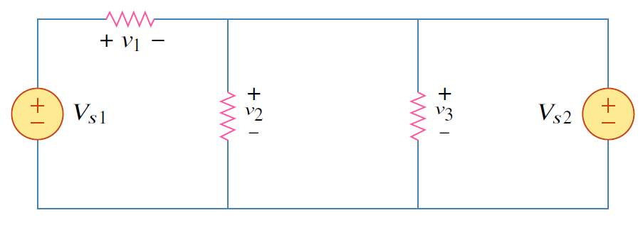
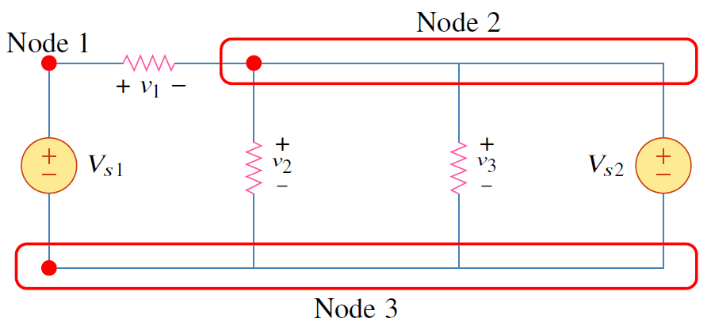
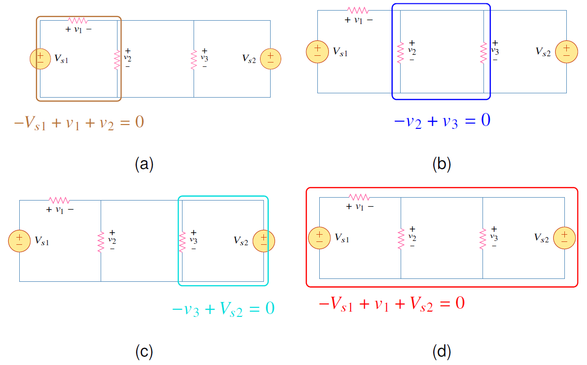


Branch คืออุปกรณ์ไฟฟ้า เช่นตัวต้านทาน แหล่งจ่ายแรงดัน  

Node คือจุดเชื่อมต่อของอุปกรณ์ไฟฟ้า  

Loop เป็นเส้นทางที่ครบรอบในวงจรไฟฟ้า ลูปเป็นอิสระถ้าไม่สามารถหาได้จาก ลูปอิสระตัวอื่น   


## สมการความสัมพันธ์ ระหว่าง branch node loop

ถ้าให้จำนวน branch เป็น $b$ จำนวน  node เป็น $n$ และจำนวน loop เป็น $l$  สมการความสัมพันธ์ระหว่าง branch node และ loop คือ
$$
\begin{equation}  
    l=b-n+1     \tag{2.5}
\end{equation} 
$$

## ตัวอย่าง 2.2 

จงหาจำนวน branch  node  loop

<figure>

  

  <figcaption style='text-align:center'>รูปที่ 2.3</figcaption>
</figure>

คำตอบ

จำนวน branch คือจำนวนอุปกรณ์ไฟฟ้าในวงจร สำหรับตัวอย่างนี้มีจำนวนอุปกรณ์ทั้งหมด 5 ตัว ดังนั้นจำนวน branch = 5 
จากรูป 2.3 จำนวน node = 3
และจากสมการ 2.5
$$
\begin{equation*}
    l=b-n+1=5-3+1=3\\;\text{ลูป}
\end{equation*}
$$

<figure>

  

  <figcaption style='text-align:center'>รูปที่ 2.4</figcaption>
</figure>



### ลูปอิสระ
ในตัวอย่าง 2.2 จำนวนลูปที่คำนวณได้เท่ากับ 3 ซึ่งทั้งสามลูปเป็นอิสระ หมายความว่า สมการ KVL ที่ได้จากแต่ละลูปไม่สามารถหาได้จากสมการของลูปอื่น

### แล้วลูปไม่อิสระเป็นอย่างไร

<figure>

  

  <figcaption style='text-align:center'>รูปที่ 2.5 ลูปในรูป (d) คือลูปไม่อิสระ เนื่องจากสามารถหาได้จากลูปในรูป (a) (b) และ (c)</figcaption>
</figure>

จากรูปที่ 2.5 แสดงการเขียน 4 ลูป และสมการ KVL ของแต่ละลูป จะเห็นได้ว่า สมการ KVL ของ ลูปในรูปที่ 2.5(d) หาได้จากสามลูปก่อนหน้าดังนี้

$$
\begin{align}
         -V_{s1}+v_1+v_2&=0  \tag{2.6}  \label{eq:loop1}\\\\
     -v_2+v_3&=0             \tag{2.7} \label{eq:loop2}\\\\
    -v_3+V_{s2}&=0           \tag{2.8} \label{eq:loop3}\\\\
    -V_{s1}+v_1+V_{s2}&=0    \tag{2.9} \label{eq:loop4}  
\end{align}
$$

สมการ \ref{eq:loop4} หาได้จาก สมการ \ref{eq:loop1}+\ref{eq:loop2}+\ref{eq:loop3} 

ดังนั้น ลูปในรูปที่ 2.5(d) จึงเป็นลูปไม่อิสระ

