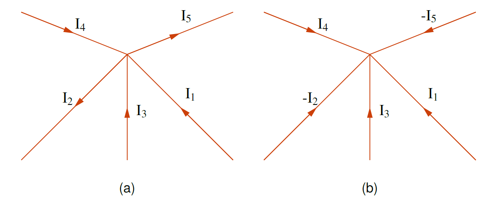
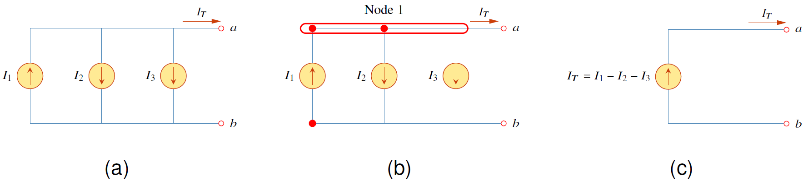
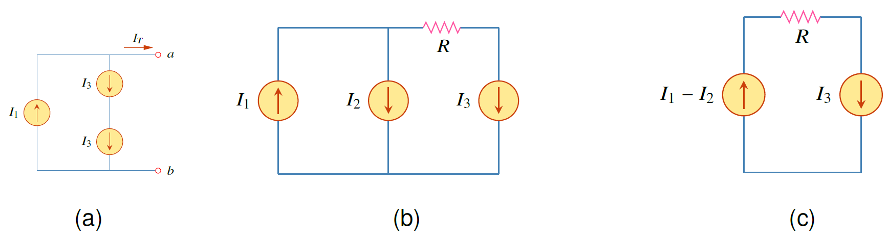
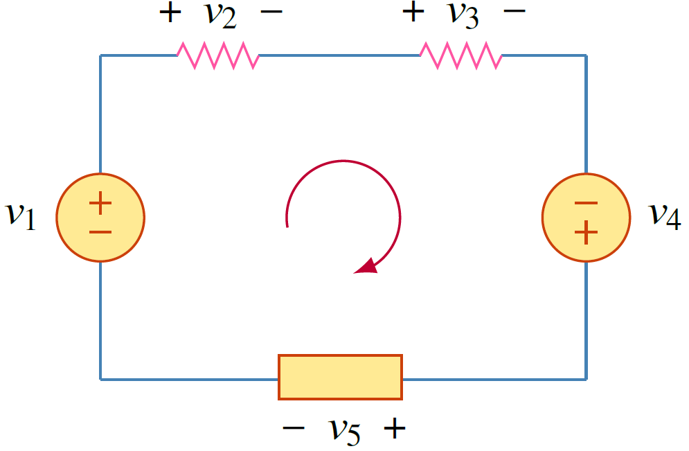
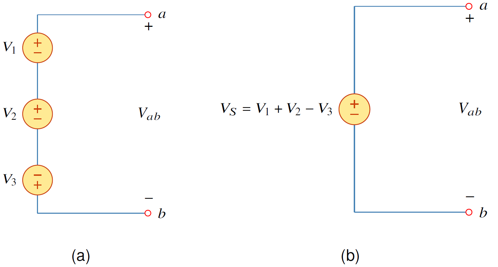
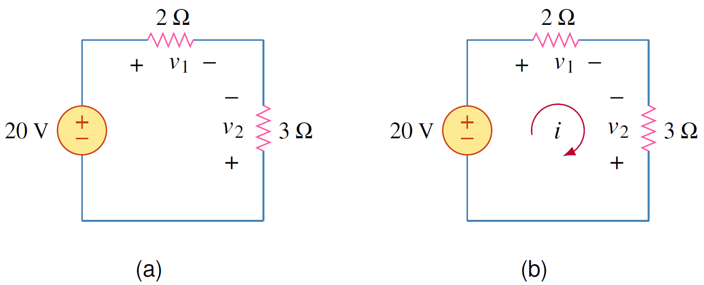
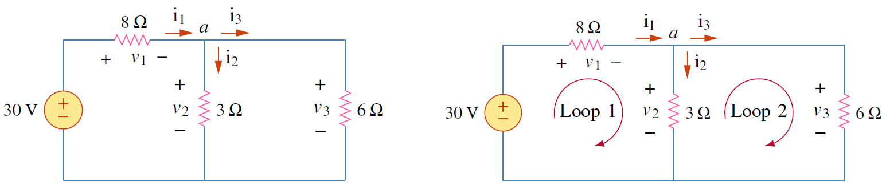

กฎโอห์มโดยลำพังยังไม่สามารถแก้โจทย์ได้มาก กฎเคอร์ชอฟช่วยทำให้การวิเคราะห์วงจรไฟฟ้าได้หลากหลาย กฎเคอร์ชอฟมี 2 กฎ คือกฎเคอร์ชอฟกระแส (KCL) และกฎเคอร์ชอฟแรงดัน (KVL)

## กฎกระแสเคอร์ชอฟส (KCL)


กฎกระแสเคอร์ชอฟ กล่าวว่าผลรวมกระแสไหลเข้าโหนด (หรือขอบเขตปิด) เป็น 0
$$ \sum_{n=1}^{N}i_{n}=0  \tag{2.10} $$

โดยที่ $N$ เป็นจำนวน branch ทั้งหมดที่เชื่อมต่อกับ node และ $i_n$ เป็นกระแสของ branch ที่ $n$ ที่ไหลเข้า node



### KCL สำหรับโหนด

<figure>

  

  <figcaption style='text-align:center'>รูปที่ 2.6 KCL สำหรับโหนด</figcaption>
</figure>

ทิศกระแสในรูป 2.6(a) มีทั้งไหลเข้าโหนด ($I_1,I_3,I_4$) และไหลออกจากโหนด ($I_2,I_5$) ทิศกระแสในรูป 2.6(b) กระแสที่ไหลออกจากโหนดถูกกลับทิศให้ไหลเข้าโหนด (สังเกตเครื่องหมายลบหน้ากระแส $I_2$ และ $I_5$)

จากนิยาม KCL เขียนสมการได้ดังนี้

$$
\begin{equation}
    I_1+I_3+I_4-I_2-I_5=0   \tag{2.11}
\end{equation}
$$

ซี่งถ้าเราย้ายข้างของกระแส $I_2$ และ $I_2$ เป็น

$$
\begin{equation}
    I_1+I_3+I_4=I_2+I_5     \tag{2.12}
\end{equation}
$$
และเมื่อเทียบกับรูป 2.6(a) เราสามารถเขียน KCL ได้ว่า
$$
\begin{equation*}
    \text{ผลรวมกระแสไหลเข้า = ผลรวมกระแสไหลออก }
\end{equation*}
$$
หรือถ้ากลับทิศกระแสให้ไหลออกทั้งหมด ก็จะเขียน KCL ได้อีกแบบคือ
$$
\begin{equation*}
    \text{ผลรวมกระแสไหลออก = 0 }
\end{equation*}
$$

### การรวมแหล่งจ่ายกระแส

<figure>

  

  <figcaption style='text-align:center'>รูปที่ 2.7 KCL สำหรับการรวมแหล่งจ่ายกระแส</figcaption>
</figure>

KCL ใช้รวมแหล่งจ่ายกระแสได้ดังรูปที่ 2.7
 ใช้ KCL ที่ โหนด $\text{Node 1}$

 $$
\begin{align}
    \text{ผลรวมกระแสออก} &= \text{ผลรวมกระแสเข้า}  \tag{2.13} \\\\
    I_T+I_2+I_3&=I_1    \tag{2.14} \\\\
    I_T&=I_1-I_2-I_3    \tag{2.15}
\end{align}
$$

### ข้อควรระวังในการรวมแหล่งจ่ายกระแส

1. แหล่งจ่ายกระแสต่ออนุกรมไม่ได้
2. แหล่งจ่ายกระแสรวมกันได้ต้องต่อขนานและต้องต่อที่โหนดเดียวกัน

<figure>

  

  <figcaption style='text-align:center'>รูปที่ 2.8 (a) ห้ามใช้ KCL รวมแหล่งจ่ายกระแสที่ต่ออนุกรม เนื่องจากไม่สามารถทำได้ (c) เป็นการใช้ KCL รวมแหล่งจ่ายกระแสในรูป (b) สังเกตว่า $I_3$ ไม่สามารถรวมกับตัวอื่นได้ เนื่องจากไม่ได้ต่อขนานกับตัวอื่น</figcaption>
</figure>

ในรูป 2.8(a) แหล่งจ่ายกระแสต่ออนุกรมไม่ได้ และในรูป 2.8(b) แหล่งจ่ายกระแส $I_1$ และ $I_2$ รวมกันได้เนื่องจากต่อที่โหนดเดียวกัน ขณะที่แหล่งจ่าย $I_3$ รวมไม่ได้เนื่องจากไม่ได้ต่อที่โหนดเดียวกันกับแหล่งจ่ายกระแสตัวอื่น สังเกตว่ามีตัวต้านทานต่อคั่นอยู่

## กฎแรงดันเคอร์ชอฟ

กฎแรงดันเคอร์ชอฟมาจากกฎอนุรักษ์พลังงาน


กฎแรงดันเคอร์ชอฟ (Kirchoff's Voltage Law)

ผลรวมของแรงดันทุกตัวในลูปเป็น 0

$$ \sum_{m=1}^{M}v_{m}=0  \notag $$
 โดยที่ $M$ เป็นจำนวน แรงดัน (ของอุปกรณ์ไฟฟ้า) ทั้งหมดในลูป และ $v_m$ เป็นแรงดัน (ของอุปกรณ์) ที่ m ของ ลูป



<figure>

  

  <figcaption style='text-align:center'>รูปที่ 2.9 รูปวงจรสำหรับการใช้กฎ KVL</figcaption>
</figure>

การเขียน KVL สำหรับรูปที่ 2.9 ได้กำหนดทิศการวนตามเข็ม และได้กำหนดทิศแรงดันของทุกอุปกรณ์ ดังนั้นเขียนสมการได้ดังนี้
$$
\begin{equation}
    -v_1+v_2+v_3-v_4+v_5=0    \tag{2.16}
\end{equation}
$$
หรือเขียนเป็น
$$
\begin{equation}
    v_2+v_3+v_5=v_1+v_4     \tag{2.17}
\end{equation}
$$
ซึ่งเขียนสรุปความสัมพันธ์แรงดันในวงจรได้เป็น
$$
\begin{equation}
    \text{ผลรวมของแรงดันลด = ผลรวมของแรงดันเพิ่ม}    \tag{2.18}
\end{equation}
$$

### ความหมายของแรงดันลด
 คือการที่อิเลคตรอนวิ่งผ่านอุปกรณ์ไฟฟ้า (เช่นตัวต้านทาน) ซึ่งต้องใช้กำลัง ดังนั้นพลังงานของอิเลคตรอนหลังผ่านตัวต้านทานจะมีค่าลดลง

### ความหมายของแรงดันเพิ่ม
 คือการที่อุปกรณ์ไฟฟ้า (แหล่งจ่ายกำลัง) นั้นจ่ายกำลังให้อิเลคตรอน ทำให้อิเลคตรอนมีพลังงานมากขึ้น ซึ่งอุปกรณ์ไฟฟ้าที่ทำให้แรงดันขึ้นได้ก็คือแหล่งจ่ายแรงดันหรือแหล่งจ่ายกระแส

### การรวมแหล่งจ่ายแรงดัน
แหล่งจ่ายแรงดันรวมกันได้เมื่อต่ออนุกรมเท่านั้น

<figure>

  

  <figcaption style='text-align:center'>รูปที่ 2.10 รูปวงจรสำหรับการใช้กฎ KVL ในการรวมแหล่งจ่ายแรงดัน</figcaption>
</figure>

การหาแรงดันรวมในรูปที่ 2.10  ใช้ KVL โดยกำหนดการวนตามเข็มได้เป็น
$$
\begin{equation}
    +V_3-V_2-V_1+V_{ab}=0   \tag{2.19}
\end{equation}
$$
ย้ายข้างได้
$$
\begin{equation}
    V_{ab}=V_1+V_2-V_3      \tag{2.20}
\end{equation}
$$

## ตัวอย่าง 2.3

จงหาแรงดัน $v_1$ และ $v_2$

<figure>

  

  <figcaption style='text-align:center'>รูปที่ 2.11 รูปวงจรสำหรับตัวอย่าง 2.3 </figcaption>
</figure>

คำตอบ

กำหนดให้กระแสหมุนตามเข็มนาฬิกา ใช้กฎของโอห์มหาแรงดัน $v_1$ และ $v_2$
$$
\begin{equation}
v_1 = 2i\\:,\\:\\: v_2 = -3i    \tag{2.21}
\end{equation}
$$
จากนั้นใช้กฎ KVL ได้สมการ
$$
\begin{equation}
    -20+v_1-v_2=0     \tag{2.22}
\end{equation}
$$

แทนค่าแรงดัน $v_1 \text{และ}\:v_2 $จากกฎของโอห์ม

$$
\begin{equation}
 -20+2i-(-3i)=0\\;\\; \rightarrow\\;\\;i=4\\;\text{A}    \tag{2.23}
\end{equation}
$$
แทนค่า $i$ ในสมการ  2.21
$$
\begin{equation}
  v_1=8\\:\text{V},\\;\\;v_2 = -12\\:\text{V}     \tag{2.24}
\end{equation}
$$


## ตัวอย่าง 2.4

จงหาแรงดันและกระแสในวงจร

<figure>

  

  <figcaption style='text-align:center'>รูปที่ 2.12 รูปวงจรสำหรับตัวอย่าง 2.4 </figcaption>
</figure>

คำตอบ

กำหนดให้กระแสหมุนตามเข็มนาฬิกา ใช้กฎของโอห์มหาแรงดัน $v_1$  $v_2$ และ $v_3$
$$
\begin{equation} \label{eq:ex1-ohm}
v_1 = 8i_1\\:,\\:\\: v_2 = 3i_2\\:,\\:\\: v_3 = 6i_3  \tag{2.25}
\end{equation}
$$
จากนั้นใช้กฎ KCL
$$
\begin{equation} \label{eq:ex2-ohm}
i_1-i_2-i_3=0   \tag{2.26}
\end{equation}
$$
จากนั้นใช้กฎ KVL ใน Loop 1
$$
\begin{align}
    -30+v_1+v_2&=0\nonumber\\\\
    -30+8i_1+3i_2&=0 \tag{2.27} \label{eq:kvl-loop1}
\end{align}
$$
ใช้กฎ KVL ใน Loop 2
$$
\begin{align}
-v_2+v_3&=0\nonumber\\\\
-3i_2+6i_3&=0   \tag{2.28}
\end{align}
$$
แทนค่า $i_3=i_1-i_2$
$$
\begin{align}
-3i_2+6i_1-6i_2&=0\nonumber\\\\
6i_1-9i_2&=0  \tag{2.29} \label{eq:kvl-loop2}
\end{align}
$$
แก้สมการ \eqref{eq:kvl-loop1} และ \eqref{eq:kvl-loop2}

$$
\begin{equation*}
 i_1=3\\:\text{A},\\;\\;i_2 = 2\\:\text{A},\\;\\; v_1=24\\:\text{V},\\;\\;v_2 = 6\\:\text{V} ,\\;\\;v_3 = 6\\:\text{V}
\end{equation*}
$$


