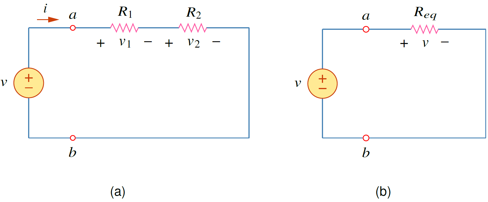

## วงจรอนุกรม
การแบ่งแรงดันเป็นเครื่องมือในการช่วยหาแรงดันที่ตกคร่อมตัวต้านทานที่ต่ออนุกรมกัน

<figure>

  

  <figcaption style='text-align:center'>รูปที่ 2.13 การแบ่งแรงดัน </figcaption>
</figure>

หาแรงดัน จากกฏของโอห์ม
$$ 
\begin{equation}
    v_1 = iR_1\\:,\\:\\: v_2 = iR_2 \tag{2.30} \label{eq:vdiv1}
\end{equation}
$$
จากนั้นใช้กฏ KVL
$$
\begin{equation}
-v+v_1+v_2=0  \tag{2.31}   \label{eq:vdiv2}
\end{equation}
$$
แทนค่า แรงดันจาก \eqref{eq:vdiv1} ใน \eqref{eq:vdiv2}
$$
\begin{equation}
    v=v_1+v_2=i(R_1+R_2)  \tag{2.32}   \label{eq:vdiv3}
\end{equation}
$$
ย้ายข้างหากระแสได้
$$
\begin{equation}
    i=\dfrac{v}{R_1+R_2}  \tag{2.33}   \label{eq:vdiv4}
\end{equation}
$$
สมการ \eqref{eq:vdiv3} เขียนได้เป็น
$$
\begin{equation}
    v=iR_{eq}   \tag{2.34}   \label{eq:vdiv5}
\end{equation}
$$
โดยที่
$$
\begin{equation}
    R_{eq} =R_1+R_2   \tag{2.35}  \label{eq:vdiv6}
\end{equation}
$$
ตัวต้านทานที่อนุกรมกันสามารถรวมกันได้เป็นตัวต้านทานสมมูลดังรูป 2.16(b)

แทนค่ากระแสจากสมการ \eqref{eq:vdiv4} ในสมการ \eqref{eq:vdiv1} ได้ค่าแรงดันที่ตกคร่อมตัวต้านทานแต่ละตัว
$$
\begin{equation}
    v_1 = v\left(\frac{R_1}{R_1+R_2}\right),\\;\\;v_2 = v\left(\frac{R_2}{R_1+R_2}\right)   \tag{2.36} \label{eq:vdiv7}
\end{equation}
$$
สมการ \eqref{eq:vdiv7} คือการแบ่งแรงดัน (Voltage Division)

## การต่ออนุกรมตัวต้านทาน $n$ ตัว

ในกรณีที่มีตัวต้านทาน $n$ ตัวต่ออนุกรม แรงดันที่ตกคร่อมตัวต้านทานตัวที่ $n$ ($v_n$) คือ
$$
\begin{equation}
    v_n = v\left(\frac{R_n}{R_1+R_2+ \cdots +R_n}\right)  \tag{2.37}
\end{equation}
$$

{}
ตัวต้านทานสมมูล ($R_{eq}$) ของตัวต้านทาน $n$ ตัวที่ต่ออนุกรมกันคือผลรวมค่าตัวต้านทานแต่ละตัวที่ต่ออนุกรม
$$ R_{eq}=R_{1}+R_{2}+\cdots +R_{n}=\sum_{i=1}^{n}R_{i} \notag $$
{}
