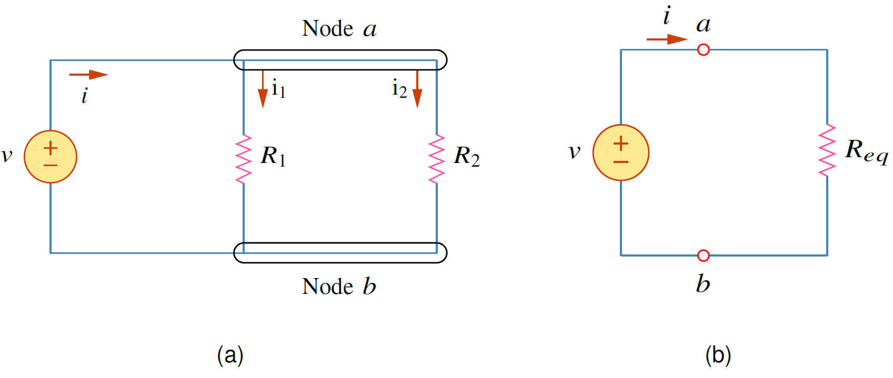
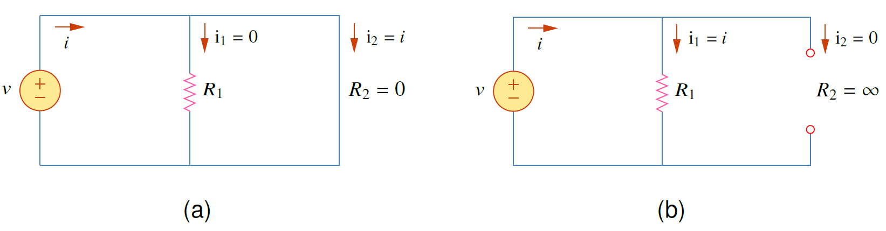
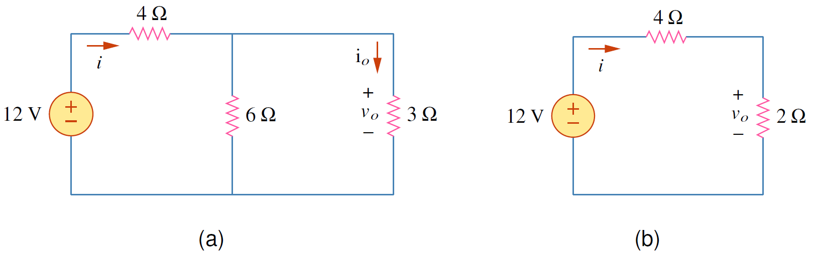
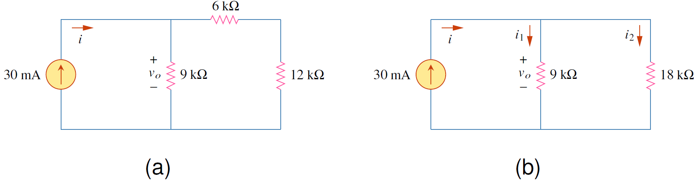

<figure>

  

  <figcaption style='text-align:center'>รูปที่ 2.14 การแบ่งกระแส</figcaption>
</figure>

## การต่อขนานของตัวต้านทาน

ในรูปที่ 2.14(a) ตัวต้านทานต่อขนานกันดังนั้นแรงดันตกคร่อมตัวต้านทานทั้งสองมีค่าเท่ากัน
$$
\begin{equation*}
    v=i_1R_1=i_2R_2
\end{equation*}
$$
หรือ
$$
\begin{equation}
    i_1 = \dfrac{v}{R_1},\\;\\;\\:\\; i_2 = \dfrac{v}{R_2} \tag{2.38} \label{eq:idiv1}
\end{equation}
$$

ใช้ KCL ที่ Node $a$ ได้กระแส $i$
$$
\begin{equation}
    i=i_1+i_2 \tag{2.39}\label{eq:idiv2}
\end{equation}
$$
แทนค่าสมการ \eqref{eq:idiv1} ในสมการ \eqref{eq:idiv2}
$$
\begin{equation}
    i=\dfrac{v}{R_1}+\dfrac{v}{R_2}=v\left(\dfrac{1}{R_1}+\dfrac{1}{R_2}\right)=\dfrac{v}{R_{eq} } \tag{2.40} \label{eq:idiv3}
\end{equation}
$$
โดยที่ $R_{eq}$ คือความต้านทานสมมูลของตัวต้านทานที่ต่อขนาน
$$
\begin{equation}
    \dfrac{1}{R_{eq}} = \dfrac{1}{R_1}+\dfrac{1}{R_2} \tag{2.41} \label{eq:idiv4}
\end{equation}
$$
หรือ
$$
\begin{equation}
    R_{eq} = \dfrac{R_1R_2}{R_1+R_2} \tag{2.42} \label{eq:idiv5}
\end{equation}
$$

{}
ความต้านทานสมมูล ($R_{eq}$) ของตัวต้านทานสองตัวต่อขนานกัน คือ
ผลคูณของ ความต้านทาน หารด้วย ผลรวมของความต้านทานทั้งสอง ดังสมการ $R_{eq}=\dfrac{R_1R_2}{R_1+R_2}$
 
ถ้าตัวต้านทาน $R_1=R_2$ ค่า $R_{eq}=\dfrac{R_1}{2}$

{}

กรณีที่มีตัวต้านทาน $n$ ตัวต่อขนานกัน ความต้านทานสมมูลคือ
$$
\begin{equation}
    \dfrac{1}{R_{eq}}=\dfrac{1}{R_1}+\dfrac{1}{R_2}+\cdots+\dfrac{1}{R_n} \tag{2.43}
\end{equation}
$$


ข้อสังเกต
1. ค่าความต้านทานสมมูลมีค่าน้อยกว่าตัวต้านทานต่ำสุดที่ต่อขนานกันเสมอ
2. ถ้า $R_1=R_2=\cdots=R_n=R$ แล้ว
$$
\begin{equation}
    R_{eq}=\dfrac{R}{n}   \tag{2.44}
\end{equation}
$$


## การแบ่งกระแส

จากรูปที่ 2.14(a) กระแส $i_1$ และ $i_2$ หาจากแทนค่า $v=iR_{eq}$ ในสมการ \ref{eq:idiv1}
$$
\begin{equation}
    i_1=i\left(\dfrac{R_2}{R_1+R_2}\right),\\;\\;\\; i_2=i\left(\dfrac{R_1}{R_1+R_2}\right) \label{eq:i-div}  \tag{2.45}
\end{equation}
$$

### การแบ่งกระแสกรณีลัดวงจรและเปิดวงจร

<figure>

  

  <figcaption style='text-align:center'>รูปที่ 2.15 การแบ่งกระแสกรณี (a) ลัดวงจร (b) เปิดวงจร</figcaption>
</figure>

ในรูปที่ 2.15(a) ตัวต้านทาน $R_2$ ถูกลัดวงจร กระแส $i_1,\\;i_2$ หาได้จากสมการ  \ref{eq:i-div} โดยแทนค่า $R_2=0$
$$
\begin{equation}
    i_1=i\left(\dfrac{0}{R_1+0}\right)=0,\\;\\;\\;
    i_2=i\left(\dfrac{R_1}{R_1+0}\right)=i    \tag{2.46}
\end{equation}
$$
ในรูปที่ 2.15(b) ตัวต้านทาน $R_2$ ถูก เปิดวงจร กระแส $i_1,\\;i_2$ หาได้จากสมการ  \ref{eq:i-div} โดยแทนค่า $R_2=\infty$ และค่า $R_2$ มีค่ามากกว่า $R_1$ มากมาก ( $R_2 >> R_1$) ดังนั้น $R_1+R_2 \approx R_2$
$$
\begin{align}
    i_1&=i\left(\dfrac{R_2}{R_1+R_2}\right)\\;\approx\\;i\left(\dfrac{R_2}{R_2}\right)=i,\notag\\\\
    i_2&=i\left(\dfrac{R_1}{R_1+R_2}\right)\\;\approx\\;i\left(\dfrac{R_1}{R_2}\right)=0   \tag{2.47}
\end{align}
$$

## ตัวอย่าง 2.5 

จงหา $v_o$ และ $i_o$ และให้คำนวณกำลังที่ใช้โดยตัวต้านทาน $3\Omega$

<figure>

  

  <figcaption style='text-align:center'>รูปที่ 2.16 วงจรสำหรับตัวอย่าง 2.5</figcaption>
</figure>

คำตอบ

ตัวต้านทาน  $6\Omega$ ต่อขนานกับ  $3\Omega$ ดังนั้นตัวต้านทานรวมคือ
$$
\begin{equation*}
    6\Omega || 3\Omega=\dfrac{6\times3}{6+3}=2\Omega
\end{equation*}
$$
หา $v_o$ จากการแบ่งแรงดัน
$$
\begin{equation*}
    v_o=12\left(\dfrac{2}{2+4}\right)=4\\;\mathrm{V}
\end{equation*}
$$
กระแส $i$ หาจากกฏโอห์ม
$$
\begin{equation*}
    i=\dfrac{v}{R}=\dfrac{12}{6}=2\\;\mathrm{A}
\end{equation*}
$$
กระแส $i_o$ หาจากการแบ่งกระแส
$$
\begin{equation*}
    i_o = i\dfrac{6}{3+6}=(2)\dfrac{2}{3}=\dfrac{4}{3}\\;\mathrm{A}
\end{equation*}
$$
กำลังที่ใช้โดยตัวต้านทาน $3\Omega$ คือ
$$
\begin{equation*}
    p_o = v_oi_o = 4\left(\dfrac{4}{3}\right)=5.33\\;\mathrm{W}
\end{equation*}
$$


## ตัวอย่าง 2.6 

จงหา $v_o$  และ กำลังที่แหล่งจ่ายกระแสจ่าย และกำลังที่ตัวต้านทานแต่ละตัวใช้

<figure>

  

  <figcaption style='text-align:center'>รูปที่ 2.17 วงจรสำหรับตัวอย่าง 2.6</figcaption>
</figure>

คำตอบ

ตัวต้านทาน  6k $\Omega$ ต่ออนุกรมกับ    12k  $\Omega$ ดังนั้นตัวต้านทานรวมคือ 18k$\Omega$
หา $i_1$  และ $i_2$ จากการแบ่งกระแส
$$
\begin{align*}
    i_1&=30\\;\text{mA}\left(\dfrac{18,000}{18,000+9,000}\right)=20\\;\text{mA}\\\\
    i_2&=30\\;\text{mA}\left(\dfrac{9,000}{18,000+9,000}\right)=10\\;\text{mA}
\end{align*}
$$
แรงดัน $v_o=9,000i_1=9,000(20\\;\text{mA})=180\\;\text{V}$

กำลังที่จ่ายโดยแหล่งจ่ายกระแสคือ
$$
\begin{equation*}
    p_o=v_o(i_1+i_2)=-180(30\\;\text{mA})=-5.4\\;\text{W}
\end{equation*}
$$
กำลังที่ใช้โดยตัวต้านทานแต่ละตัวคือ
$$
\begin{align*}
    p_{6k\Omega}&=i_2^2R=(10\\;\text{mA})^2(6k\Omega)=(10\times10^{-3})^2(6,000)=0.6\\;\text{W}\\\\
    p_{9k\Omega}&=i_1^2R=(20\\;\text{mA})^2(9k\Omega)=(20\times10^{-3})^2(9,000)=3.6\\;\text{W}\\\\
    p_{12k\Omega}&=i_2^2R=(10\\;\text{mA})^2(12k\Omega)=(10\times10^{-3})^2(12,000)=1.2\\;\text{W}
\end{align*}
$$
ตรวจคำตอบโดยใช้กฏอนุรักษ์พลังงาน 
$$
\begin{align*}
    \text{ผลรวมกำลังในวงจร = 0}\\\\
    -5.4\\;\text{W}+0.6\\;\text{W}+3.6\\;\text{W}+1.2\\;\text{W}=0
\end{align*}
$$

