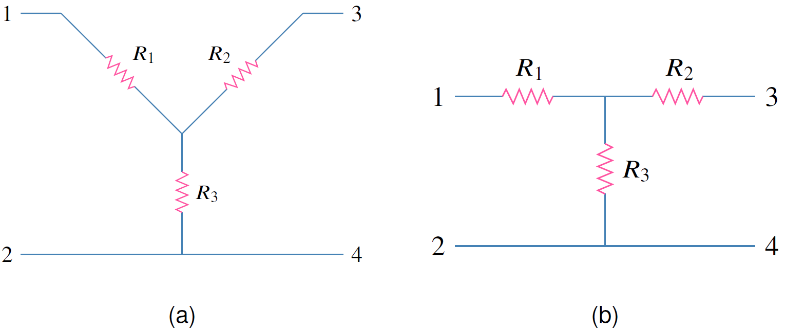
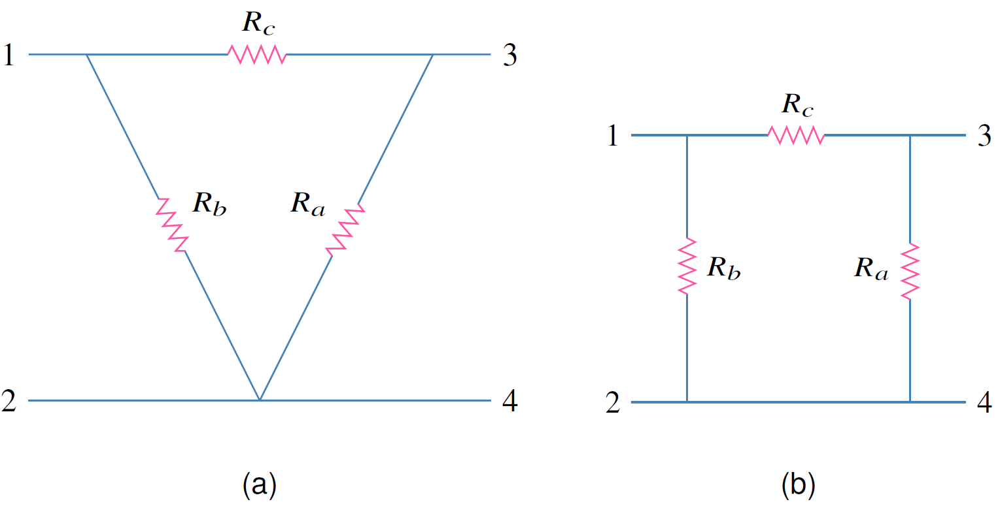
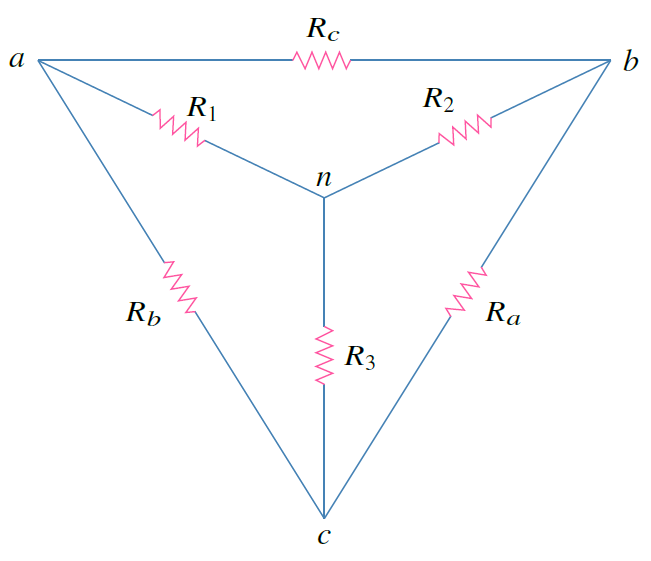
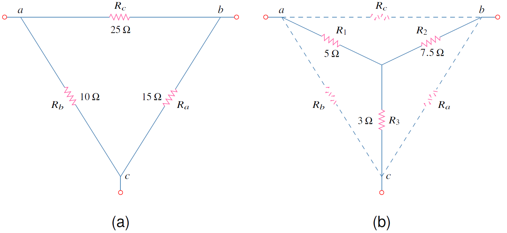

## การแปลง Y-$\Delta$ และ $\Delta$-Y

ในบางกรณีตัวต้านทานไม่ได้ต่อทั้งแบบอนุกรมหรือขนาน ดังนั้นเพื่อให้การวิเคราะห์วงจรทำได้ง่าย เครื่องมือที่ช่วยคือ การแปลง Y-$\Delta$ และ $\Delta$-Y

รูปแบบของวงจรลักษณะ Y มีสองแบบคือแบบตัวอักษร Y และตัวอักษร T

<figure>

  

  <figcaption style='text-align:center'>รูปที่ 2.18 (a) วงจร Y และ (b) วงจร T เป็นวงจรสมมูลกัน</figcaption>
</figure>

รูปแบบของวงจรลักษณะ เดลต้า มีสองแบบคือแบบตัวอักษร $\Delta$ และตัว $\Pi$

<figure>

  

  <figcaption style='text-align:center'>รูปที่ 2.19 (a) วงจร $\Delta$ และ (b) วงจร $\Pi$ เป็นวงจรสมมูลกัน</figcaption>
</figure>

### การแปลง $\Delta$-Y

<figure>

  

  <figcaption style='text-align:center'>รูปที่ 2.20 วงจร $\Delta$</figcaption>
</figure>

สำหรับการแปลง  $\Delta$ เป็น Y ตัวต้านทานแต่ละตัวของวงจร Y มีวิธีจำการแปลงดังนี้

{}
ตัวต้านทานแต่ละตัวในวงจร Y เป็นผลคูณของตัวต้านทานในวงจร $\Delta$ ที่ติดกับมันแล้วหารด้วยผลรวมของตัวต้านทาน ทั้งสามตัวในวงจร $\Delta$
{}

$$
\begin{align}
    R_1&=\dfrac{R_bR_c}{R_a+R_b+R_c} \tag{2.48} \label{eq:r1}\\\\
    R_2&=\dfrac{R_aR_c}{R_a+R_b+R_c} \tag{2.49}\label{eq:r2}\\\\
    R_3&=\dfrac{R_aR_b}{R_a+R_b+R_c} \tag{2.50}\label{eq:r3}\\\\   
\end{align}
$$

### การแปลง Y-$\Delta$

การแปลงจาก Y เป็น Delta ก็มีวิธีการจำดังนี้

{}
ตัวต้านทานในวงจร $\Delta$ เป็นผลรวมของผลคูณตัวต้านทานในวงจร Y (โดยที่เลือกตัวต้านครั้งละสองตัวจากวงจร Y มาคูณกัน) หารด้วยตัวต้านทานในวงจร Y ที่อยู่ไกลสุด(ตรงข้าม) ของตัวต้านทาน  $\Delta$ ที่ต้องการหา
{}
$$
\begin{align*}
    R_a&=\dfrac{R_1R_2+R_2R_3+R_3R_1}{R_1}\tag{2.51}\\\\
    R_b&=\dfrac{R_1R_2+R_2R_3+R_3R_1}{R_2}\tag{2.52}\\\\
    R_c&=\dfrac{R_1R_2+R_2R_3+R_3R_1}{R_3}\tag{2.53}\\\\
\end{align*}
$$
โครงข่าย Y และ $\Delta$ เป็นโครงข่ายสมดุลถ้า
$$
\begin{equation}
    R_1=R_2=R_3=R_Y,\\;\\;\\;R_a=R_b=R_c=R_\Delta \tag{2.54}
\end{equation}
$$
และเมื่อโครงข่ายสมดุล สูตรการแปลงลดรูปเหลือ
$$
\begin{equation}
    R_Y=\dfrac{R_\Delta}{3}\\;\\;\\;\text{หรือ}\\;\\;\\;R_\Delta=3R_Y \tag{2.55}
\end{equation}
$$

## ตัวอย่าง 2.7 

จงแปลงโครงข่าย $\Delta$ เป็นโครงข่าย Y

<figure>

  

  <figcaption style='text-align:center'>รูปที่ 2.21 วงจรสำหรับตัวอย่าง 2.7</figcaption>
</figure>

คำตอบ

ใช้สมการ \eqref{eq:r1} ถึง \eqref{eq:r3}
$$
\begin{align*}
    R_1&=\dfrac{R_bR_c}{R_a+R_b+R_c}=\dfrac{10\times25}{15+10+25}=\dfrac{250}{50}=5\Omega\\\\
    R_2&=\dfrac{R_cR_a}{R_a+R_b+R_c}=\dfrac{25\times15}{50}=7.5\Omega\\\\
    R_3&=\dfrac{R_aR_b}{R_a+R_b+R_c}=\dfrac{15\times10}{50}=3\Omega
\end{align*}
$$

