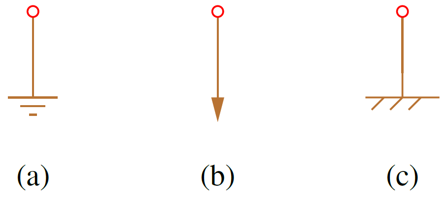
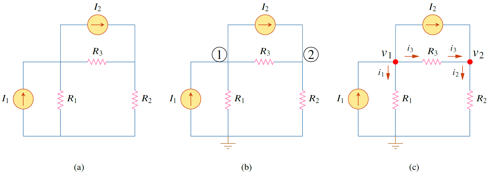
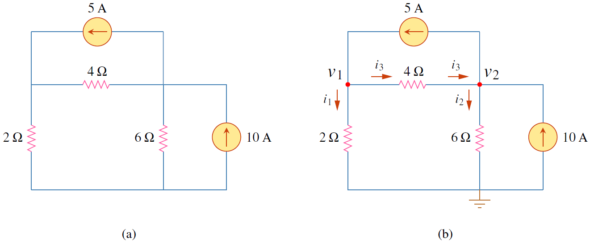
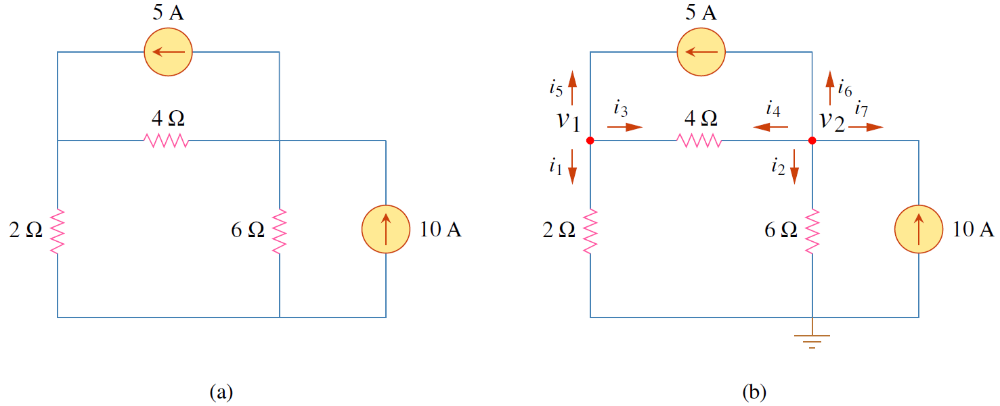

## **การวิเคราะห์โหนด**
การวิเคราะห์เป็นวิธีวิเคราะห์วงจรโดยใช้แรงดันโหนดเป็นตัวแปร  การใช้แรงดันโหนดดีกว่าการใช้แรงดันอุปกรณ์เป็นตัวแปร เนื่องจากทำให้จำนวนสมการลดลง ในหัวข้อนี้วงจรที่วิเคราะห์ จะไม่มีแหล่งจ่ายแรงดัน วงจรที่มีแหล่งจ่ายแรงดันจะพูดในหัวข้อถัดไป

### ขั้นตอนการวิเคราะห์โหนด

1. เลือกหนึ่งโหนดเป็นโหนดอ้างอิง (แรงดันที่โหนดนี้เป็น 0)
2. กำหนดหมายเลขให้กับโหนดที่เหลือโดยให้เริ่มจากเลข 1 จนถึง $n-1$
3. กำหนดแรงดันโหนดตามหมายเลขโหนดให้เป็น $v_1, v_2, \cdots, v_{n-1}$ 
4. ใช้กฏ KCL กับทุก $n-1$ โหนด โดยใช้กฏของโอห์มในการแสดงค่ากระแสในรูปของแรงดันโหนด
5. แก้สมการที่ได้เพื่อหาค่าแรงดันโหนด
 
### รายละเอียดของแต่ละขั้นตอน

สัญลักษณ์ที่แทนโหนดกราวด์แสดงดังรูปที่ 3.1

<figure>

  

  <figcaption style='text-align:center'>รูปที่ 3.1 สัญลักษณ์ที่ใช้แทนโหนดอ้างอิง (a) กราวด์ (b) กราวด์ทั่วไป (c) กราวด์ตัวเครื่อง</figcaption>
</figure>

ในการอธิบายขั้นตอนจะใช้รูปที่ 3.2  ช่วยอธิบาย  
ในขั้นตอนแรกสิ่งที่ต้องทำคือเลือกโหนดอ้างอิง (reference node) หรือเรียกอีกชื่อหนึ่งว่า โหนดกราวด์ (ground node) สิ่งสำคัญของโหนดกราวด์แรงดันที่โหนดนี้มีค่าเป็น 0 V 

<figure>

  

  <figcaption style='text-align:center'>รูปที่ 3.2 (a)  รูปวงจร (b) เลือกโหนดอ้างอิงและกำหนดหมายเลขให้โหนดที่เหลือ (c) กำหนดแรงดันเป็น $v_1,\;v_2$ กำหนดทิศกระแสแล้วใช้ KCL หาสมการ
</figcaption>
</figure>

ขั้นตอนที่ 2 กำหนดหมายเลขให้กับโหนดที่เหลือ ซึ่งมีอยู่ 2 โหนดจึงกำหนดหมายเลขเป็น 1 และ 2 ตามลำดับ (หมายเหตุการกำหนดหมายเลขให้ทำจากซ้ายไปขวา แต่ถ้าอยากกำหนดในรูปแบบอื่นก็ทำได้) 

ในขั้นตอนที่ 3 กำหนดแรงดันของโหนดตามหมายเลขโหนด ดังนั้น โหนดที่ 1 มีแรงดันเป็น $v_1$ และโหนดหมายเลข 2 มีแรงดันเป็น $v_2$ ดังในรูป 3.2(c)

ขั้นตอนที่ 4 ใช้ KCL เขียนสมการดังนี้

ที่โหนด 1
$$
\begin{align}
    \sum i_{in} &= \sum i_{out}\nonumber\\\\
    I_1&=I_2 + i_1 + i_3 \label{eq3:node1}\tag{3.1}
\end{align}
$$
ที่โหนด 2
$$
\begin{align}
    \sum i_{in} &= \sum i_{out}\nonumber\\\\
    I_2+i_3&=i_2 \label{eq3:node2}\tag{3.2}
\end{align}
$$
หลังจากได้สมการจาก KCL ขั้นต่อไปคือการหาสัมพันธ์ของกระแส $i_1, i_2, i_3$ กับแรงดันโหนด โดยใช้กฏโอห์ม 

{}
กระแส $i$ จะไหลจากแรงดันศักย์สูงไปแรงดันศักย์ต่ำเสมอในกรณีที่อุปกรณ์ไฟฟ้าเป็นตัวต้านทาน
$$ i=\dfrac{v_{\text{ศักย์สูง}} - v_{\text{ศักย์ต่ำ}}}{R} \notag$$
{}

ดังนั้นกระแสที่ไหลเข้าหรือออกโหนด หาได้ดังนี้
$$
\begin{align}
    i_1&=\dfrac{v_1-0}{R_1}=\dfrac{v_1}{R_1}\nonumber\\\\
    i_2&=\dfrac{v_2-0}{R_2}=\dfrac{v_2}{R_2} \label{eq3:node-i} \tag{3.3}\\\\
    i_3&=\dfrac{v_1-v_2}{R_3}\nonumber
\end{align}
$$
แทนค่ากระแสจากสมการ \eqref{eq3:node-i} ในสมการ \eqref{eq3:node1} และ \eqref{eq3:node2}
$$
\begin{align}
    I_1&=I_2 + \dfrac{v_1}{R_1}+\dfrac{v_1-v_2}{R_3} \label{eq3:node-v1}\tag{3.4}\\\\
    I_2+\dfrac{v_1-v_2}{R_3}
    &=\dfrac{v_2}{R_2}\label{eq3:node-v2}\tag{3.5}
\end{align}
$$
จัดรูปสมการโดยย้ายค่าคงที่ให้อยู่ด้วยกัน และเรียงลำดับตัวแปรตามลำดับเลขโหนดดังนี้

สมการ \eqref{eq3:node-v1} จัดรูปใหม่ได้เป็น
$$
\begin{align}
    \dfrac{v_1}{R}+\dfrac{v_1-v_2}{R_3}&=I_1-I_2\nonumber\\\\
    \dfrac{v_1}{R_1}+\dfrac{v_1}{R_3}-\dfrac{v_2}{R_3}&=I_1-I_2\nonumber\\\\
    \left(\dfrac{1}{R_1}+\dfrac{1}{R_3}\right)v_1+\left(\dfrac{1}{R_2}\right)v_2&=I_1-I_2 \label{eq3:node-v1-new}\tag{3.6}
\end{align}
$$
สมการ \eqref{eq3:node-v2} จัดรูปใหม่ได้เป็น
$$
\begin{align}
    \dfrac{v_1-v_2}{R_3}-\dfrac{v_2}{R_2}&=-I_2\nonumber\\\\
    \dfrac{v_1}{R_3}-\dfrac{v_2}{R_3}-\dfrac{v_2}{R_2}&=-I_2\nonumber\\\\
    \left(\dfrac{1}{R_3}\right)v_1-\left(\dfrac{1}{R_2}+\dfrac{1}{R_3}\right)v_2&=-I_2 \label{eq3:node-v2-new}\tag{3.7}
\end{align}
$$
เมื่อจัดรูปเสร็จแล้วก็ใช้เครื่องคิดเลขแก้สมการ \eqref{eq3:node-v1-new} และ \eqref{eq3:node-v2-new} ก็จะได้แรงดันโหนด และสามารถหากระแสต่อไป

### ตัวอย่าง 3.1 

จงคำนวณหาแรงดันโหนด

<figure>

  

  <figcaption style='text-align:center'>รูปที่ 3.3 วงจรสำหรับตัวอย่าง 3.1
</figcaption>
</figure>

คำตอบ

ขั้นตอนที่ 1 คือการเลือกโหนดอ้างอิงและกำหนดให้แรงดันอ้างอิงเป็น 0 

ขั้นตอนที่ 2 กำหนดหมายเลขให้โหนดที่เหลือโดยเรียงจากซ้ายไปขวา

ขั้นตอนที่ 3 กำหนดแรงดันโหนดให้เป็น $v_1,\\;v_2$

ขั้นตอนที่ 4 ใช้ KCL เขียนสมการที่โหนด 1 และโหนด 2

พิจารณา โหนด 1
$$
\begin{align}
                i_1+i_3-5&=0\nonumber\\\\
                i_1+i_3&=5\nonumber\\\\
                \frac{v_1}{2}+\frac{v_1-v_2}{4}&=5\nonumber\\\\
                \frac{3}{4}v_1-\frac{1}{4}v_2&=5 \label{eq3:ex1-node-1} \tag{3.8}
            \end{align}
$$
พิจารณาโหนด 2
$$
\begin{align}
                i_2-i_3+5-10&=0\nonumber\\\\
                i_2-i_3&=10-5\nonumber\\\\
                -\frac{v_2}{6}-\frac{v_1-v_2}{4}&=5\nonumber\\\\
                -\frac{1}{4}v_1+\frac{10}{24}v_2&=5 \label{eq3:ex1-node-2}\tag{3.9}
            \end{align}
$$
ขั้นตอนที่ 5 แก้สมการ

แก้สมการ \eqref{eq3:ex1-node-1} และ \eqref{eq3:ex1-node-2} ได้ $v_1=13.33\\;\text{V}$  และ $v_2=20\\;\text{V}$



### การวิเคราะห์โหนดโดยกำหนดให้กระแส ทุกตัวไหลออกจากแต่ละโหนด
ในวิธีที่ผ่านมาการกำหนดกระแสทำเพียงครั้งเดียวแล้วใช้กับโหนดทุกตัว ข้อเสียของวิธีดังกล่าวคือจะต้องจำทิศกระแสที่กำหนดไว้ให้ถูกต้องไม่เช่นนั้นอาจทำให้เกิดข้อผิดพลาดได้ในการวิเคราะห์วงจร 

ด้วยเหตุนี้ อีกวิธีที่ใช้วิเคราะห์วงจรได้คือการกำหนดทิศกระแสใหม่ให้กับทุกโหนดโดยกำหนดให้กระแสไหลออกจากโหนดดังแสดงในตัวอย่าง 3.2

### ตัวอย่าง 3.2 

จงคำนวณหาแรงดันโหนด

<figure>

  

  <figcaption style='text-align:center'>รูปที่ 3.4 วงจรสำหรับตัวอย่าง 3.2
</figcaption>
</figure>

คำตอบ

สังเกตการกำหนดทิศกระแสของแต่ละโหนด จะเห็นว่าเป็นกำหนดให้กระแสไหลออกทุกตัวจากโหนด

พิจารณา โหนด 1
$$
\begin{align}
                i_1+i_3+i_5&=0\nonumber\\\\
                i_1+i_3&=-i_5=5\nonumber\\\\
                \frac{v_1}{2}+\frac{v_1-v_2}{4}&=5\nonumber\\\\
                \frac{3}{4}v_1-\frac{1}{4}v_2&=5 \label{eq3:ex1-alt-node-1}\tag{3.10}
            \end{align}
$$
พิจารณาโหนด 2
$$
\begin{align}
                i_2+i_4+i_6+i_7&=0\nonumber\\\\   
                i_2+i_4+5-10&=0\nonumber\\\\   
                i_2+i_4&=5\nonumber\\\\   
                \frac{v_2}{6}+\frac{v_2-v_1}{4}&=5\nonumber\\\\
                -\frac{1}{4}v_1+\frac{10}{24}v_2&=5 \label{eq:ex1-alt2}\tag{3.11}
            \end{align} 
$$
แก้สมการ \eqref{eq3:ex1-alt-node-1} และ \eqref{eq:ex1-alt2} ได้ $v_1=13.33\\;\text{V}$  และ $v_2=20\\;\text{V}$

