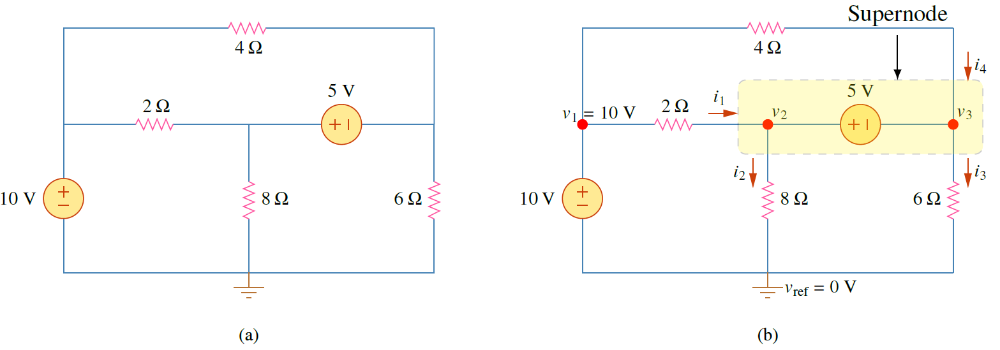
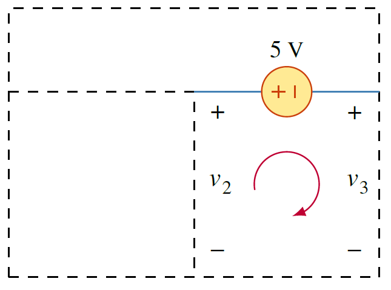
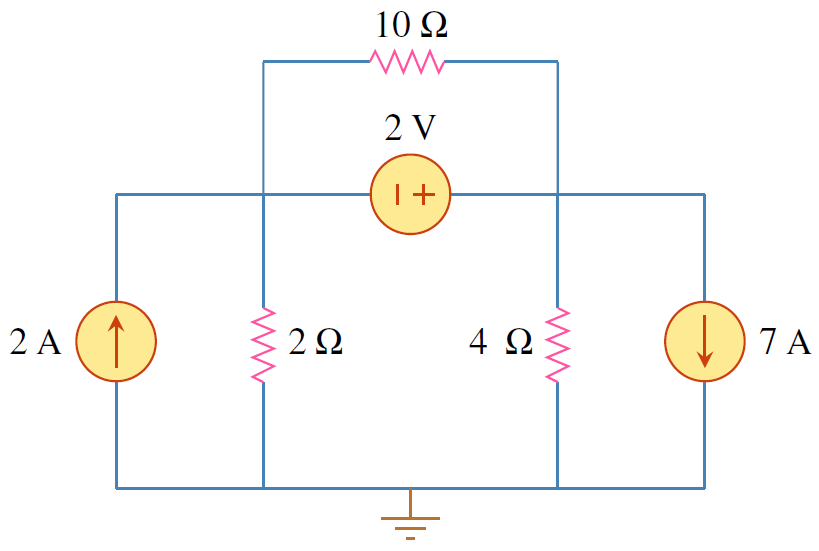
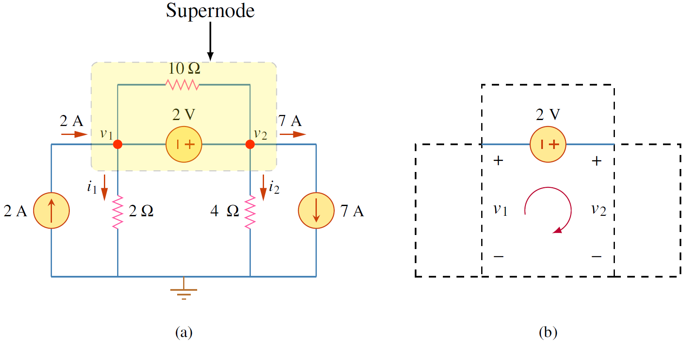
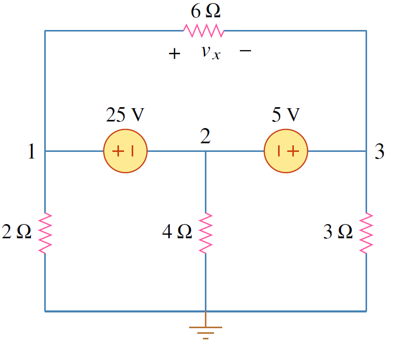
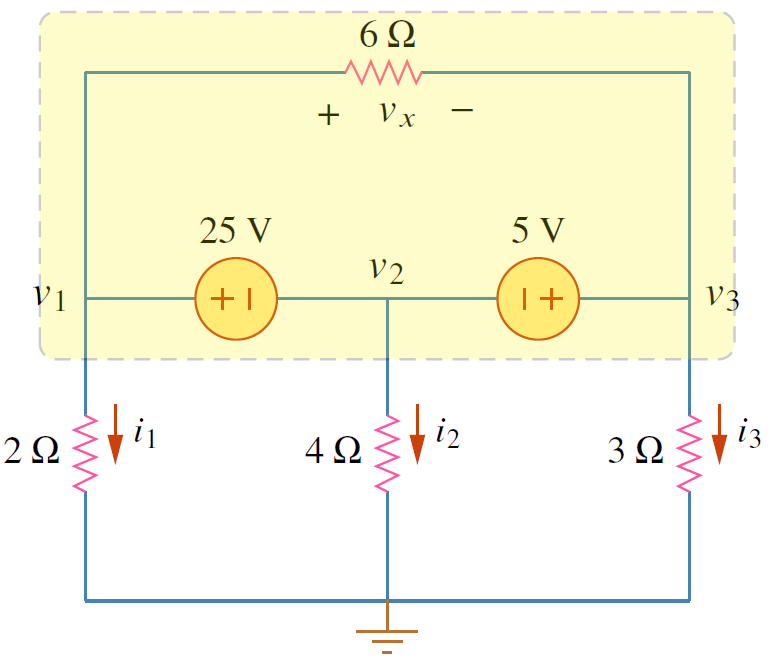

การมีแหล่งจ่ายแรงดันในวงจรทำให้การวิเคราะห์โหนดแบบเดิมทำไม่ได้เนื่องจากไม่ทราบค่ากระแสที่ไหลผ่านแหล่งจ่ายแรงดัน ดังนั้นการวิเคราะห์จึงต้องมีการปรับเปลี่ยน

<figure>

  

  <figcaption style='text-align:center'>รูปที่ 3.5 วงจรที่มีแหล่งจ่ายแรงดัน
</figcaption>
</figure>

ในรูปที่ 3.5(a) มีแหล่งจ่ายแรงดัน 2 ตัว โดยที่การต่อแหล่งจ่ายทั้งสองตัวต่างกันดังนี้
1. แหล่งจ่ายแรงดัน $10\\;\text{V}$ ต่อระหว่างโหนดอ้างอิงกับโหนดอื่น (โหนด $v_1$) เนื่องจากโหนดอ้างอิงมีแรงดันเป็น 0 ดังนั้นแรงดัน $v_1=10\\;\text{V}$ (แหล่งจ่ายแรงดันมีหน้าที่ทำให้แรงดันระหว่างสองจุดที่มันต่ออยู่มีค่าความต่างศักย์เท่ากับพิกัดของมัน ดังนั้น เนื่องจากแหล่งจ่ายแรงดันมีพิกัด $10\\;\text{V}$ และต่ออยู่ระหว่างแรงดัน $v_1$ และ $v_{ref}$ ดังนั้น $v_1 - v_{ref} = 10$ และเนื่องจาก $v_{ref}=0$ ดังนั้น $v_1 = 10\\;\text{V}$
2. แหล่งจ่ายแรงดัน $5\\;\text{V}$ ต่อระหว่างโหนดที่ไม่ใช่โหนดอ้างอิง ซึ่งอย่างที่กล่าวแล้วว่าไม่สามารถทราบค่ากระแสที่ไหลผ่านแหล่งจ่ายแรงดัน ดังนั้นเพื่อแก้ปัญหาดังกล่าวให้ ควบรวมโหนดทั้งสองที่มีแหล่งจ่ายแรงดันต่ออยู่เป็น supernode จากนั้นให้เขียน KCL ของ supernode นี้


Supernode คือ โหนดที่ครอบแหล่งจ่ายแรงดันและโหนดทั้งสองที่แหล่งจ่ายแรงดันต่ออยู่รวมถึงอุปกรณ์ไฟฟ้าทุกๆตัวที่ต่อขนานกับโหนดทั้งสองนี้



จำนวนโหนดที่รวมอยู่ใน super node อาจมีมากกว่าสองโหนดดังในรูปที่ 3.9


เมื่อได้ supernode แล้วให้ใช้ KCL หาสมการตามปกติดังนี้
$$
\begin{align}
                i_1+i_4&=i_2+i_3\nonumber\\\\
            \frac{v_1-v_2}{2}+\frac{v_1-v_3}{4}\nonumber&=\frac{v_2-0}{8}+\frac{v_3-0}{6}\\\\   
             \frac{10-v_2}{2}+\frac{10-v_3}{4}\nonumber&=\frac{v_2}{8}+\frac{v_3}{6}\\\\
                \frac{10}{2}+\frac{-v_2}{2}+\frac{10}{4}+\frac{-v_3}{4}\nonumber&=\frac{v_2}{8}+\frac{v_3}{6}\\\\
                \frac{v_2}{8}+\frac{v_3}{6}+\frac{v_2}{2}+\frac{v_3}{4}\nonumber&=\frac{10}{2}+\frac{10}{4}\\\\
                \frac{5}{8}v_2+\frac{10}{24}v_3&=\frac{30}{4} \label{eq3:supernode} \tag{3.12}
            \end{align}
$$
ได้สมการที่มี 2 ตัวแปร ซึ่งยังไม่สามารถแก้สมการได้ ยังขาดอีกหนึ่งสมการ ซึ่งสมการที่ขาดหาได้จากความสัมพันธ์ของแหล่งจ่ายแรงดันกับโหนดทั้งสองที่แหล่งจ่ายแรงดันต่ออยู่

<figure>

  

  <figcaption style='text-align:center'>รูปที่ 3.6 Supernode ใช้หาความสัมพันธ์ของแรงดันโหนดที่แหล่งจ่ายแรงดันต่ออยู่
</figcaption>
</figure>

จากรูปที่ 3.6 ใช้ KVL หาความสัมพันธ์ของแหล่งจ่ายแรงดันกับแรงดันโหนดทั้งสองได้ดังนี้
$$
           \begin{align}
                -v_2+5+v_3&=0\nonumber\\\\
                v_2-v_3&=5 \label{eq3:supernode2}\tag{3.13}
            \end{align}
$$
แก้สมการ \eqref{eq3:supernode}  และ \eqref{eq3:supernode2} ได้ แรงดันโหนด $v_2=9.2\\;\text{V}$ และ $v_3=4.2\\;\text{V}$


1. แหล่งจ่ายแรงดันใน supernode  ใช้สร้างสมการความสัมพันธ์กับแรงดันโหนด
2. supernode ไม่มีแรงดันโหนดของตัวมันเอง
3. supernode ต้องการทั้ง KVL และ KCL ในการแก้สมการ


## ตัวอย่าง 3.3 

จงหาแรงดันโหนด

<figure>

  

  <figcaption style='text-align:center'>รูปที่ 3.7 วงจรสำหรับตัวอย่าง 3.3
</figcaption>
</figure>

คำตอบ

เนื่องจากมีแหล่งจ่ายแรงดัน  1 ตัว พิจารณาดังนี้

แหล่งจ่ายแรงดัน 2V ต่อระหว่างโหนดที่ไม่ใช่โหนดอ้างอิง ดังนั้นให้พิจาณาโหนด 1 และ โหนด 2 รวมทั้งแหล่งจ่ายแรงดัน 2V และตัวต้านทาน $10\\;\Omega$  (เนื่องจากต่อขนานกับโหนดทั้งสองซึ่งมีแหล่งจ่ายแรงดันต่ออยู่) เป็น Supernode

<figure>

  

  <figcaption style='text-align:center'>รูปที่ 3.8 
</figcaption>
</figure>

พิจารณาโหนด Supernode
$$
            \begin{align}
                i_1+i_2+7&=2\nonumber\\\\
                \frac{v_1}{2}+\frac{v_2}{4}&=2-7=-5 \label{eq3:ex2-sup-node1}\tag{3.14}
            \end{align}
$$
ใช้กฏ KVL หาความสัมพันธ์ $v_1$ และ $v_2$
$$
\begin{align}
                -v_1-2+v_2&=0\nonumber\\\\
                -v_1+v_2&=2 \label{eq3:ex2-sup-node2} \tag{3.15}
            \end{align}
$$
แก้สมการ \ref{eq3:ex2-sup-node1} และ \ref{eq3:ex2-sup-node2} หาคำตอบได้ แรงดันโหนด $v_1=-7.33\\;\text{V}$ และ $v_2=-5.33\\;\text{V}$



## ตัวอย่าง 3.4 

จงหาแรงดันโหนด และแรงดัน $v_x$

<figure>

  

  <figcaption style='text-align:center'>รูปที่ 3.9 วงจรสำหรับตัวอย่าง 3.4 
</figcaption>
</figure>

คำตอบ

เนื่องจากมีแหล่งจ่ายแรงดัน  2 ตัวต่ออยู่จากโหนด 1 ถึง โหนด 3 จึงต้องสร้าง supernode ครอบโหนด 1 ถึง โหนด 3 (ตัวต้านทาน 6 $\Omega$ อยู่ใน supernode ด้วยเนื่องจากต่อขนานโหนดที่อยู่ใน supernode)  ดังรูปที่ 3.10

<figure>

  

  <figcaption style='text-align:center'>รูปที่ 3.10  
</figcaption>
</figure>

พิจารณาโหนด Supernode
$$
            \begin{align}
                i_1+i_2+i_3&=0\nonumber\\\\
                \dfrac{v_1}{2}+\dfrac{v_2}{4}+\dfrac{v_3}{3}&=0 \label{eq3:ex2-sup2-node1}\tag{3.16}
            \end{align}
$$
พิจารณาแหล่งจ่ายแรงดัน 25 V ซึ่งต่อระหว่างโหนด 1 และ โหนด 2 เนื่องจากหน้าที่ของแหล่งจ่ายแรงดันคือทำให้โหนดที่ต่อที่ ขั้วบวกมีแรงดันสูงกว่าโหนดที่ต่อที่ขั้วลบดังนั้น
$$
\begin{align}
                v_1-v_2&=25 \label{eq3:ex2-sup2-node2}\tag{3.17}
            \end{align}
$$
พิจารณาแหล่งจ่ายแรงดัน 5 V ซึ่งต่อระหว่างโหนด  2 และ โหนด 3 เนื่องจากหน้าที่ของแหล่งจ่ายแรงดันคือทำให้โหนดที่ต่อที่ขั้วบวกมีแรงดันสูงกว่าโหนดที่ต่อที่ขั้วลบดังนั้น
$$
\begin{align}
v_3-v_2&=5 \label{eq3:ex2-sup2-node3}\tag{3.18}
\end{align}
$$            
แก้สมการ \ref{eq3:ex2-sup2-node1}, \ref{eq3:ex2-sup2-node2} และ \ref{eq3:ex2-sup2-node3} หาคำตอบได้ แรงดันโหนด $v_1=11.92\\;\text{V}$,
$v_2=-13.08\\;\text{V}$ และ $v_3=-8.08\\;\text{V}$
ส่วน $v_x = v_1 - v_3=11.92- (-8.08)= 20\\;\text{V}$ 
หรือหา $v_x$ โดยใช้ KVL ได้ $v_x+5-25=0$ ย้ายฝั่งได้ $v_x=20\\;\text{V}$



