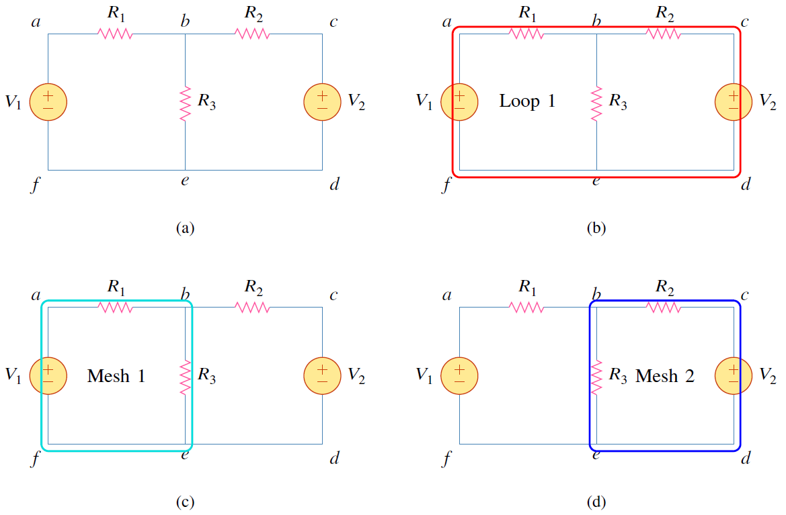
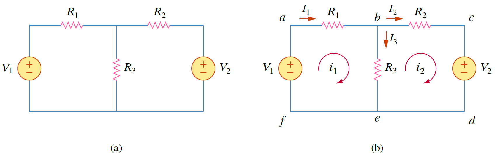
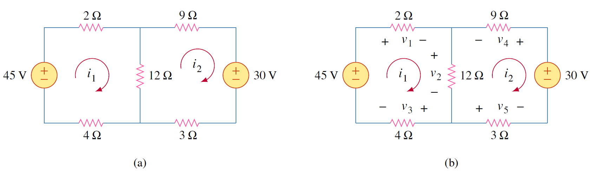

การวิเคราะห์แมชเป็นอีกวิธีหนี่งในการวิเคราห์วงจรไฟฟ้า โดยใช้กระแสแมชเป็นตัวแปรแทนการใช้กระแสที่ผ่านอุปกรณ์เป็นตัวแปรทำให้ลดจำนวนสมการซึ่งช่วยให้การวิเคราะห์วงจรง่ายขึ้น

## **แมชคืออะไร**

อย่างที่ทราบแล้วว่า ลูปคือเส้นทางที่เริ่มและสิ้นสุดที่จุดเดิมและผ่านแต่ละอุปกรณ์เพียงครั้งเดียว แมชก็คือลูปโดยที่เป็นลูปที่ไม่มีลูปอื่นซ้อนอยู่ภายใน หรือกล่าวอีกนัยหนึ่งว่า แมชคือลูปที่เล็กที่สุด


แมชก็คือลูปโดยที่เป็นลูปที่ไม่มีลูปอื่นซ้อนอยู่ภายใน หรือกล่าวอีกนัยหนึ่งว่า แมชคือลูปที่เล็กที่สุด


<figure>

  

  <figcaption style='text-align:center'>รูปที่ 3.11 ความแตกต่างระหว่างแมชและลูป
</figcaption>
</figure>


การวิเคราะห์แมชใช้ได้เฉพาะวงจรที่ทุกอุปกรณ์อยู่บนระนาบสองมิติ (planar circuit) กล่าวคือการต่อเชื่อมของแต่ละอุปกรณ์จะต้องไม่มีอุปกรณ์ไหนอยู่ ซ้อนเหนืออุปกรณ์อื่น หรือต่อข้ามอุปกรณ์อื่น (ให้นึกภาพของแผ่นกระดาษเทียบกับกล่อง ในกรณีของกระดาษเป็นสองมิติ (planar) ส่วนกล่องเป็นสามมิติ (nonplanar)) หรือคิดถึงการเขียนเส้นบนกระดาษ วงจรที่เป็นวงจรระนาบจะต้องสามารถเขียนเส้นวงจรโดยไม่มีเส้นใดซ้อนทับเส้นอื่น


## **ขั้นตอนการหากระแสแมช**
1. กำหนดกระแสแมช $i_1,\\;i_2,\\;\cdots,i_n$ ให้กับแมชที่ 1 ถึงแมชที่ $n$ ตามลำดับ
2. ใช้กฎ KVL ในแต่ละแมช
3. ใช้กฎของโอห์ม หาแรงดันในรูปของกระแสแมช
4. แก้สมการที่ได้เพื่อหากระแสแมช



## **รายละเอียดของแต่ละขั้นตอน**

ในการอธิบายขั้นตอนจะใช้รูปที่ 3.12 ช่วยอธิบาย

<figure>

  

  <figcaption style='text-align:center'>รูปที่ 3.12 วงจรสำหรับการอธิบายขั้นตอนการวิเคราะห์แมช
</figcaption>
</figure>

ขั้นตอนแรกกำหนดกระแสแมชโดยในวงจรในรูปที่ 3.12(a) มี 2 แมช คือแมชตามเส้นทาง abefa และ bcdeb โดยกำหนดกระแสแมชเป็น $i_1$ และ $i_2$ และกำหนดทิศกระแสแมชให้หมุนตามเข็มนาฬิกา


กระแสแมชให้ใช้ตัวอักษรภาษาอังกฤษตัวพิมพ์เล็ก ($i$)
 
ส่วนกระแสที่ไหลผ่านอุปกรณ์ให้ใช้ตัวอักษรภาษาอังกฤษตัวพิมพ์ใหญ่ ($I$)


ขั้นตอนที่ 2 ใช้กฎ KVLในแต่ละแมช
พิจารณาแมช 1
$$
\begin{equation*}
    -V_1 +R_1i_1 +R_3(i_1-i_2)=0
\end{equation*}
$$
ย้ายข้างและจัดรูปสมการใหม่ได้เป็น
$$
\begin{equation}
    (R_1+R_2)i_1 -R_3i_2=V_1 \tag{3.19}
\end{equation}
$$
ใช้ KVL กับแมช 2
$$
\begin{equation*}
    R_2i_2+V_2+R_3(i_2-i_1)=0
\end{equation*}
$$
ย้ายข้างและจัดรูปสมการใหม่ได้เป็น
$$
\begin{equation}
    -R_3i_1 + (R_2+R_3)i_2 = -V_2 \tag{3.20}
\end{equation}
$$
เมื่อได้สมการครบก็แก้สมการได้ค่ากระแสแมช $i_1$ และ $i_2$
สำหรับในรูปที่ 3.12(b) ค่ากระแสที่ผ่านอุปกรณ์คือ
$$
\begin{equation}
    I_1=i_1,\quad I_2=i_2,\quad I_3=i_1-i_2 \tag{3.21}
\end{equation}
$$

### ตัวอย่าง 3.5

จงหากระแส $I_1, I_2, I_3$

<figure>

  

  <figcaption style='text-align:center'>รูปที่ 3.13 วงจรสำหรับตัวอย่าง 3.5
</figcaption>
</figure>

คำตอบ

เริ่มขั้นตอนแรกโดยการกำหนดแมชจากนั้นกำหนดกระแสแมชและทิศการไหลตามเข็ม
แล้วเขียน KVL โดยเริ่มจากแมช 1
$$
 \begin{align}
                -15+5i_1+10(i_1-i_2)+10&=0\nonumber\\\\
                15i_1-10i_2&=5\nonumber\\\\
                3i_1-2i_2&=1 \label{eq3:ex-mesh1} \tag{3.22}
            \end{align}
$$
พิจารณา mesh 2
$$
\begin{align}
                -10+10(i_2-i_1)+6i_2+4i_2&=0\nonumber\\\\
                -10i_1+20i_2&=10\nonumber\\\\
                -i_1+2i_2&=1 \label{eq3:ex-mesh2} \tag{3.23}
            \end{align}
$$
แก้สมการ \eqref{eq3:ex-mesh1} และ \eqref{eq3:ex-mesh2} หาคำตอบได้ กระแสแมช $i_1=1\\;\text{A}$ และ $i_2=1\\;\text{A}$

เมื่อทราบกระแสแมช หากระแส $I_1, I_2, I_3$ได้ดังนี้
$$
   \begin{equation}
        I_1 = i_1=1\text{A},\\;I_2=i_2=1\text{A},\\;I_3=i_1-i_2=0\text{A} \tag{3.24}
   \end{equation}
$$


## **การกำหนดแรงดันในแมช โดยไม่สนทิศของกระแสแมช**

### ตัวอย่าง 3.6

จงหากระแสแมช $i_1, i_2$

<figure>

  

  <figcaption style='text-align:center'>รูปที่ 3.14 วงจรสำหรับตัวอย่าง 3.6
</figcaption>
</figure>

คำตอบ

สังเกตการกำหนดทิศแรงดันในแมช 2 ซึ่งกำหนดโดยไม่ได้สนใจทิศของกระแสแมช $i_2$

ดังนั้นเมื่อวน KVL ก็ให้วนตามทิศแรงดันที่เจอ

แต่เมื่อต้องการใช้กฎของโอห์ม ต้องยึดว่า $v=+iR$ เมื่อกระแสไหลเข้าขั้วบวกของแรงดันของตัวต้านทาน

แต่ในกรณีกระแสแมช $i_2$ กระแสไหลเข้าขั้วลบของแรงดันของตัวต้านทาน

ดังนั้นกฎของโอห์มจึงเป็น $v=-iR$

พิจารณาแมช $i_1$
$$
    \begin{align}
                -45+v_1+v_2+v_3&=0\nonumber\\\\
                -45+2i_1+12(i_1-i_2)+4i_1&=0\nonumber\\\\
                18i_1-12i_2&=45 \label{eq3:ex-mesh2-1} \tag{3.25}
            \end{align}
$$
พิจารณาแมช $i_2$
$$
         \begin{align}
                +30-v_5-v_2-v_4&=0\nonumber\\\\
                -(-3i_2)-(-12(i_2-i_1))-(-9i_2)&=-30\nonumber\\\\
                3i_2+12(i_2-i_1)+9i_2&=-30\nonumber\\\\
                -12i_1+24i_2&=-30 \label{eq3:ex-mesh2-2} \tag{3.26}
            \end{align}
$$
คูณ 2 กับสมการ \eqref{eq3:ex-mesh2-1} ได้
$$
\begin{equation}
    36i_1-24i_2=90 \label{eq3:ex-mesh2-3} \tag{3.27}
\end{equation}
$$
และนำสมการ \eqref{eq3:ex-mesh2-3} บวก  \eqref{eq3:ex-mesh2-2} ได้
$$
 \begin{align*}
                24i_1&=60\nonumber\\\\
                i_1&=\frac{60}{24}=2.5\mathrm{A}\notag
            \end{align*}
$$
แทนค่า $i_1$ ในสมการ \eqref{eq3:ex-mesh2-2} ได้ $i_2=0\mathrm{A}$

สรุปคำตอบได้ กระแสแมช $i_1=2.5\mathrm{A},\\;\\;i_2=0\mathrm{A}$

