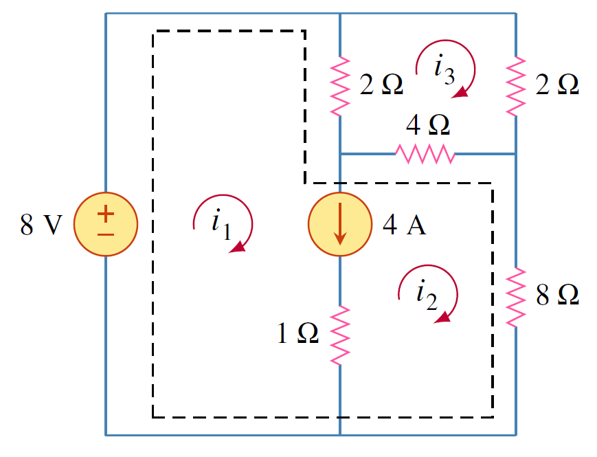

การวิเคราะห์แยกเป็น 2 กรณีดังนี้
1. แหล่งจ่ายกระแสปรากฏในแมชเดียว ดังรูปที่ 3.15 ซึ่งทำให้หากระแสแมช 2 $i_2=-5\mathrm{A}$ และเขียน KVL สำหรับแมช 1 ได้เป็น
$$
    \begin{equation}
        -10+4i_1+6(i_1-i_2)=0 \quad \rightarrow \quad i_1=-2\mathrm{A}
    \end{equation}
$$

<figure>

  

  <figcaption style='text-align:center'>รูปที่ 3.15 วงจรสำหรับการวิเคราะห์แมชที่มีแหล่งจ่ายกระแส
</figcaption>
</figure>

2. แหล่งจ่ายกระแสปรากฏระหว่างสองแมชซึ่งจะไม่สามารถเขียน KVL ได้เนื่องจากไม่ทราบแรงดันตกคร่อมแหล่งจ่ายกระแส วิธีแก้คือสร้าง supermesh เพื่อซ่อนแหล่งจ่ายกระแสและอุปกรณ์ไฟฟ้าใดๆที่ต่ออนุกรมกับมัน ดังแสดงในรูปที่ 3.16(b)

<figure>

  

  <figcaption style='text-align:center'>รูปที่ 3.16 
</figcaption>
</figure>

3. จากนั้นให้เขียน KVL รอบ supermesh โดยที่เพื่อวนมาถึงแมชใด ก็ให้ใช้กระแสแมชนั้นในการคำนวณแรงดัน ดังต่อไปนี้
$$
\begin{align}
    -20+6i_1+10i_2+4i_2&=0\nonumber\\\\
    6i_1+14i_2&=20 \label{eq3:case2-1} \tag{3.29}
\end{align}
$$
ได้หนึ่งสมการสองตัวแปร สมการที่เหลือหาจากความสัมพันธ์ระหว่างกระแสแมชกับแหล่งจ่ายกระแสโดยใช้ KCL ที่โหนด 0 ดังนี้
$$
\begin{equation}
    i_2=i_1+6  \label{eq3:case2-2} \tag{3.30}
\end{equation}
$$
แก้สมการ \eqref{eq3:case2-1} และ \eqref{eq3:case2-2} ได้ 
$$
\begin{equation}
    i_1=-3.2\\;\mathrm{A} \quad i_2=2.8\\;\mathrm{A} \tag{3.31}
\end{equation}
$$


ข้อสังเกตเกี่ยวกับ supermesh
1. แหล่งจ่ายกระแสใน supermesh ใช้สร้างสมการความสัมพันธ์กับกระแสแมช
2. supermesh ไม่มีกระแสแมชของตัวมันเอง
3. supermesh ต้องการทั้ง KVL และ KCL ในการแก้สมการ


ตัวอย่าง 3.7 จงหากระแสแมช $i_1, i_2, i_3$

<figure>

  

  <figcaption style='text-align:center'>รูปที่ 3.17 วงจรสำหรับตัวอย่าง 3.7
</figcaption>
</figure>

คำตอบ

เขียน KVL สำหรับ supermesh ดังนี้
$$
\begin{align}
                -8+2(i_1-i_3)+4(i_2-i_3)+8i_2&=0\nonumber\\\\
                2i_1+12i_2-6i_3&=8 \label{eq3:supermesh-1} \tag{3.32}
            \end{align}
$$
เขียน KVL สำหรับ mesh $i_3$
$$
            \begin{align}
                2(i_3-i_1)+2i_3+4(i_3-i_2)&=0\nonumber\\\\   
                -2i_1-4i_2+8i_3&=0 \label{eq3:supermesh-2} \tag{3.33}
            \end{align}
$$
หาความสัมพันธ์กระแสแมชและแหล่งจ่ายกระแส
$$
            \begin{align}
                i_1-i_2&=4 \label{eq3:supermesh-3} \tag{3.34}
            \end{align}
$$
แก้สมการ \eqref{eq3:supermesh-1}   \eqref{eq3:supermesh-2} และ  \eqref{eq3:supermesh-3}  
 หาคำตอบได้ กระแสแมช \
$$
 \begin{equation*}
  i_1=\frac{88}{19}=4.63\mathrm{A},\\;i_2=\frac{12}{19}=0.63\mathrm{A},\\; i_3=\frac{28}{19}=1.47\mathrm{A}
 \end{equation*}
$$

<figure>

  

  <figcaption style='text-align:center'>รูปที่ 3.18 
</figcaption>
</figure>
