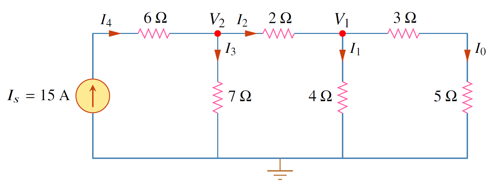

## คุณสมบัติเชิงเส้น

คุณสมบัติเชิงเส้นที่ช่วยวิเคราะห์วงจรคือ homogeneity (scaling) และ additivity

### homogeneity

เป็นคุณสมบัติที่บอกว่าเมื่อวงจรไฟฟ้ามีการเปลี่ยนแปลงอินพุทเป็นจำนวน $k$ เท่าของค่าเดิม การเปลี่ยนแปลงเอาท์พุทก็จะเป็นจำนวน $k$ เท่าของเอาท์พุทเดิมเช่นกัน
ตัวอย่างเช่นตัวต้านทาน จากกฏโอห์ม อินพุท $i$ สัมพันธ์กับเอาท์พุท $v$ ดังนี้
$$
\begin{equation}
    v=iR    \tag{4.1}
\end{equation}
$$
ถ้ากำหนดให้อินพุทเดิมเป็น $i_{old}$ จากกฏโอห์ม เอาท์พุทเดิม $v_{old}$ คือ
$$
\begin{equation}
    v_{old}=i_{old}R \tag{4.2}
\end{equation}
$$
ถ้าอินพุทใหม่เป็น $i_{new}=ki_{old}$ จะได้เอาท์พุทใหม่ $v_{new}$ เป็น
$$
\begin{equation}
    v_{new}=i_{new}R=ki_{old}R=kv_{old} \tag{4.3}
\end{equation}
$$

### additivity

การตอบสนองของวงจรต่ออินพุทหลายตัว เป็นผลรวมของการตอบสนองของวงจรต่ออินพุทแต่ละตัว
ตัวอย่างเช่นถ้ามีอินพุทเป็น $i_1$ และ $i_2$ ค่าเอาท์พุท $v_1$ และ $v_2$ คือ
$$
\begin{align}
    v_1&=i_1R  \tag{4.4}\\\\
    v_2&=i_2R  \tag{4.5}
\end{align}
$$
ถ้าอินพุทเป็น $i_1+i_2$ เอาท์พุทคือ
$$
\begin{equation}
    v=(i_1+i_2)R=i_1R+i_2R=v_1+v_2  \tag{4.6}
\end{equation}
$$
เนื่องจากตัวต้านทานมีคุณสมบัติทั้งสองอย่าง ดังนั้น ตัวต้านทานเป็นอุปกรณ์ที่เป็นเชิงเส้น 

โดยทั่วไปถ้าวงจรมีคุณสมบัติ homogeneity และ additivity วงจรนั้นเป็นวงจรเชิงเส้น


สมมุติให้ $I_o=1$ จงใช้คุณสมบัติความเป็นเชิงเส้น หาค่ากระแสจริงของ $I_o$

<figure>

  

  <figcaption style='text-align:center'>รูปที่ 4.1 วงจรสำหรับตัวอย่าง 4.1
</figcaption>
</figure>

คำตอบ

ถ้า $I_o=1\mathrm{A}$ แรงดัน $V_1=(3+5)I_o=8\mathrm{V}$ และ $I_1=V_1/4=2\mathrm{A}$

ใช้ KCL ที่ โหนด 1  $:$
$$       
\begin{align*}
           I_2&=I_1+I_o=3\mathrm{A}\\\\
           V_2&=V_1+2I_2=8+6=14\mathrm{V}\\\\
           I_3&=\frac{V_2}{7}=2\mathrm{A}
\end{align*}
$$      
ใช้ KCL ที่ โหนด 2 $:$ $I_4=I_3+I_2=5\mathrm{A}$

ดังนั้น $I_s=5 \mathrm{A}$ แต่ค่าจริงของ $I_s=15\mathrm{A}$ ซึ่งมากกว่าค่าสมมุติ 3 เท่า

ดังนั้นค่าจริงของ $I_o=3(1)=3\mathrm{A}$

