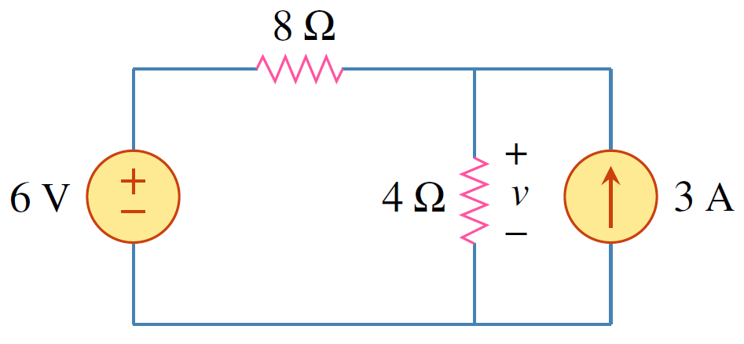
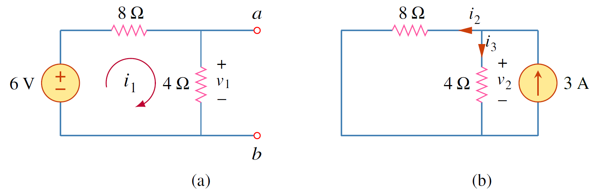
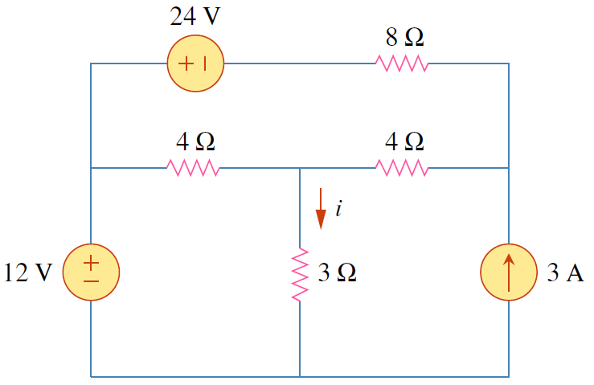
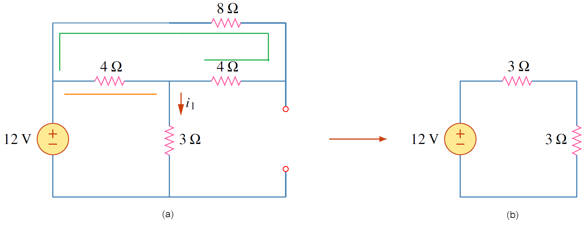
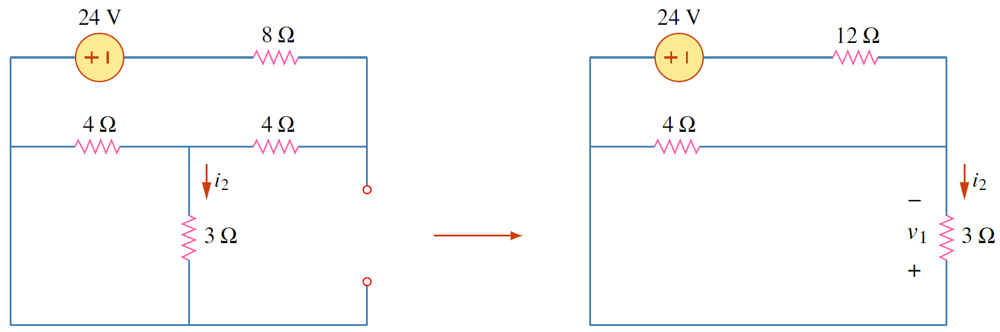
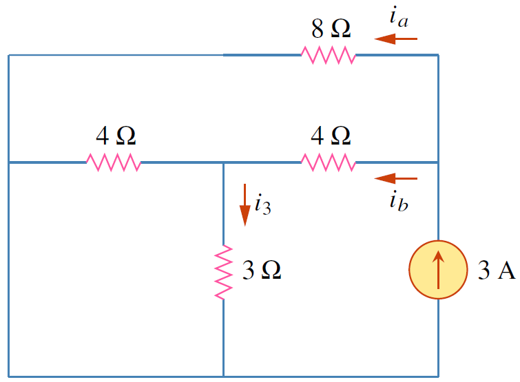

## การวางทับซ้อน (Superposition)

การแก้ปัญหาโดยใช้โหนดหรือแมชถ้าวงจรมีจำนวนโหนดหรือแมชมากการแก้โจทย์ทำได้ช้า การใช้การวางทับซ้อนช่วยให้การแก้ปัญหาทำได้ง่าย ซึ่งอาศัยคุณสมบัติเชิงเส้นข้อ additivity โดยการแก้ปัญหาทีละแหล่งจ่าย


นิยาม 4.1
การวางทับซ้อน (Superposition) กล่าวว่า แรงดันที่ตกคร่อม (หรือกระแสที่ไหลผ่าน) อุปกรณ์ไฟฟ้าในวงจรเชิงเส้นเป็นผลรวมแรงดันที่ตกคร่อม (หรือกระแสที่ไหลผ่าน) อุปกรณ์ไฟฟ้าตัวนั้น ที่เป็นผลมาจากแหล่งจ่ายอิสระทีละแหล่งกระทำต่อวงจร


### การกำจัดแหล่งจ่ายอิสระ

หลักการของการวางทับซ้อนคือการพิจารณาผลการกระทำต่อวงจรของทีละแหล่งจ่าย ดังนั้นกรณีมีแหล่งจ่าย $n$ ตัว ก็จะต้องกำจัดแหล่งจ่ายให้เหลือเพียงตัวเดียวแล้วค่อยวิเคราะห์วงจร  และจะต้องทำอย่างนี้จนครบทุกแหล่งจ่าย

การกำจัดแหล่งจ่ายมีหลักดังนี้
1. แหล่งจ่ายแรงดันให้ลัดวงจร ซึ่งทำให้แหล่งจ่ายดังกล่าวไม่มีผลต่อวงจร
2. แหล่งจ่ายกระแสให้เปิดวงจร

### ขั้นตอนการใช้หลักการวางทับซ้อน
1. ปิดการทำงานของแหล่งจ่ายอิสระให้เหลือเพียงแหล่งจ่ายเดียว หลังจากนั้นคำนวณหาค่าที่ต้องการ
2. วนทำซ้ำขั้นตอนที่ 1 จนครบทุกแหล่งจ่ายอิสระ
3. หาผลลัพธ์ที่ต้องการโดยนำค่าของผลลัพธ์แต่ละแหล่งจ่ายมาบวกรวมกัน

ข้อเสียของการแก้ปัญหาด้วยการวางทับซ้อนคือถ้ามีจำนวนแหล่งจ่ายมาก ก็จะเสียเวลาในการวิเคราะห์มากตามไป แต่ข้อดีคือสามารถวิเคราะห์วงจรซับซ้อนได้ง่าย


การวางทับซ้อนใช้ได้เฉพาะวงจรที่มีความสัมพันธ์อินพุทและเอาท์พุทเป็นเชิงเส้นเท่านั้น



จงใช้ Superposition หาแรงดัน $v$

<figure>

  

  <figcaption style='text-align:center'>รูปที่ 4.2 วงจรสำหรับตัวอย่าง 4.2
</figcaption>
</figure>

คำตอบ

พิจารณาทีละแหล่งจ่าย โดยพิจารณาแหล่งจ่ายแรงดัน $6\mathrm{V}$ ดังนั้นกำจัดแหล่งจ่ายกระแสโดยการเปิดวงจร ดังรูปที่ 4.3(a)
  หาแรงดัน $v_1$ โดยการแบ่งแรงดันได้
  $$
  \begin{equation*}
      v_1=\left(\frac{4}{12}\right)6=2\mathrm{V}
  \end{equation*}
  $$
  พิจารณาแหล่งจ่ายกระแส ดังนั้นกำจัดแหล่งจ่ายแรงดันโดยการลัดวงจรดังรูปที่ 4.3(b)
  หากระแส $i_3$ ด้วยการแบ่งกระแส
  $$
  \begin{equation*}
    i_3=\dfrac{8}{8+4}(3)=2\mathrm{A}
\end{equation*}
$$
ใช้กฎโอห์มหาแรงดัน $v_2$
$$
\begin{equation*}
    v_2=i_3(4)=2\times4=8\mathrm{V}
\end{equation*}
$$
ดังนั้นแรงดัน $v$ คือ
$$
\begin{equation*}
    v=v_1+v_2=2+8=10\mathrm{V}
\end{equation*}
$$

<figure>

  

  <figcaption style='text-align:center'>รูปที่ 4.3 </figcaption>
</figure>



ตัวอย่าง 4.3 จงใช้ Superposition หาแรงดัน $v$

<figure>

  

  <figcaption style='text-align:center'>รูปที่ 4.4 วงจรสำหรับตัวอย่าง 4.3
</figcaption>
</figure>

คำตอบ

พิจารณาทีละแหล่งจ่าย โดยพิจารณาแหล่งจ่ายแรงดัน $12\mathrm{V}$ ดังรูปที่ 4.5

<figure>

  

  <figcaption style='text-align:center'>รูปที่ 4.5 พิจารณาเฉพาะแหล่งจ่ายแรงดัน $12\mathrm{V}$</figcaption>
</figure>

จากรูปที่ 4.5(a) หาความต้านรวม (ที่ต่อในแนวนอนระหว่างแหล่งจ่ายแรงดัน $12\mathrm{V}$ กับความต้าน $3\Omega$ ในแนวตั้ง)ได้เป็น $(8\Omega + 4\Omega)||(4\Omega)=3\Omega$

จากรูปที่ 4.5(b) ใช้กฎของโอห์ม
$$
    \begin{align}
                i_1&=\frac{12}{6}=2\mathrm{A} \tag{4.7}
    \end{align}
$$

พิจารณาเฉพาะแหล่งจ่ายแรงดัน $24\mathrm{V}$ ดังรูปที่ 4.6
<figure>

  

  <figcaption style='text-align:center'>รูปที่ 4.6 พิจารณาเฉพาะแหล่งจ่ายแรงดัน $24\mathrm{V}$</figcaption>
</figure>

ใช้กฎแบ่งแรงดัน
$$
      \begin{align*}
          v_1&=\left(\frac{12/7}{12+12/7}\right)24\nonumber\\\\
          v_1&=\left(\frac{12}{96}\right)24=3\mathrm{V}\nonumber
      \end{align*}
$$
จากกฎของโอห์ม
$$
      \begin{equation}
          i_2=-\dfrac{v_1}{3}=-1\mathrm{A}  \tag{4.8}
      \end{equation}
$$

พิจารณาแหล่งจ่ายกระแส ดังนั้นกำจัดแหล่งจ่ายแรงดันโดยการลัดวงจรดังรูปที่ 4.7

<figure>

  

  <figcaption style='text-align:center'>รูปที่ 4.7 พิจารณาเฉพาะแหล่งจ่ายกระแส $3\mathrm{A}$</figcaption>
</figure>

หากระแส $i_b$ ด้วยการแบ่งกระแส จาก แหล่งจ่ายกระแส $3\\;\mathrm{A}$
$$
  \begin{align*}
      i_b&=\left(\frac{8}{8+4+12/7}\right)3\nonumber\\\\
      i_b&=\left(\frac{56}{84+12}\right)3\nonumber\\\\
      i_b&=\left(\frac{56}{96}\right)3=\frac{7}{4}\\;\mathrm{A}\nonumber\\\\
  \end{align*}
$$

หากระแส $i_3$ ด้วยการแบ่งกระแส จาก $i_b$
$$
  \begin{align}
      i_3&=\left(\frac{4}{4+3}\right)i_b=\left(\frac{4}{4+3}\right)\frac{7}{4}=1\mathrm{A} \tag{4.9}
  \end{align}
$$
ดังนั้น กระแส $i$ คือ
$$
\begin{equation*}
    i=i_1+i_2+i_3=2-1+1=2\mathrm{A}
\end{equation*}
$$



