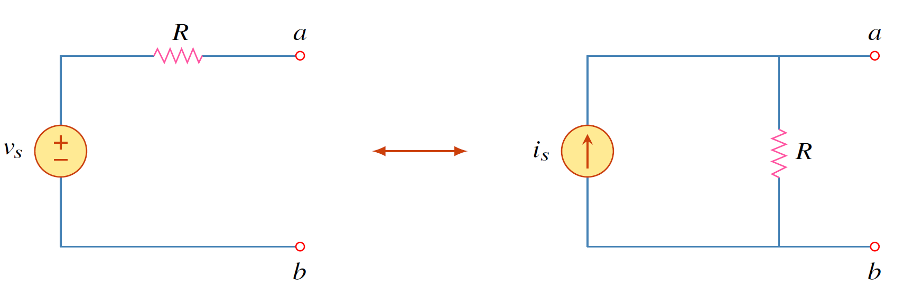

การแปลงแหล่งจ่ายเป็นอีกเครื่องมือช่วยให้การคำนวณหาค่าต่างๆง่ายขึ้น
การแปลงแหล่งจ่ายมีสองแบบคือ

1. การแปลงจากแหล่งจ่ายกระแสเป็นแหล่งจ่ายแรงดัน
2. การแปลงจากแหล่งจ่ายแรงดันเป็นแหล่งจ่ายกระแส
  
## หลักการแปลงแหล่งจ่าย


การแปลงแหล่งจ่ายคือการแทนแหล่งจ่ายแรงดัน $v_s$ ที่ต่ออนุกรมกับตัวต้านทาน $R$ ให้เป็นแหล่งจ่ายกระแส $i_s$ ที่ต่อขนานกับตัวต้านทาน $R$


<figure>

  

  <figcaption style='text-align:center'>รูปที่ 4.8 การแปลงแหล่งจ่าย
</figcaption>
</figure>
