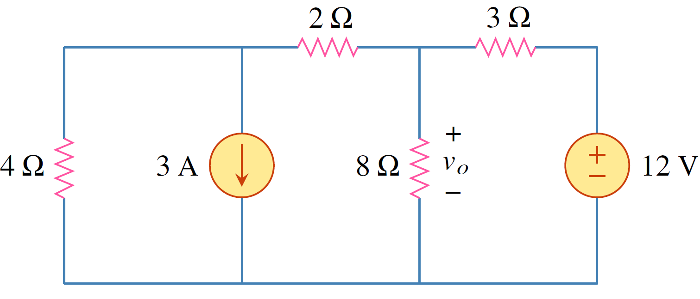
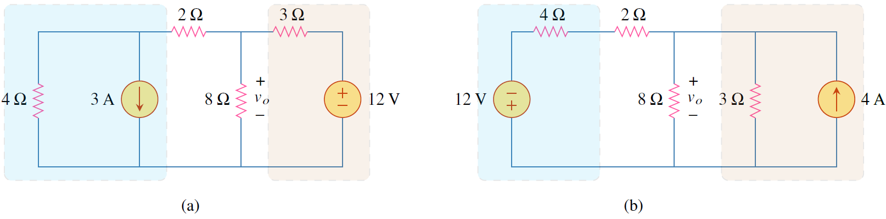

การแปลงแหล่งจ่ายเป็นอีกเครื่องมือช่วยให้การคำนวณหาค่าต่างๆง่ายขึ้น
การแปลงแหล่งจ่ายมีสองแบบคือ

1. การแปลงจากแหล่งจ่ายกระแสเป็นแหล่งจ่ายแรงดัน
2. การแปลงจากแหล่งจ่ายแรงดันเป็นแหล่งจ่ายกระแส
  
## หลักการแปลงแหล่งจ่าย


การแปลงแหล่งจ่ายคือการแทนแหล่งจ่ายแรงดัน $v_s$ ที่ต่ออนุกรมกับตัวต้านทาน $R$ ให้เป็นแหล่งจ่ายกระแส $i_s$ ที่ต่อขนานกับตัวต้านทาน $R$


<figure>

  

  <figcaption style='text-align:center'>รูปที่ 4.8 การแปลงแหล่งจ่าย
</figcaption>
</figure>

โดยที่ $v_s$ และ $i_s$ มีความสัมพันธ์ตามกฏของโอห์มดังนี้
$$
\begin{equation}
    v_s=i_sR \quad \text{หรือ} \quad i_s=\dfrac{v_s}{R}
\end{equation}
$$

## ข้อระวังเมื่อทำการแปลงแหล่งจ่าย


1. ทิศหัวลูกศรของแหล่งจ่ายกระแสชี้ไปยังขั้วบวกของแหล่งจ่ายแรงดัน
2. การแปลงแหล่งจ่ายแรงดันเป็นแหล่งจ่ายกระแสไม่สามารถทำได้ ถ้าตัวต้านทาน $R=0$
3. การแปลงแหล่งจ่ายกระแสเป็นแหล่งจ่ายแรงดันไม่สามารถทำได้ถ้าตัวต้านทาน $R=\infty$


ตัวอย่าง 4.4  จงใช้การแปลงแหล่งจ่าย หาแรงดัน $v_o$

<figure>

  

  <figcaption style='text-align:center'>รูปที่ 4.9 วงจรสำหรับตัวอย่าง 4.4
</figcaption>
</figure>

คำตอบ 

แปลงแหล่งจ่ายดังนี้

<figure>

  

  <figcaption style='text-align:center'>รูปที่ 4.10 
</figcaption>
</figure>

