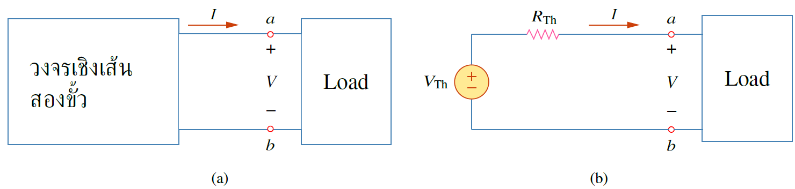
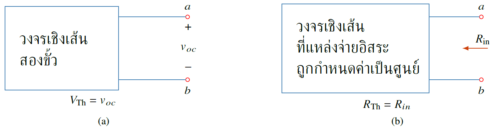
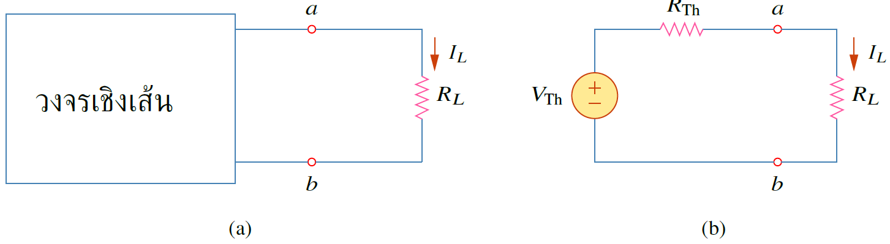
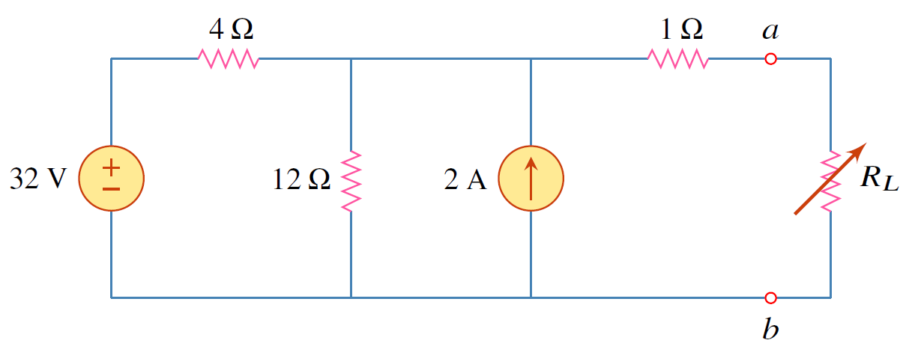
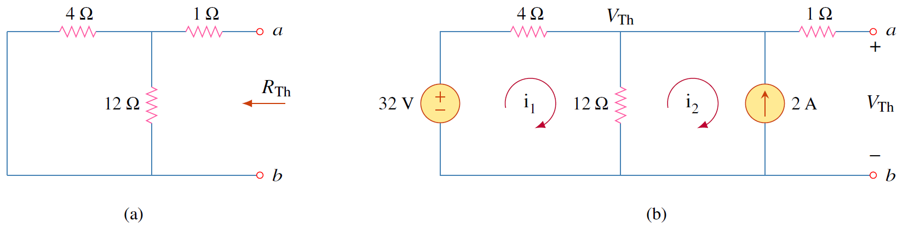
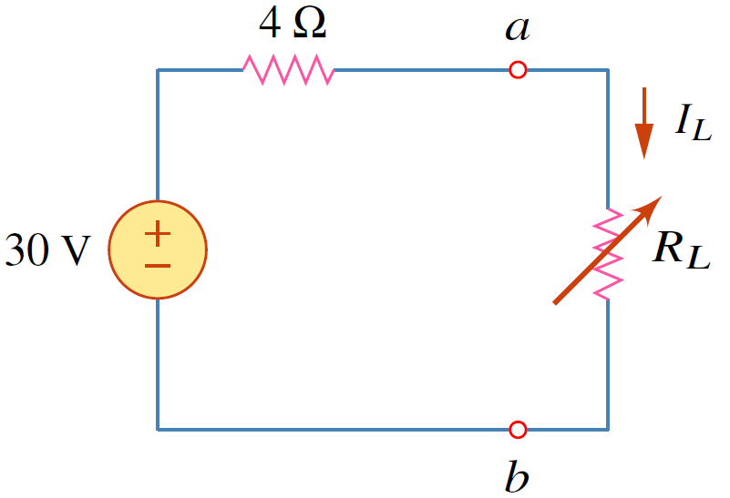

วงจรไฟฟ้าโดยทั่วไปสามารถแบ่งได้เป็นสองส่วน คือส่วนที่คงที่และส่วนที่เปลี่ยนแปลงได้ (หรือเรียกว่าโหลด) ตัวอย่างเช่นเต้าเสียบไฟในบ้านสามารถเสียบปลั๊กพัดลม หรือทีวีก็ได้ ซึ่งในการวิเคราะห์วงจไฟฟ้าเมื่อโหลดเปลี่ยนแปลงก็ต้องวิเคราะห์วงจรใหม่ทั้งหมด เพื่อเลี่ยงปัญหาดังกล่าว ทฤษฏีเทเวนิน ช่วยแทนส่วนวงจรคงที่ด้วยวงจรสมมูล 

<figure>

  

  <figcaption style='text-align:center'>รูปที่ 4.12 การใช้วงจรเทเวนินแทนวงจรเชิงเส้นสองขั้วที่มีความซับซ้อน </figcaption>
</figure>

ทฤษฏีเทเวนินกล่าวว่าวงจรเชิงเส้นสองขั้วในรูปที่ 4.12(a) สามารถแทนที่ด้วยวงจรสมมูลที่ประกอบด้วยแหล่งจ่ายแรงดัน $V_\text{Th}$ ต่ออนุกรมกับตัวต้านทาน $R_\text{Th}$ ดังรูปที่ 4.12(b)

วงจรซ้ายมือของขั้ว $a-b$ ในรูปที่ 4.12(b) คือวงจรเทเวนิน


นิยาม 4.2
ทฤษฏีเทเวนินกล่าวว่า วงจรเชิงเส้นสองขั้วใดๆ สามารถถูกแทนได้ด้วยวงจรสมมูลที่มีแหล่งจ่ายแรงดัน $V_\text{Th}$ ต่ออนุกรมกับตัวต้านทาน $R_\text{Th}$ โดยที่ $V_\text{Th}$ เป็นแรงดันเปิดวงจรที่ขั้ว $a-b$ และ $R_\text{Th}$ เป็นตัวต้านทานสมมูลที่ขั้ว $a-b$ เมื่อแหล่งจ่ายอิสระทุกตัวถูกกำจัด


<figure>

  

  <figcaption style='text-align:center'>รูปที่ 4.13 (a) วงจรสำหรับหาแรงดันเทเวนิน (b) วงจรสำหรับหาความต้านทานเทเวนิน </figcaption>
</figure>

<figure>

  

  <figcaption style='text-align:center'>รูปที่ 4.14 (a) วงจรเชิงเส้นต่อกับตัวต้านทาน $R_L$ (b) วงจรเชิงเส้นถูกแทนด้วยวงจรเทเวนิน </figcaption>
</figure>

รูปที่ 14.4(a) เป็นวงจรเชิงเส้นต่อกับต้านทาน $R_L$ โดยที่วงจรเชิงเส้นมีความซับซ้อน แต่สามารถแทนวงจรดังกล่าวโดยใช้วงจรสมมูลเทเวนินดังรูปที่ 14.4(b) ซึ่งทั้งสองวงจรจะให้ค่ากระแส $I_L$ เท่ากันซึ่งค่า $I_L$ หาจากกฏโอห์ม
$$
\begin{equation}
    I_L=\dfrac{V_\text{Th}}{R_\text{Th}+R_L}  \tag{4.11}
\end{equation}
$$
ส่วนแรงดัน $V_L$ หาจากการแบ่งแรงดัน
$$
\begin{equation}
    V_L=\dfrac{R_L}{R_L+R_\text{Th}}V_\text{Th} \tag{4.12}
\end{equation}
$$

ตัวอย่าง 4.5 จงหาวงจรเทเวนิน จากนั้นให้หากระแสที่ไหลผ่านตัวต้านทาน $R_L=6, 16, 36\\;\Omega$

<figure>

  

  <figcaption style='text-align:center'>รูปที่ 4.15 วงจรสำหรับตัวอย่าง 4.5</figcaption>
</figure>

คำตอบ 

การหาตัวต้านทานเทเวนิน($R_{\text{Th}}$) เริ่มด้วยการปิดแหล่งจ่ายแรงดัน 32V (แทนด้วยการลัดวงจร)
และแหล่งจ่ายกระแส $2\mathrm{A}$ (แทนด้วยการเปิดวงจร) ซึ่งได้วงจรในรูปที่ 4.16(a) ดังนั้น
$$
\begin{equation}
            R_{\text{Th}}=4 || 12 + 1 = \dfrac{4\times12}{16}+1=4\Omega \tag{4.13}
\end{equation}
$$

<figure>

  

  <figcaption style='text-align:center'>รูปที่ 4.16</figcaption>
</figure>

ส่วนการหาแรงดันเทเวนิน($V_{\text{Th}}$)
ใช้การวิเคราะห์แมชในรูปที่ 4.16(b)
    $$
    \begin{equation}
               -32+4i_1+12(i_1-i_2)=0, \qquad \qquad i_2=-2\mathrm{A} \tag{4.14}
    \end{equation}
    $$
แก้สมการได้ $i_1=0.5\mathrm{A} \qquad$ 

ดังนั้น
    $$
    \begin{equation}
              V_{\text{Th}}=12(i_1-i_2)=12(0.5+2.0)=30\mathrm{V} \tag{4.15}
    \end{equation}
    $$    
วงจรสมมูลเทเวนินแสดงดังรูปที่ 4.17

<figure>

  

  <figcaption style='text-align:center'>รูปที่ 4.17</figcaption>
</figure>

$$
    \begin{align*}
                I_L&=\frac{V_{\text{Th}}}{R_{\text{Th}}+R_L}=\frac{30}{4+R_L}
    \end{align*}
$$

$\qquad\qquad\qquad\qquad\qquad$ $  \quad R_L=6\Omega$,
 $          I_L=\dfrac{30}{10}=3\mathrm{A}$

$\qquad\qquad\qquad\qquad\qquad$  $\quad R_L=16\Omega$, $ I_L=\dfrac{30}{20}=1.5\mathrm{A}$

$\qquad\qquad\qquad\qquad\qquad$  $ \quad R_L=36\Omega$, $I_L=\dfrac{30}{40}=0.7\mathrm{A}$
