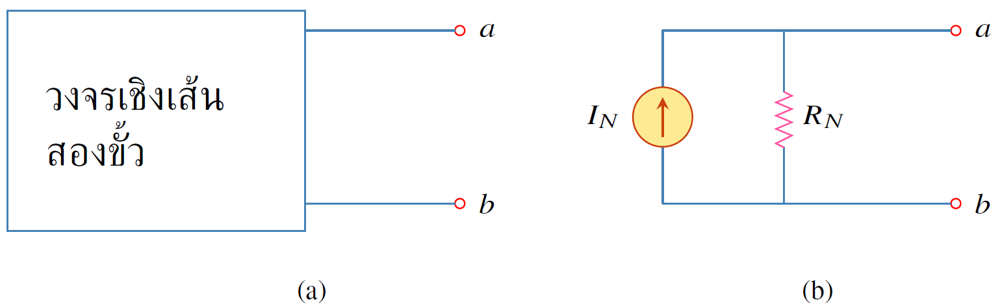
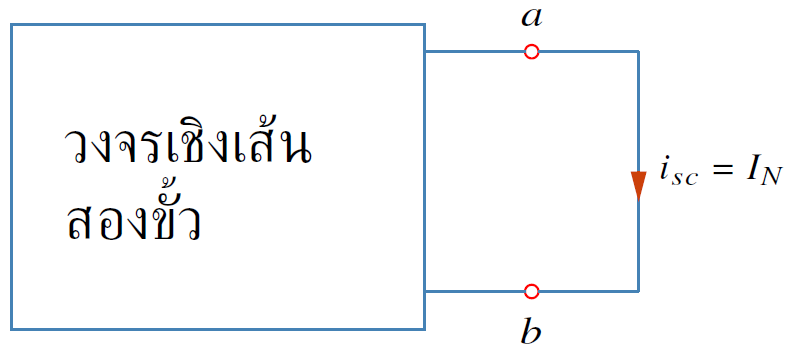
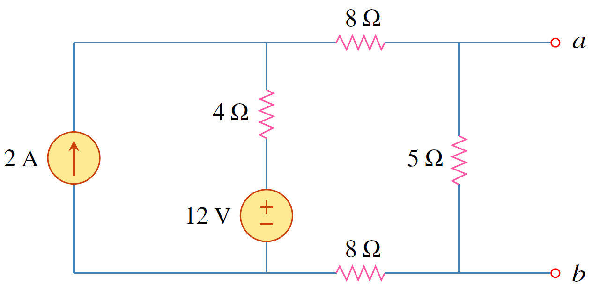
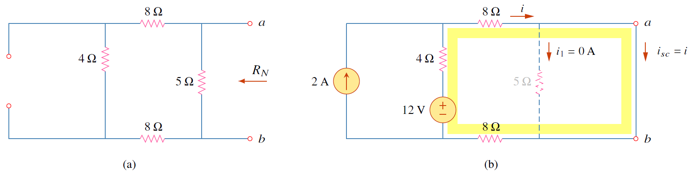
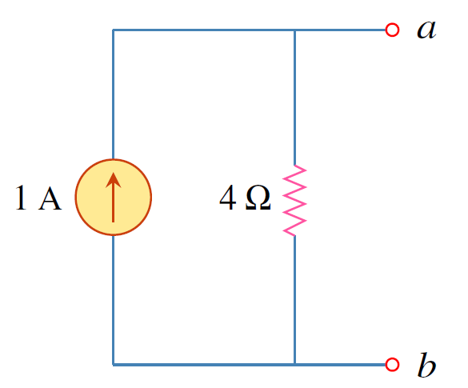

ทฤษฏีนอร์ตันโดยหลักการเหมือนกับทฤษฏีเทเวนิน เพียงแต่ในทฤษฏีนอร์ตันใช้แหล่งจ่ายกระแสต่ออนุกรมกับตัวต้านทานในการแทนวงจรเชิงเส้นสองขั้วด้วยวงจรสมมูล 


นิยาม 4.3
ทฤษฏีนอร์ตันกล่าวว่า วงจรเชิงเส้นสองขั้วสามารถถูกแทนด้วยวงจรสมมูลที่ประกอบด้วยแหล่งจ่ายกระแส $I_N$ ต่อขนานกับตัวต้านทาน $R_N$ โดยที่ $I_N$ เป็นกระแสที่ไหลผ่านขั้ว $a-b$ เมื่อขั้ว $a-b$ ถูกลัดวงจร และ $R_N$ เป็นตัวต้านทานสมมูลที่ขั้ว $a-b$ เมื่อแหล่งจ่ายอิสระทุกตัวในวงจรเชิงเส้นถูกกำจัด


<figure>

  

  <figcaption style='text-align:center'>รูปที่ 4.18 (a) วงจรเชิงเส้นสองขั้วที่มีความซับซ้อน (b) วงจรนอร์ตันที่มีแหล่งจ่ายกระแส $I_N$ ต่อขนานกับตัวต้านทานนอร์ตัน $R_N$ </figcaption>
</figure>

จะสังเกตว่าวงจรนอร์ตันและวงจรเทเวนินสามารถแปลงกลับไปกลับมาได้โดยใช้ทฤษฏีการวางทับซ้อน ซึ่งทำให้ได้ว่า
$$
\begin{equation}
    R_N=R_\text{Th} \tag{4.16}
\end{equation}
$$
การหากระแสนอร์ตัน $I_N$ ให้ลัดขั้ว $a-b$ และหากระแสลัดวงจร $i_{sc}$ ดังรูปที่ 4.19
$$
\begin{equation}
    I_N=i_{sc}  \tag{4.17}
\end{equation}
$$

<figure>

  

  <figcaption style='text-align:center'>รูปที่ 4.19 กระแสนอร์ตัน $I_N$ หาได้จากกระแสที่ไหลผ่านขั้ว $a-b$ ที่ถูกลัดวงจร</figcaption>
</figure>

และเนื่องจาก $R_N=R_\text{Th}$ ดังนั้นกระแสนอร์ตัน $I_N$ หาจากแรงดันเทเวนิน $V_\text{Th}$ ดังสมการ
$$
\begin{equation}
    I_N=\dfrac{V_\text{Th}}{R_\text{Th}}\tag{4.18}
\end{equation}
$$
โดยสรุปการหาแรงดันเทเวนิน กระแสนอร์ตัน และตัวต้านนอร์ตัน (เทเวนิน) สามารถทำได้ดังนี้
1. หาแรงดันเปิดวงจร $v_{oc}$ ที่ขั้ว $a-b$
2. หากระแสลัดวงจร $i_{sc}$ ที่ขั้ว $a-b$
3. หาตัวต้านทานสมมูล ที่ขั้ว $a-b$ เมื่อทำการกำจัดแหล่งจ่ายทุกตัว

สมการแสดงความสัมพันธ์
$$
\begin{align}
     V_\text{Th}&=v_{oc}\tag{4.19}\\\\
     I_N&=i_{sc}\tag{4.20}\\\\
     R_\text{Th}&=\dfrac{v_{oc}}{i_{sc}}=R_N\tag{4.21}
\end{align}
$$

ตัวอย่าง 4.6 จงหาวงจรนอร์ตันที่ขั้ว a-b

<figure>

  

  <figcaption style='text-align:center'>รูปที่ 4.20 วงจรสำหรับตัวอย่าง 4.6</figcaption>
</figure>

คำตอบ

การหาความต้านทานนอร์ตัน($R_N$) เริ่มด้วยการกำจัดแหล่งจ่ายแรงดัน   12V (แทนด้วยการลัดวงจร) และแหล่งจ่ายกระแส 2A (แทนด้วยการเปิดวงจร) ซึ่งได้วงจรในรูปที่ 4.21(a) 

ดังนั้น
$$
\begin{equation}
            R_N=(8+4+8) \\;||\\; 5 = \dfrac{20\times5}{20+5}=4\Omega\tag{4.22}
\end{equation}
$$

<figure>

  

  <figcaption style='text-align:center'>รูปที่ 4.21</figcaption>
</figure>

ส่วนการหากระแสนอร์ตัน $I_N$ ใช้การวิเคราะห์แมช
$$
\begin{align}
    -12+4(i-2)+8i+8i&=0, \qquad \qquad i=1\mathrm{A}\tag{4.23}\\\\
I_N&=i= 1\mathrm{A} \tag{4.24}\qquad
\end{align}
$$
ดังนั้น
$$
\begin{equation}
           V_{\text{Th}}= R_N I_N =4\mathrm{V}\tag{4.25}
\end{equation}
$$

<figure>

  

  <figcaption style='text-align:center'>รูปที่ 4.22 วงจรนอร์ตัน</figcaption>
</figure>
