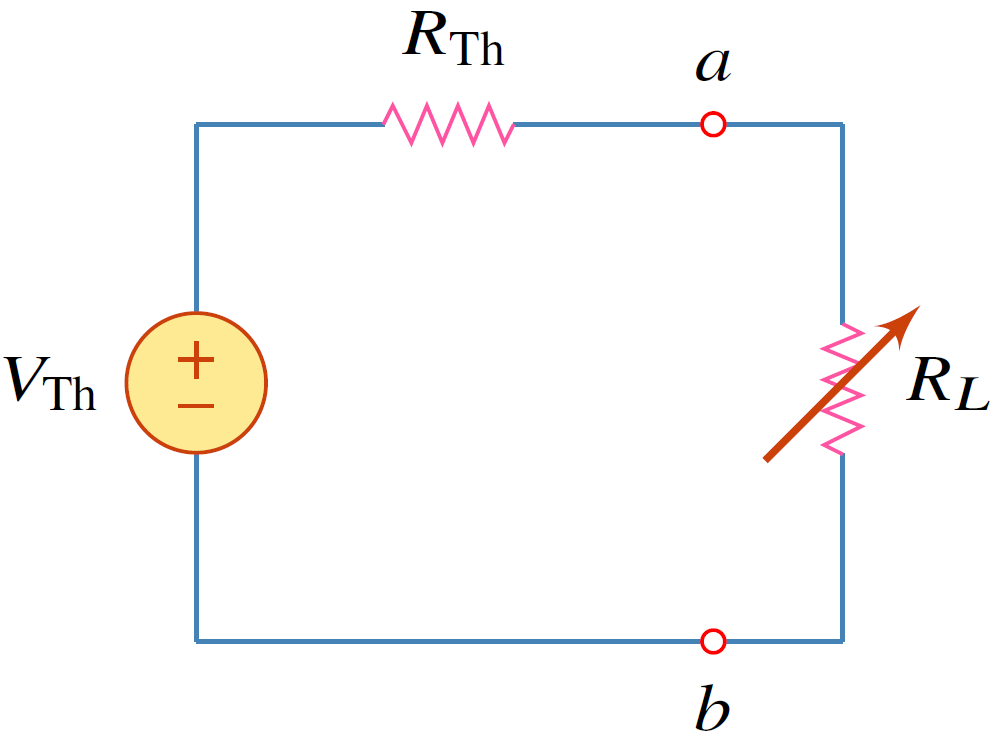
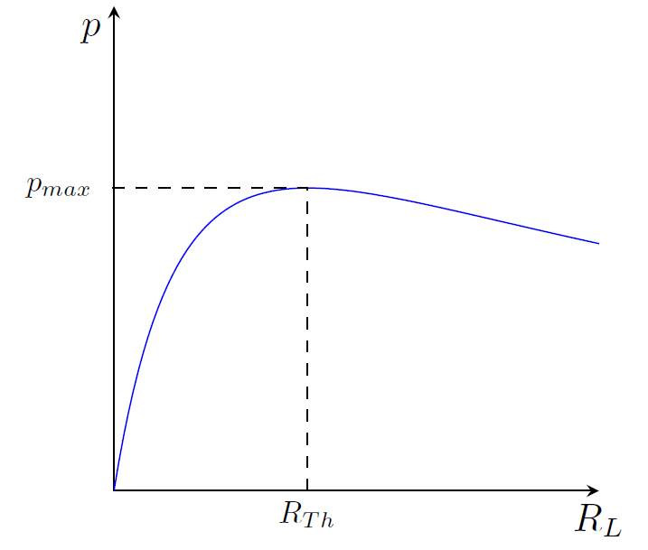
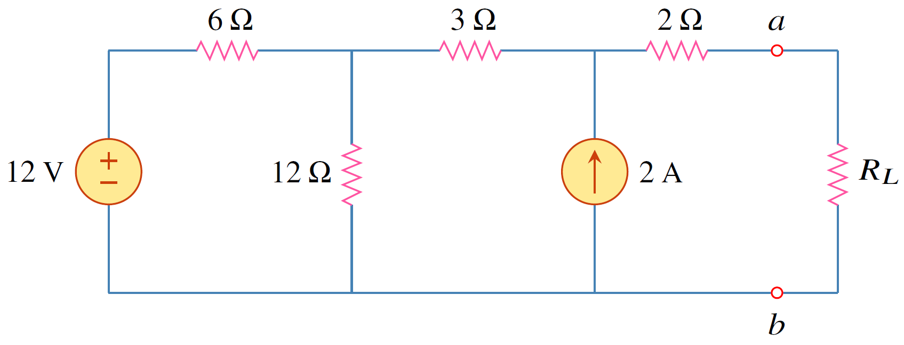
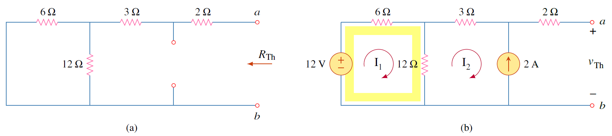
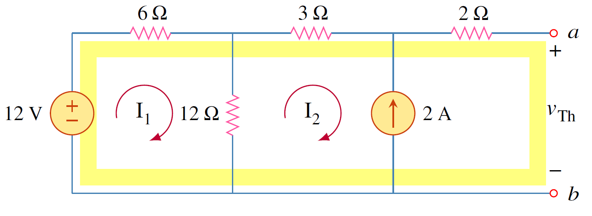

โดยทั่วไปแล้วการถ่ายกำลังสูงสุดให้กับโหลดเป็นสิ่งสำคัญ การหาเงื่อนไขการถ่ายกำลังสูงสุดสามารถนำวงจรสมมูลเทเวนินมาช่วยได้ดังรูปที่ 4.23

<figure>

  

  <figcaption style='text-align:center'>รูปที่ 4.23 วงจรเทเวนินนำมาใช้หาการถ่ายกำลังสูงสุดให้กับตัวต้าน $R_L$</figcaption>
</figure>

ซึ่งเงื่อนไขการถ่ายกำลังสูงสุดหาได้ดังนี้ จากรูปที่ 4.23 กำลังที่โหลด $R_L$ คือ
$$
\begin{equation}
p=i^2R_L=\left(\dfrac{V_\text{Th}}{R_\text{Th}+R_L}\right)^2R_L\tag{4.26}
\end{equation}
$$
เงื่อนไขที่ทำให้เกิดการถ่ายกำลังสูงสุดคือ
$$
\begin{equation}
    R_L=R_\text{Th}\tag{4.27}
\end{equation}

$$


นิยาม 4.4
การถ่ายกำลังสูงสุดไปยังโหลด $R_L$ เกิดขึ้นเมื่อ $R_L=R_\text{Th}$
และค่ากำลังสูงสุดคือ
$$
\begin{equation}
    p_{max}=\dfrac{(V_\text{Th})^2}{4
    R_\text{Th}}
\end{equation}
$$


รูปที่ 4.24 แสดงความสัมพันธ์ระหว่างกำลังและโหลด $R_L$ ซึ่งเห็นได้ว่า การถ่ายกำลังสูงสุด ($p_{max}$) เกิดขึ้นที่ $R_L=R_\text{Th}$ 

<figure>

  

  <figcaption style='text-align:center'>รูปที่ 4.24 กราฟแสดงความสัมพันธ์ระหว่าง ตัวต้านทาน $R_L$ และกำลังที่ตัวต้านทาน $R_L$ ได้รับ</figcaption>
</figure>

ตัวอย่าง 4.7 จงหา $R_L$ ที่ทำให้ได้การถ่ายกำลังสูงสุดจากแหล่งจ่าย และหากำลังสูงสุด

<figure>

  

  <figcaption style='text-align:center'>รูปที่ 4.25 วงจรสำหรับตัวอย่าง 4.7</figcaption>
</figure>

คำตอบ

การหาความต้านทานเทเวนิน($R_\text{Th}$) เริ่มด้วยการปิดแหล่งจ่ายแรงดัน  12V (แทนด้วยการลัดวงจร)

และแหล่งจ่ายกระแส 2A (แทนด้วยการเปิดวงจร) ซึ่งได้วงจรในรูปที่ 4.26(a)  
      
ดังนั้น
$$
      \begin{equation}
        R_\text{Th}=(2+3) + 12\\;||\\; 6 = 9\Omega \tag{4.29}
      \end{equation}
$$
ส่วนการหาแรงดันเทเวนิน $V_{\text{Th}}$
    ใช้การวิเคราะห์แมชในรูปที่ 4.26(b)    
$$    
\begin{align*}
               -12+6I_1+12(I_1-I_2)=0, \qquad \qquad I_2=-2\mathrm{A}
\end{align*}
$$

แก้สมการได้ $I_1=-0.67\mathrm{A},\\;I_2=-2\mathrm{A}$

จาก KVL รอบ loop ในรูปที่ 4.27
$$ 
 \begin{equation*}
             -12+6I_1+3I_2+2(0)+V_{\text{Th}}=0\qquad \Rightarrow \qquad  V_{\text{Th}} = 22\mathrm{V}
 \end{equation*}
$$ 

สำหรับเงื่อนไขของการถ่ายกำลังสูงสุดคือ
$$
 \begin{equation}
     R_L=R_\text{Th}= 9\;\Omega \tag{4.30}
 \end{equation}
$$
และค่ากำลังสูงสุดคือ
$$
 \begin{equation}
     p_{max}=\dfrac{V_\text{Th}^2}{4R_L}=\dfrac{22^2}{4\times9}=13.44\;\text{W} \tag{4.31}
 \end{equation}
$$      

<figure>

  

  <figcaption style='text-align:center'>รูปที่ 4.26 </figcaption>
</figure>

<figure>

  

  <figcaption style='text-align:center'>รูปที่ 4.27 </figcaption>
</figure>
