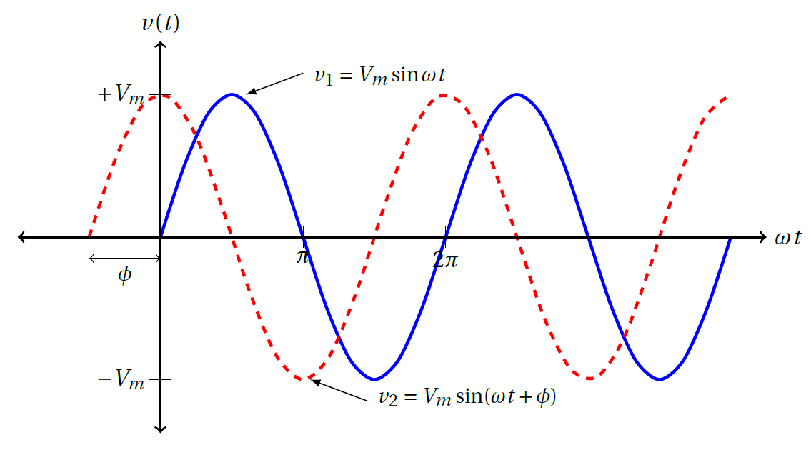

## สัญญาณฟังก์ชันตระกูลซายน์


สัญญาณฟังก์ชันตระกูลซายน์ (Sinusoid) เป็นสัญญาณที่มีรูปฟังก์ชัน ซายน์ หรือ โคซายน์


กระแสที่เป็นฟังก์ชันตระกูลซายน์เรียกว่ากระแสสลับเนื่องจากกระแสไหลกลับทิศไปมาตลอด วงจรที่มีแหล่งจ่ายกระแสหรือแรงดันที่เป็นสัญญาณซายน์ หรือ โคซายน์คือวงจรกระแสสลับ
พิจารณาแรงดันดังสมการต่อไปนี้
$$
\begin{align}
    v(t)=V_m \sin \omega t\tag{5.1}
\end{align}
$$
โดยที่ 
$$
\begin{align*}
V_m & = \text{ขนาดของสัญญาณ}           \\\\
\omega  & = \text{ความถี่เชิงมุมในหน่วย เรเดียนต่อวินาที}   \\\\
  \omega t& = \text{มุมในหน่วยเรเดียน}
  \end{align*}
$$

<figure>

  

  <figcaption style='text-align:center'>รูปที่ 5.1 แรงดันกระแสสลับเมื่อเทียบกับ (a) มุมเรดียน (b) เวลา</figcaption>
</figure>

จากรูปที่ 5.1 จะเห็นว่าแรงดันเป็นสัญญาณที่มีคาบเวลาเท่ากับ T และเมื่อสังเกตจากรูปจะได้ว่า
$$
\begin{equation}
    T=\dfrac{2\pi}{\omega}\tag{5.2}
\end{equation}
$$
และเนื่องจาก
$$
\begin{equation}
    f=\dfrac{1}{T}\tag{5.3}
\end{equation}
$$
ดังนั้น
$$
\begin{equation}
    \omega = 2\pi f\tag{5.4}
\end{equation}
$$
โดยที่ $\omega$ มีหน่วยเป็นเรเดียน และ f มีหน่วยเป็น เฮิรทซ์ (Hz)

ในกรณีทั่วไปสัญญาณซายน์ไม่จำเป็นต้องเริ่มจากศูนย์ที่เวลาเป็นศูนย์ดังสมการ
$$
\begin{equation}
    v(t)=V_m\sin (\omega t + \phi)\tag{5.5}
\end{equation}
$$
โดยที่มุม $\phi$ เป็นมุมเริ่มต้นของฟังก์ชันซายน์เมื่อเวลาเป็น 0 สังเกตว่าทั้ง $\omega t$ และ $\phi$ ต้องเป็นมุมที่เป็นหน่วยเรเดียนหรือหน่วย degree

<figure>

  

  <figcaption style='text-align:center'>รูปที่ 5.2 แรงดัน $v_1$ และ $v_2$ มีมุมเริ่มต้นต่างกันเท่ากับ $\phi$</figcaption>
</figure>

ถ้ากำหนดให้ฟังก์ชันซายน์คือ
$$
\begin{equation}
    v_1(t)=V_m \sin \omega t \quad \text{และ} \quad v_2(t)=V_m \sin (\omega t + \phi )\tag{5.6}
\end{equation}
$$

จากรูปที่ 5.2 จะเห็นว่าที่เวลา $t=0$ แรงดัน $v_2$ มีค่ามากกว่า 0 ขณะที่ $v_1$ ยังเป็น 0 ดังนั้น $v_2$ มาก่อน $v_1$ หรือ $v_2$ นำ $v_1$ ($v_2$ lead $v_1$) เป็นมุม $\phi$ หรืออาจบอกได้อีกแบบหนึ่งว่า $v_1$ ตาม $v_2$ ($v_1$ lag $v_2$) เป็นมุม $\phi$
ในกรณีนี้สัญญาณทั้งสองมีเฟสไม่ตรงกัน (out of phase) แต่ถ้า $\phi=0$ สัญญาณทั้งสองมีเฟสตรงกัน (in phase)


 กำหนดให้
 $$
 \begin{equation}
    v_1(t)=V_m \sin \omega t \quad \text{และ} \quad v_2(t)=V_m \sin (\omega t + \phi )\tag{5.7}
\end{equation}
$$
$v_1$ และ $v_2$ มีเฟสไม่ตรงกัน หรือ ต่างเฟส (out of phase) เมื่อ $\phi \neq 0$

-  ถ้า $v_1$ มีค่ามากกว่า 0 ก่อน $v_2$ หมายความว่า $v_1$ นำ(lead) $v_2$ หรือ $v_2$ ตาม(lag) $v_1$ 
-  ถ้า $v_1$ มีค่ามากกว่า 0  หลัง $v_2$ หมายความว่า $v_1$ ตาม(lag) $v_2$ หรือ $v_2$ นำ(lead) $v_1$ 

$v_1$ และ $v_2$ มีเฟสตรงกัน (in phase) เมื่อ $\phi = 0$


## คุณสมบัติตรีโกณ
ในการเปรียบเทียบการนำและการตามของสัญญาณสองตัวนั้น สัญญาณทั้งสองตัวต้องอยู่ในรูปฟังก์ชันเดียวกัน (ถ้าเป็นฟังก์ชัน sine ก็ต้องเป็นฟังก์ชัน sine ทั้งสองสัญญาณ ถ้าเป็น cosine ก็ต้องเป็น cosine ทั้งสองสัญญาณ) และต้องมีขนาดเป็นบวก ในการเปลี่ยนฟังก์ชันให้ใช้คุณสมบัติต่อไปนี้
$$
  \begin{align}
 \sin(A \pm B) &= \sin A \cos B \pm \cos A \sin B\notag\\\\
  \cos(A \pm B) &= \cos A \cos B \mp \sin A \sin B\tag{5.8}
  \end{align}
$$
ซึ่งจากคุณสมบัติข้างต้นทำให้ได้ความสัมพันธ์ต่อไปนี้
$$
  \begin{align}
    \sin(\omega t \pm 180^{\circ}) &= -\sin \omega t\notag\\\\
    \cos(\omega t \pm 180^{\circ}) &= -\cos \omega t\notag\\\\
    \sin(\omega t \pm 90^{\circ}) &= \pm\cos \omega t\notag\\\\
    \cos(\omega t \pm 90^{\circ}) &= \mp\sin \omega t\tag{5.9}
  \end{align}
$$

## ตัวอย่าง 5.1 


จงหา ขนาด เฟส คาบ และความถี่ของสัญญาณ
\begin{equation*}
    v(t)=12 \cos (50t+10^{\circ})
\end{equation*}
คำตอบ

ขนาด = 12,  มุมเฟส = $10^{\circ}$, ความถี่เชิงมุม $\omega$ = 50 rad/s

คาบเวลา T = $\dfrac{2\pi}{\omega}=\dfrac{2\pi}{50}=0.1257\\;s$, 
ความถี่ $f=\dfrac{1}{T} =7.958$ Hz



 

## ตัวอย่าง 5.2 

จงหามุมต่างเฟสระหว่าง $v_1=-10\cos (\omega t + 50^{\circ})$ และ $v_2=12 \sin (\omega t - 10^{\circ})$

คำตอบ
เนื่องจาก $v_1$ มีขนาดเป็นลบ ต้องเป็นให้เป็นบวกดังนี้
\begin{equation*}
    v_1=-10\cos (\omega t + 50^{\circ})=10\cos (\omega t + 50^{\circ} - 180^{\circ})
\end{equation*}

\begin{equation}
    v_1=10\cos (\omega t - 130^{\circ}) \quad \text{หรือ}\quad v_1=10\cos (\omega t + 230^{\circ}) \tag{5.10}\label{eq5:v1}
\end{equation}
และ 
\begin{equation*}
    v_2=12\sin (\omega t - 10^{\circ})=12\cos (\omega t - 10^{\circ}-90^{\circ})
\end{equation*}

\begin{equation}
    v_2=12\cos (\omega t -100^{\circ}) \tag{5.11}\label{eq5:v2}
\end{equation}
จากสมการ \ref{eq5:v1} และ \ref{eq5:v2} จะได้มุมต่างเฟสระหว่าง $v_1$ และ $v_2$ เป็น $30^{\circ}$  ซึ่งถ้าเขียน $v_2$ ใหม่เป็น
\begin{equation}
    v_2=12 \cos (\omega t - 130^{\circ} +30^{\circ}) \quad \text{หรือ} \quad v_2=12 \cos (\omega t+ 260^{\circ}) \tag{5.12}\label{eq5:v2n}
\end{equation}
และเมื่อเปรียบเทียบสมการ \ref{eq5:v1} และ \ref{eq5:v2n} จะเห็นได้ชัดว่า $v_2$ นำ $v_1$ อยู่ $30^{\circ}$

