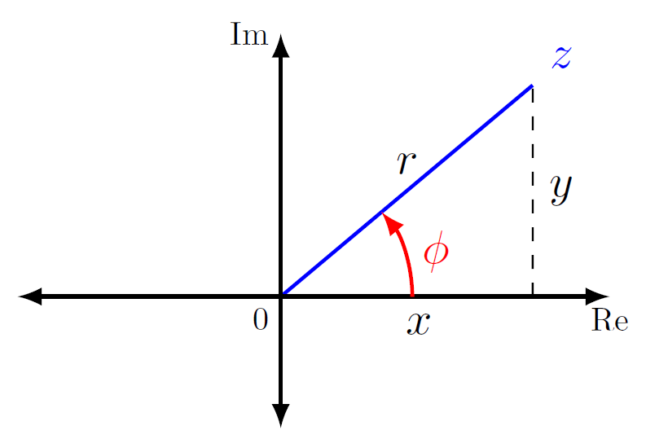

การแก้วิเคราะห์วงจรกระแสสลับทำได้ง่ายถ้าใช้เฟสเซอร์


นิยาม 5.3
เฟสเซอร์คือ จำนวนเชิงซ้อนที่ใช้แทนขนาดและมุมเฟสของฟังก์ชันตระกูลซายน์ และสิ่งที่ทำให้เฟสเซอร์ต่างจากจำนวนเชิงซ้อนคือค่าขนาดและมุมขึ้นอยู่กับความถี่ $\omega$


## จำนวนเชิงซ้อน
กำหนดให้ $z$ เป็นจำนวนเชิงซ้อนซึ่งเขียนในรูปเชิงพิกัดฉาก (rectangular form) ได้ดังนี้
\begin{equation}
    z=x+jy\tag{5.13}
\end{equation}
โดยที่ $j=\sqrt{-1} \quad x$  เป็นส่วนจำนวนจริง ของ $z$ และ $y$ เป็นส่วนจำนวนจินตภาพ ของ $z$

จำนวนเชิงซ้อน $z$ ยังเขียนในรูปเชิงขั้ว (polar form) ดังนี้
$$
\begin{equation}
    z=r\measuredangle{\phi}\tag{5.14}
\end{equation}
$$
โดยที่ $r=\sqrt{x^2+y^2}$ เป็นขนาด และ มุม $\phi=\arctan \left( {\dfrac{y}{x}} \right)$

แต่ถ้าทราบขนาด $r$ และมุม $\phi$ สามารถหาค่า $x$ และ $y$ ดังนี้
\begin{equation}
    x=r\cos \phi,\qquad y=r\sin \phi \tag{5.15}
\end{equation}

<figure>

  

  <figcaption style='text-align:center'>รูปที่ 5.3 จำนวนเชิงซ้อน $z=x+jy=r\angle\phi$</figcaption>
</figure>

### ตัวดำเนินการจำนวนเชิงซ้อน
กำหนดให้ 
$$
\begin{align*}
    z&=x+jy=r\angle{\phi}\\\\\notag
    z_1&=x_1+jy_1=r_1\angle{\phi_1}\\\\ \notag
    z_2&=x_2+jy_2=r_2\angle{\phi_2}\tag{5.16}
\end{align*}
$$
| ตัวดำเนินการ      | สมการแสดงการดำเนินการ | 
| :---        |    :----   | 
| การบวก      | $z_1+z_2=(x_1+x_2) + j(y_1+y_2) $       | 
| การลบ   | $z_1-z_2=(x_1-x_2) + j(y_1-y_2)$         | 
| การคูณ      | $z_1z_2=r_1r_2 (\angle{\phi_1} + \angle{\phi_2})$       | 
| การหาร   | $\dfrac{z_1}{z_2}=\dfrac{r_1}{r_2} (\angle{\phi_1} - \angle{\phi_2})$         | 
| การกลับส่วน      | $\dfrac{1}{z}=\dfrac{1}{r} \angle{(- \phi)}$       | 
| การคอนจูเกต   | $z^*=x-jy=r\angle{(-\phi)}$         | 
| รากที่สอง   | $\sqrt{z}=\sqrt{r}\angle{(\phi/2)}$         | 

## เฟสเซอร์จากสัญญาณเวลา

ถ้าแรงดันหรือกระแสเป็นฟังก์ชันของเวลาดังนี้
\begin{equation}
    v(t)=V_m \cos(\omega t + \phi) \tag{5.18}
\end{equation}
เฟสเซอร์ของแรงดัน $v(t)$ คือ
\begin{equation}
    V = V_m\angle{\phi} \tag{5.19}
\end{equation}


  1. ขนาด $V_m$ ต้องเป็นบวก
  2. สัญญาณในรูปเวลาเป็นฟังก์ชัน $\cos$


ถ้าสัญญาณอยู่ในรูป $\sin$ ต้องแปลงให้อยู่ในรูป $\cos$ ดังนี้
\begin{equation}
i(t) = I_m \sin (\omega t + \theta) \tag{5.20}
\end{equation}
อาศัยคุณสมบัติจากสมการ (5.9)
\begin{equation}
i(t) = I_m \sin (\omega t + \theta)= I_m \cos (\omega t -90^{\circ}+\theta ) \tag{5.21}
\end{equation}
ดังนั้นเฟสเซอร์ของกระแส $i(t)$ คือ
\begin{equation}
    I=I_m\angle{(\theta-90^{\circ})} \tag{5.22}
\end{equation}

## ตัวอย่าง 5.3 
จงแปลงแรงดัน $v_1=-10\cos (\omega t + 50^{\circ})$ และ $v_2=12 \sin (\omega t - 10^{\circ})$ เป็นเฟสเซอร์

คำตอบ
การแทนเฟสเซอร์ให้ใช้ตัวอักษรตัวใหญ่ดังนี้
\begin{equation}
    \mathbf{V_1} = -10\angle{50^{\circ}}\notag
\end{equation}
แต่เนื่องจากขนาดของเฟสเซอร์ต้องเป็นบวก ดังนั้นให้ใช้คุณสมบัติ 
$$-1=\sqrt{-1}\times\sqrt{-1}=j\times j= (1\angle{90^{\circ}}) \times (1\angle{90^{\circ}})\tag{5.23}
$$ 
ในการแปลงขนาดจากลบให้เป็นบวก

พิจารณา $\mathbf{V_1}$

\begin{align}
    \mathbf{V_1} =-10\angle{50^{\circ}}&=-1\times 10\angle{50^{\circ}}\notag\\\\&=\sqrt{-1}\times\sqrt{-1}\times 10\angle{50^{\circ}}\tag{5.24}\\\\
     &=j\times j\times 10\angle{50^{\circ}}\tag{5.25}\\\\
    &= (1\angle{90^{\circ}}) \times (1\angle{90^{\circ}}) \times 10\angle{50^{\circ}}\tag{5.26}\\\\
   &=10\angle{230^{\circ}} \tag{5.27}
\end{align}
เนื่องจาก $v_2$ เป็นฟังก์ชัน $\sin$ ดังนั้นต้องแปลงเป็นฟังก์ชัน $\cos$ ตามสมการ (5.9)
\begin{equation}
     v_2=12 \sin (\omega t - 10^{\circ})=12 \cos (\omega t - 90^{\circ} - 10^{\circ}) = 12\cos (\omega t - 100^{\circ}) \tag{5.28}
\end{equation}
ดังนั้นเฟสเซอร์ของ $v_2$ คือ
\begin{equation}
    \mathbf{V_2} = 12\angle{(-100^{\circ})} \tag{5.29}
\end{equation}
ในการเปรียบเทียบมุมต่างเฟส ต้องเขียนเฟสเซอร์ที่มีมุมอยู่ระหว่าง $-180^{\circ}$ และ $180^{\circ}$ 
แต่เนื่องจากเฟสเซอร์ $\mathbf{V_1}$ มีมุม $230^{\circ}$  จึงต้องปรับมุมโดยการบวกหรือลบ $360^{\circ}$  ดังนั้น
\begin{equation}
    \mathbf{V_1} = 10\angle{230^{\circ}}=10\angle{(230^{\circ}-360^{\circ})}=10\angle{(-130^{\circ})} \tag{5.30}
\end{equation}
ซึ่งจะเห็นได้ชัดว่า $\mathbf{V_1}$ ตาม $\mathbf{V_2}$ อยู่ $30^{\circ}$

### เฟสเซอร์ lead หรือ lag

{}
ในการหาว่าเฟสเซอร์ตัวใดมีมุมนำหรือตามให้ทำดังนี้
 1. กำหนดให้ $V_1$ เป็นเฟสเซอร์ตัวที่ 1 และ $V_2$ เป็นเฟสเซอร์ตัวที่ 2
 2. นำมุมของเฟสเซอร์ $V_1$ $-$ มุมของเฟสเซอร์ $V_2$
  &emsp; &emsp;&emsp;(a) ถ้าผลเป็นบวก แสดงว่า มุมของเฟสเซอร์ $V_1$ นำ (lead) มุมของเฟสเซอร์ $V_2$
  &emsp; &emsp;&emsp;(b) ถ้าผลเป็นลบ แสดงว่า มุมของเฟสเซอร์ $V_1$ ตาม (lag) มุมของเฟสเซอร์ $V_2$    
{}

## ตัวอย่าง 5.4 
จงหาค่าต่อไปนี้

a. $(40\angle{50^{\circ}} + 20\angle{-30^{\circ}})^{1/2}$

b. $\dfrac{10\angle{-30^{\circ}}+(3-j4)}{(2+j4)(3-j5)^*}$

คำตอบ

(a) \begin{align*}
    40\angle{50^{\circ}}&=40(\cos50^{\circ} +j\sin 50^{\circ} )=25.71+j30.64\\\\
    20\angle{-30^{\circ}}&=20[\cos(-30^{\circ}) +j\sin (-30^{\circ})] =17.32-j10
\end{align*}
บวกทั้งสองเข้าด้วยกัน
\begin{align*}
    40\angle{50^{\circ}}+20\angle{-30^{\circ}}&=(25.71+17.32)+j(30.64-10)\\\\
    &=43.03+j20.64=47.72\angle{25.63^{\circ}}\\\\
    \text{ถอดรากที่สอง}
    (40\angle{50^{\circ}}+20\angle{-30^{\circ}})^{1/2}&=6.91\angle{12.81^{\circ}}
\end{align*}

(b) 
\begin{align*}
  \dfrac{10\angle{-30^{\circ}}+(3-j4)}{(2+j4)(3-j5)^\*}
    &=\dfrac{8.66-j5+(3-j4)}{(2+j4)(3+j5)}\notag\\\\
    &=\dfrac{11.66-j9}{-14+j22}=\dfrac{14.73\angle{-37.66^{\circ}}}{26.08\angle{122.47^{\circ}}}\notag\\\\
    &=0.565\angle{(-160.13^{\circ}})\notag
\end{align*}

ตัวอย่าง 5.5 กำหนดให้ $i_1=4\cos (\omega t + 30^{\circ})\mathrm{A}$ และ $i_2=5\sin (\omega t -20^{\circ})\mathrm{A}$ จงหาผลรวมของกระแสทั้งสอง

คำตอบ

แปลงกระแสทั้งสองให้อยู่ในรูปเฟสเซอร์
\begin{equation*}
    \mathbf{I}_1=4\angle{30^{\circ}}
\end{equation*}

แปลง $i_2$ ให้อยู่ในรูป $\cos$ โดยใช้คุณสมบัติ $\sin x = \cos (x - 90^{\circ})$

\begin{align*}   
i_2&=5 \cos (\omega t-20^{\circ} -90^{\circ})=5\cos (\omega t -110^{\circ})\\\\
\mathbf{I}_2&=5\angle{-110^{\circ}} 
    \end{align*}

กำหนดให้ $i=i_1+i_2$
\begin{align*}
\mathbf{I}&=\mathbf{I}_1+\mathbf{I}_2=4\angle{30^{\circ}}+5\angle{-110^{\circ}}\\\\
&=3.464+j2-1.71-j4.698=1.754-j2.698\\\\
&=3.218\angle{-56.97^{\circ}}\\;\mathrm{A}
\end{align*}
จากเฟสเซอร์ที่ได้แปลงเป็นฟังก์ชันในรูปของเวลา  $t$ ดังนี้
\begin{equation*}
    i(t)=3.128\cos (\omega t -56.97^{\circ})\\;\\;\mathrm{A}
\end{equation*}

