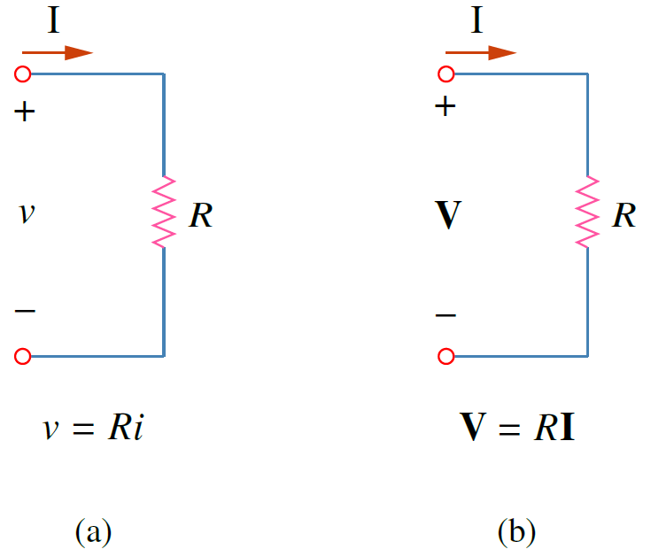
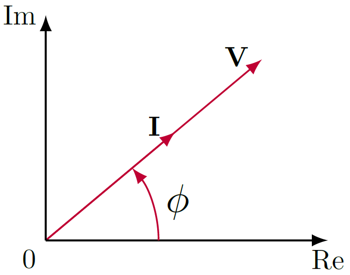
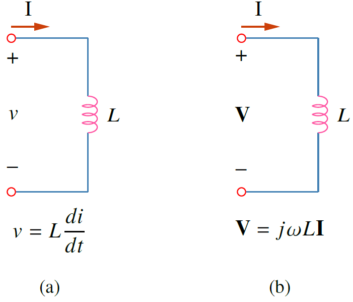
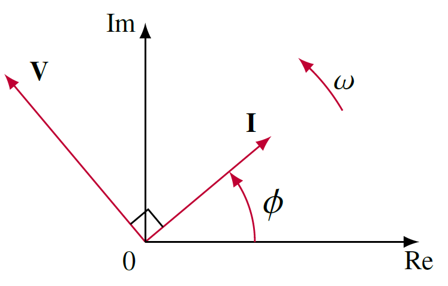
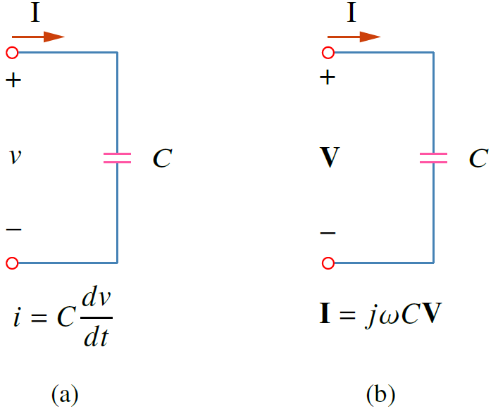
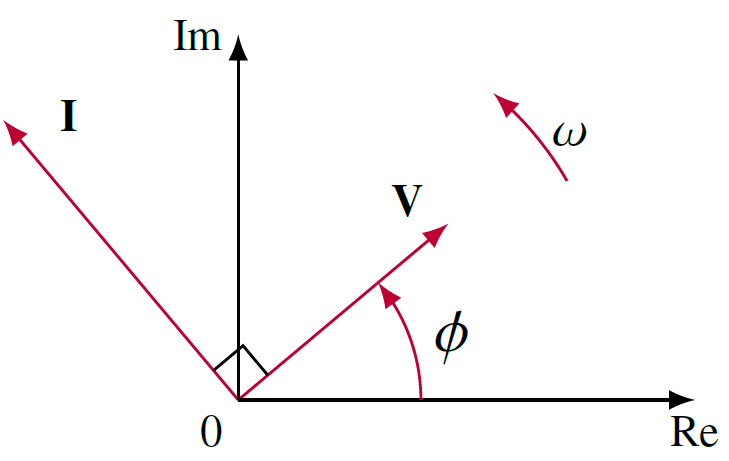

อุปกรณ์ไฟฟ้าที่พิจารณาคือตัวต้านทาน ตัวเหนี่ยวนำ และ ตัวเก็บประจุ

## **เฟสเซอร์ของอุปกรณ์ไฟฟ้า**

### ตัวต้านทาน
กำหนดให้กระแสที่ไหลผ่านตัวต้านทานคือ $i=I_m \cos (\omega t + \phi )$ จากกฎของโอห์มหาแรงดันตกคร่อมตัวต้านทาน $R$ ได้เป็น
\begin{equation}
    v=Ri = RI_m \cos (\omega t + \phi ) \tag{5.31}
\end{equation}
เฟสเซอร์ของแรงดัน $v$ คือ
\begin{equation}
    \mathbf{V}=RI_m\angle{\phi}=R\mathbf{I} \tag{5.32}
\end{equation}
รูปที่ 5.4 แสดงความสัมพันธ์ระหว่างกระแสและแรงดันในรูปเวลาและรูปเฟสเซอร์
จากสมการ จะเห็นได้ว่าในกรณีตัวต้านทาน มุมเฟสของแรงดันและกระแสเท่ากัน  (in phase) ดังแสดงในรูปที่ 5.5

<figure>

  

  <figcaption style='text-align:center'>รูปที่ 5.4 ความสัมพันธ์กระแสแรงดันใน (a) รูปเวลา (b) รูปเฟสเซอร์</figcaption>
</figure>

<figure>

  

  <figcaption style='text-align:center'>รูปที่ 5.5 เฟสเซอร์ของตัวต้านทาน</figcaption>
</figure>

### ตัวเหนี่ยวนำ
กำหนดให้กระแสที่ไหลผ่านตัวเหนี่ยวนำคือ $i=I_m \cos (\omega t + \phi )$ แรงดันตกคร่อมตัวเหนี่ยวนำ $L$ คือ
\begin{equation}
    v=L\dfrac{di}{dt} = -\omega LI_m \sin (\omega t + \phi ) \tag{5.33}
\end{equation}
แต่เนื่องจาก $-\sin A = \cos (A+90^{\circ})$ ดังนั้น
\begin{equation}
    v=\omega LI_m \cos (\omega t + \phi +90^{\circ}) \tag{5.34}
\end{equation}
เฟสเซอร์ของแรงดัน $v$ คือ
\begin{equation}
    \mathbf{V}=\omega LI_m\angle{\phi+90^{\circ}}=(\omega LI_m\angle{\phi})(1\angle{90^{\circ}})=(\omega L\mathbf{I})(j)=j \omega L\mathbf{I} \tag{5.35}
\end{equation}
รูปที่ 5.6 แสดงความสัมพันธ์ระหว่างกระแสและแรงดันในรูปเวลาและรูปเฟสเซอร์
จากสมการ จะเห็นได้ว่าในกรณีตัวเหนี่ยวนำ มุมเฟสของแรงดันและกระแสต่างกันเป็นมุม $90^{\circ}$ (out of phase) โดยที่มุมเฟสของกระแสตามแรงดันดังแสดงในรูปที่ 5.7

<figure>

  

  <figcaption style='text-align:center'>รูปที่ 5.6 ความสัมพันธ์กระแสแรงดันใน (a) รูปเวลา (b) รูปเฟสเซอร์</figcaption>
</figure>

<figure>

  

  <figcaption style='text-align:center'>รูปที่ 5.7 เฟสเซอร์ของตัวเหนี่ยวนำ</figcaption>
</figure>

### ตัวเก็บประจุ
กำหนดให้แรงดันตกคร่อมตัวเก็บประจุคือ $v=V_m \cos (\omega t + \phi )$ กระแสที่ไหลผ่านตัวเก็บประจุ $C$ คือ
\begin{equation}
    i=C\dfrac{dv}{dt} = -\omega CV_m \sin (\omega t + \phi ) \tag{5.36}
\end{equation}
แต่เนื่องจาก $-\sin A = \cos (A+90^{\circ})$ ดังนั้น
\begin{equation}
    i=\omega CV_m \cos (\omega t + \phi +90^{\circ}) \tag{5.37}
\end{equation}
เฟสเซอร์ของกระแส $i$ คือ
\begin{equation}
    \mathbf{I}=\omega CV_m\angle{\phi+90^{\circ}}=(\omega CV_m\angle{\phi})(1\angle{90^{\circ}})=(\omega C\mathbf{V})(j)=j \omega C\mathbf{V} \tag{5.38}
\end{equation}
ย้ายข้างได้
\begin{equation}
    \mathbf{V}=\dfrac{\mathbf{I}}{j\omega C} \tag{5.39}
\end{equation}
รูปที่ 5.8 แสดงความสัมพันธ์ระหว่างกระแสและแรงดันในรูปเวลาและรูปเฟสเซอร์
จากสมการ จะเห็นได้ว่าในกรณีตัวเก็บประจุ มุมเฟสของแรงดันและกระแสต่างกันเป็นมุม $90^{\circ}$ (out of phase) โดยที่มุมเฟสของกระแสนำแรงดันดังแสดงในรูปที่ 5.9

{}
ให้ใช้กระแสเป็นตัวเทียบในบอกการนำ (lead) หรือ ตาม (lag) เสมอ
 1. ในตัวเหนี่ยวนำ กระแสตามแรงดัน
 2. ในตัวเก็บประจุ กระแสนำแรงดัน
{}

<figure>

  

  <figcaption style='text-align:center'>รูปที่ 5.8 ความสัมพันธ์กระแสแรงดันใน (a) รูปเวลา (b) รูปเฟสเซอร์</figcaption>
</figure>

<figure>

  

  <figcaption style='text-align:center'>รูปที่ 5.9 เฟสเซอร์ของตัวเก็บประจุ</figcaption>
</figure>

## **ตารางสรุปเฟสเซอร์ของอุปกรณ์ไฟฟ้า**

| อุปกรณ์ไฟฟ้า      | รูปเวลา (time domain) | รูปเฟสเซอร์ (frequency domain) |
| :---        |    :----   |  :----   |
| R      | $v=Ri$      | $\mathbf{V}=R\mathbf{I}$ |
| L      | $v=L\dfrac{di}{dt}$      | $\mathbf{V}=j\omega L\mathbf{I}$   |
| C      | $i=C\dfrac{dv}{dt}$      | $\mathbf{V}=\dfrac{\mathbf{I}}{j\omega C}$ |

## ตัวอย่าง 5.6

แรงดัน $v=12\cos (60t+45^{\circ})$ ตกคร่อมตัวเหนี่ยวนำ 0.1H จงหากระแสในสภาวะคงตัวที่ไหลผ่านตัวเหนี่ยวนำนี้

คำตอบ

สำหรับตัวเหนี่ยวนำ $\mathbf{V}=j\omega L\mathbf{I}$ โดยที่ $\omega = 60  \;\mathrm{rad/s}$ และ $ \mathbf{V}=12\angle{45^{\circ}}\mathrm{V}$
ดังนั้น
\begin{equation*}
    \mathbf{I}=\dfrac{\mathbf{V}}{j\omega L}=\dfrac{\mathbf{V}}{j60\times 0.1}=\dfrac{12\angle{45^{\circ}}}{6\angle{90^{\circ}}}=2\angle{45^{\circ}}\mathrm{A}
\end{equation*}
เปลี่ยนให้อยู่ในรูปของเวลา
\begin{equation*}
    i(t)=2\cos (60t -45^{\circ} )\mathrm{A}
\end{equation*}

