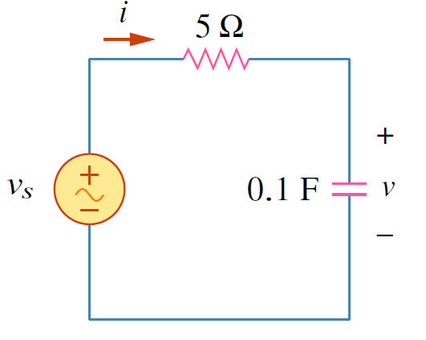

## **อิมพีแดนซ์**

 อิมพีแดนซ์ (Z) เป็นความต้านทานของอุปกรณ์ไฟฟ้าในวงจรกระแสสลับ 
 
 (a) กรณีตัวต้านทาน
     \begin{equation*}
         Z=\dfrac{\mathbf{V}}{\mathbf{I}}=R
     \end{equation*}
 (b) กรณีตัวเหนี่ยวนำ
     \begin{equation*}
         Z=\dfrac{\mathbf{V}}{\mathbf{I}}=j\omega L
     \end{equation*}
 (c) กรณีตัวเก็บประจุ
     \begin{equation*}
         Z=\dfrac{\mathbf{V}}{\mathbf{I}}=\dfrac{1}{j\omega C}
     \end{equation*}     
 

{}
อิมพีแดนซ์ของตัวเหนี่ยวนำและตัวเก็บประจุมีค่าขึ้นกับค่าความถี่ $\omega$ 
 
กำหนดให้ $Z_c$ คือ ค่าอิมพีแดนซ์ของตัวเก็บประจุ และ $Z_L$ คือ ค่าอิมพีแดนซ์ของตัวเหนี่ยวนำ
  &emsp; &emsp;&emsp;(a) ที่ $\omega = 0$ (กรณีไฟตรง)  ค่า $Z_C=\infty$  (เปิดวงจร) และ $Z_L=0$ (ลัดวงจร)
  &emsp; &emsp;&emsp;(b) ที่ $\omega$ มีค่าสูงมาก ค่า $Z_C=0$ (ลัดวงจร) และ $Z_L=\infty$ (เปิดวงจร)
{}

อิมพีแดนซ์เป็นจำนวนเชิงซ้อน
\begin{align}
    Z&=R+jX=|\mathbf{Z}|\angle{\theta} \tag{5.40} \\\\
|Z|&=\sqrt{R^2+X^2},\qquad \theta=\arctan \dfrac{X}{R} \tag{5.41}\\\\
\text{และ} \notag \\\\
R&=|Z|\cos \theta,\qquad X=|Z|\sin \theta \tag{5.42}
\end{align}
โดยที่ $R$ เป็นค่าความต้านทาน (resistance) และ $X$ เป็นค่ารีแอคแตนซ์ (reactance) โดยที่ค่า $X$ เป็นได้ทั้งบวกหรือลบ ถ้าค่า $X$ เป็นบวก อิมพีแดนซ์เป็น inductive ถ้าค่า $X$ เป็นลบ อิมพีแดนซ์เป็น capacitive ค่าอิมพีแดนซ์ ค่าความต้านทาน และค่ารีแอคแตนซ์มีหน่วยเป็นโอห์ม

## **แอดมิตแตนซ์**



ค่าแอดมิตแตนซ์ Y (admittance) เป็นส่วนกลับของอิมพีแดนซ์ 
\begin{equation}
    Y=\dfrac{1}{Z}=\dfrac{I}{V} \tag{5.43}
\end{equation}
ค่าแอดมิตแตนซ์มีหน่วยเป็นซีเมน และเป็นจำนวนเชิงซ้อนเช่นกัน
\begin{equation}
    Y=G+jB \tag{5.44}
\end{equation}
โดยที่ G เรียกว่าค่าคอนดัคแตนซ์ (conductance) และ B เรียกว่า ซัสเซปแตนซ์ (susceptance) 


## **ความสัมพันธ์ระหว่างแอตมิตแตนซ์กับอิมพีแดนซ์**
\begin{equation}
    Y=G+jB=\dfrac{1}{Z}=\dfrac{1}{R+jX} \tag{5.45}
\end{equation}
จากการจัดรูปได้
\begin{equation}
    G=\dfrac{R}{R^2+X^2},\qquad B=-\dfrac{X}{R^2+X^2} \tag{5.46}
\end{equation}
จะเห็นได้ว่า $G\neq\dfrac{1}{R}$ ยกเว้นเมื่อค่า $X=0$ จะทำให้ $G=\dfrac{1}{R}$

## ตัวอย่าง 5.7

กำหนดให้ $v_s=10\cos 4t$ จงหา $v(t), i(t)$

<figure>

  

  <figcaption style='text-align:center'>รูปที่ 5.10 วงจรสำหรับตัวอย่าง 5.7</figcaption>
</figure>

คำตอบ

จากโจทย์ค่า $\omega =4$ แปลง $v_s$ เป็นเฟสเซอร์ได้
$$
\mathbf{V}_s=10\angle{0^{\circ}} \mathrm{V}\notag
$$
หาค่าอิมพีแดนซ์ Z ซึ่งเป็นการอนุกรมระหว่างตัวต้านทานกับตัวเก็บประจุ

$$
\mathbf{Z}=5+\dfrac{1}{j\omega C}=5+\dfrac{1}{j4\times 0.1}=5-j2.5\\;\Omega \notag
$$
หากระแส
    \begin{align}
      \mathbf{I}=\dfrac{\mathbf{V}_s}{\mathbf{Z}}&=\dfrac{10\angle{0^{\circ}}}{5-j2.5}=\dfrac{10(5+j2.5)}{5^2+2.5^2}\notag\\\\
      &=1.6+j0.8=1.789\angle{26.57^{\circ}}\mathrm{A} \tag{5.47a}
    \end{align}
แรงดันตกคร่อมตัวเก็บประจุ
    \begin{align}
      \mathbf{V}=\mathbf{I}
      \mathbf{Z}_C&=\dfrac{\mathbf{I}}{j\omega C}=\dfrac{1.789\angle{26.57^{\circ}}}{j4\times 0.1}\notag\\\\
      &=\dfrac{1.789\angle{26.57^{\circ}}}{0.4\angle{90^{\circ}}}=4.47\angle{-63.43^{\circ}}\mathrm{V} \tag{5.47b}
    \end{align}

เปลี่ยนจากเฟสเซอร์เป็นรูปเวลาได้
\begin{align*}
 i(t)&=1.789\cos (4t + 26.57^{\circ})\mathrm{A}\\\\
 v(t)&=4.47\cos (4t-63.43^{\circ})\mathrm{V}
\end{align*}
สังเกตว่ากระแส $i(t)$ นำแรงดัน $v(t)$ เป็นมุม $90^{\circ}$

