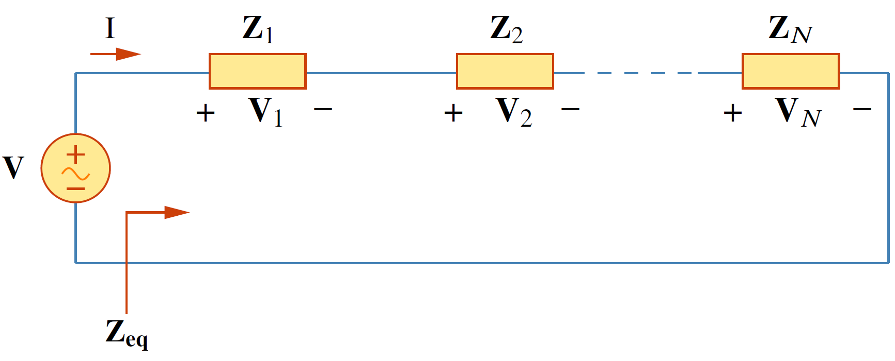
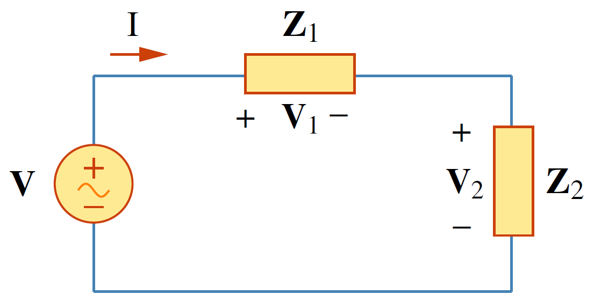
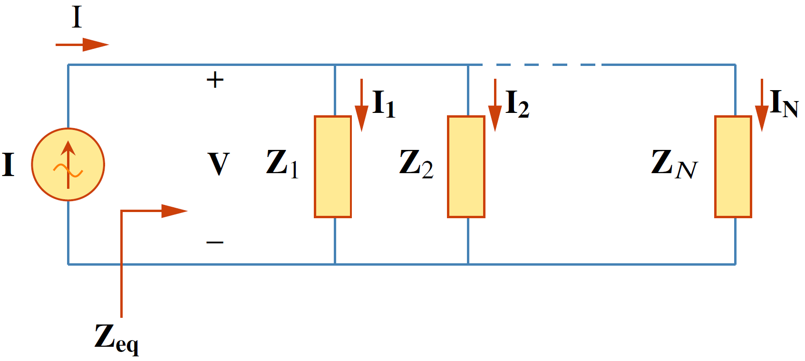
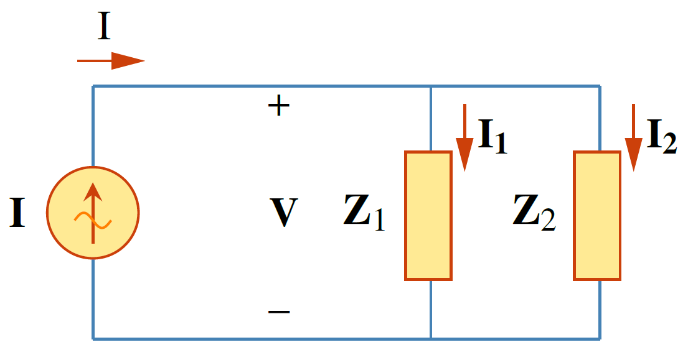
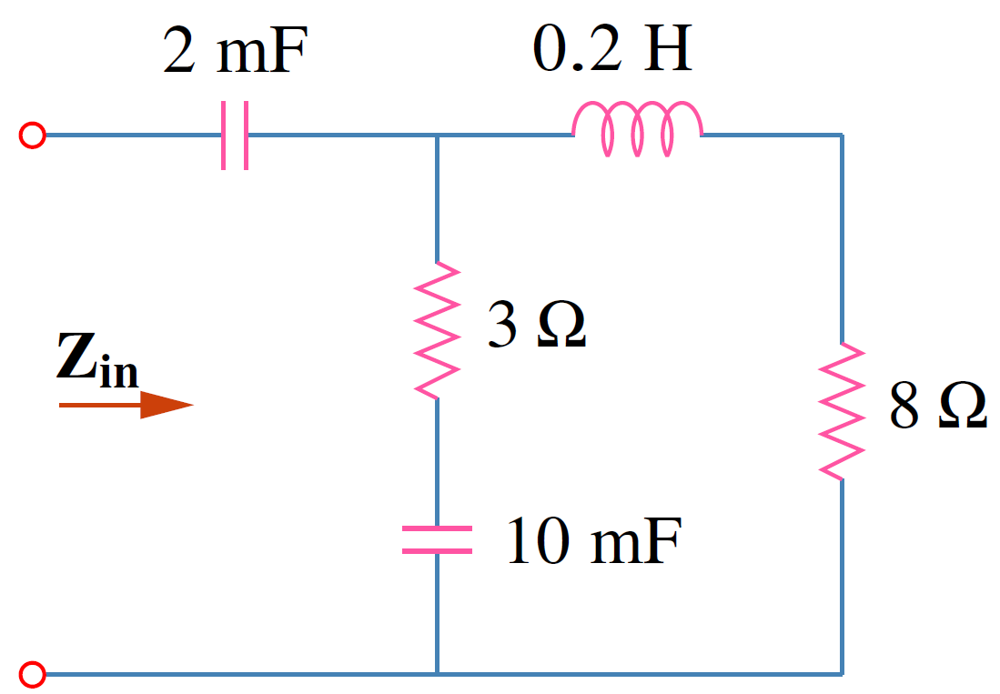
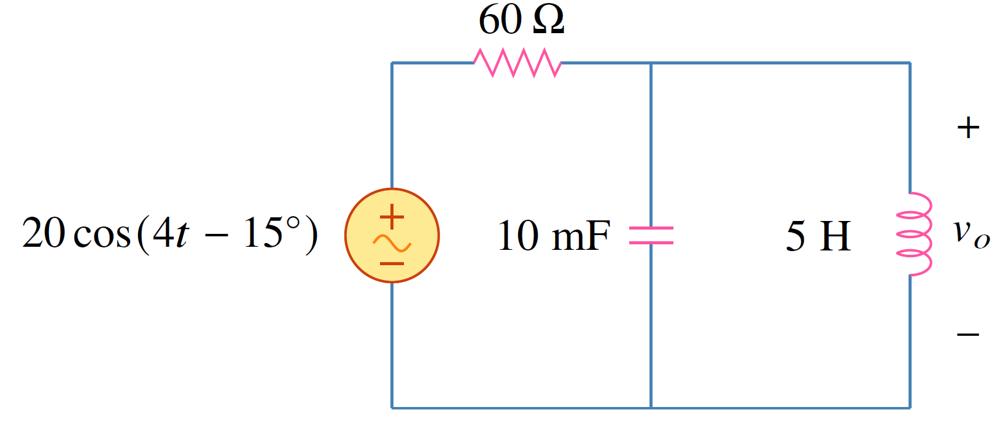

## **การต่ออนุกรม**
พิจารณารูปที่ 5.11 กระแส $\mathbf{I}$ ไหลผ่านอิมพีแดนซ์ที่ต่ออนุกรมกัน $N$ ตัว จาก KVL
\begin{equation}
    \mathbf{V}=\mathbf{V}_1+\mathbf{V}_2+\dots +\mathbf{V}_N=\mathbf{I}(\mathbf{Z}_1+\mathbf{Z}_2+\dots +\mathbf{Z}_N) \tag{5.48}
\end{equation}

<figure>

  

  <figcaption style='text-align:center'>รูปที่ 5.11 การหาอิมพีแดนซ์รวมสำหรับการต่ออนุกรม</figcaption>
</figure>

ค่าอิมพีแดนซ์สมมูลคือ
\begin{equation}
    \mathbf{Z}_{eq}=\dfrac{\mathbf{V}}{\mathbf{I}}=\mathbf{Z}_1+\mathbf{Z}_2+\dots+\mathbf{Z}_N \tag{5.49}
\end{equation}
ในกรณี $N=2$ ดังในรูปที่ 5.12 กระแสที่ไหลผ่านอิมพีแดนซ์ทั้งสองตัวคือ
\begin{equation}
    \mathbf{I}=\dfrac{\mathbf{V}}{\mathbf{Z}_1+\mathbf{Z_2}} \tag{5.50}
\end{equation}
การหาแรงดันที่ตกคร่อมอิมพีแดนซ์แต่ละตัวใช้กฎแบ่งแรงดันดังนี้
\begin{equation}
    \mathbf{V}_1=\dfrac{\mathbf{Z}_1}{\mathbf{Z}_1+\mathbf{Z}_2}\mathbf{V}\qquad\mathbf{V}_2=\dfrac{\mathbf{Z}_2}{\mathbf{Z}_1+\mathbf{Z}_2}\mathbf{V} \tag{5.51}
\end{equation}

<figure>

  

  <figcaption style='text-align:center'>รูปที่ 5.12 การแบ่งแรงดันสำหรับอิมพีแดนซ์สองตัวที่ต่ออนุกรม</figcaption>
</figure>

## **การต่อขนาน**

<figure>

  

  <figcaption style='text-align:center'>รูปที่ 5.13 การต่อขนานของอิมพีแดนซ์ $N$ ตัว</figcaption>
</figure>

จากรูปที่ 5.13 เป็นการขนานของอิมพีแดนซ์ $N$ ตัว ใช้กฎ KCL

$$
\begin{equation}
    \mathbf{I}=\mathbf{I}_1+\mathbf{I}_2+\dots+\mathbf{I}_N=\mathbf{V}\left(\dfrac{1}{\mathbf{Z}_1}+\dfrac{1}{\mathbf{Z}_2}+\dots+\dfrac{1}{\mathbf{Z}_N}\right) \tag{5.52}
\end{equation}
$$

อิมพีแดนซ์สมมูลในกรณีต่อขนานคือ

\begin{equation}
    \dfrac{1}{\mathbf{Z}_{eq}}=\dfrac{1}{\mathbf{Z}_1}+\dfrac{1}{\mathbf{Z}_2}+\dots+\dfrac{1}{\mathbf{Z}_N} \tag{5.53}
\end{equation}

หรือถ้าเขียนในรูปของแอตมิตแตนซ์

\begin{equation}
    \mathbf{Y}_{eq}=\mathbf{Y}_1+\mathbf{Y}_2+\dots+\mathbf{Y}_N \tag{5.54}
\end{equation}

สำหรับกรณี $N=2$ อิมพีแดนซ์สมมูลคือ
\begin{equation}
    \mathbf{Z}_{eq}=\dfrac{\mathbf{Z}_1\mathbf{Z}_2}{\mathbf{Z}_1+\mathbf{Z}_2} \tag{5.55}
\end{equation}

<figure>

  

  <figcaption style='text-align:center'>รูปที่ 5.14 การต่อขนานของอิมพีแดนซ์ 2 ตัว</figcaption>
</figure>

และกระแสที่ไหลผ่านอิมพีแดนซ์แต่ละตัวหาจากการแบ่งกระแสดังนี้
\begin{equation}
    \mathbf{I}_1=\dfrac{\mathbf{Z}_2}{\mathbf{Z}_1+\mathbf{Z}_2}\mathbf{I},\qquad\mathbf{I}_2=\dfrac{\mathbf{Z}_1}{\mathbf{Z}_1+\mathbf{Z}_2}\mathbf{I} \tag{5.56}
\end{equation}

## ตัวอย่าง 5.8

จงหาอิมพีแดนซ์ $\mathbf{Z}_{in}$ กำหนดให้ $\omega = 50\;\mathrm{rad/s}$

<figure>

  

  <figcaption style='text-align:center'>รูปที่ 5.15 วงจรสำหรับตัวอย่าง 5.8</figcaption>
</figure>

คำตอบ

กำหนดให้
\begin{align*}
    \mathbf{Z}_1&=\text{อิมพีแดนซ์ของตัวเก็บประจุ 2 mF}\\\\
    \mathbf{Z}_2&=\text{อิมพีแดนซ์ของตัวต้านทาน 3 $\Omega$ ต่ออนุกรมกับตัวเก็บประจุ 10 mF}\\\\
    \mathbf{Z}_3&=\text{อิมพีแดนซ์ของตัวต้านทาน 8 $\Omega$ ต่ออนุกรมกับตัวเหนี่ยวนำ 0.2H}
\end{align*}

ดังนั้น

\begin{align*}
    \mathbf{Z}_1&=\dfrac{1}{j\omega C}=\dfrac{1}{j50\times 2\times 10^{-3}}=-j10\\;\Omega\\\\
    \mathbf{Z}_2&=3+\dfrac{1}{j\omega C}=3+\dfrac{1}{j50\times 10\times 10^{-3}}=(3-j2)\\;\Omega \\\\
    \mathbf{Z}_3&=8+j\omega L=8+j50\times 0.2=(8+j10)\\;\Omega
\end{align*}

อินพุทอิมพีแดนซ์คือ

$$
\begin{align*}
    \mathbf{Z}_{in}=\mathbf{Z}_1+\mathbf{Z}_2||\mathbf{Z}_3&=-j10+\dfrac{(3-j2)(8+j10)}{11+j8}\\\\
    &=-j10+\dfrac{(44+j14)(11-j8)}{11^2+8^2}\\\\&=-j10+3.22-j1.07\\;\Omega =3.22-j11.07\\;\Omega
\end{align*}
$$


## ตัวอย่าง 5.9

จงหา $v_o(t)$

<figure>

  

  <figcaption style='text-align:center'>รูปที่ 5.16 วงจรสำหรับตัวอย่าง 5.9</figcaption>
</figure>

คำตอบ

แปลงทุกอย่างให้เป็นเฟสเซอร์
\begin{align*}
    v_s=20\cos (4t-15\deg)\qquad &\Rightarrow \qquad \mathbf{V}_s=20\angle{-15^{\circ}}\mathrm{V},\\;\omega=4\\\\
    10\\;\mathrm{mF}\qquad &\Rightarrow \qquad \dfrac{1}{j\omega C}=\dfrac{1}{j4\times 10\times 10^{-3}}=-j25\\;\Omega\\\\
    5\\;\mathrm{H}\qquad &\Rightarrow \qquad j \omega L =j4\times 5=j20\\;\Omega
\end{align*}
กำหนดให้
\begin{align*}
    \mathbf{Z}_1&=\text{อิมพีแดนซ์ของตัวต้านทาน 60 $\Omega$}\\\\
    \mathbf{Z}_2&=\text{อิมพีแดนซ์ของตัวเหนี่ยวนำ 5H ต่อขนานกับตัวเก็บประจุ 10 mF}
\end{align*}
ดังนั้น $Z_1=60\\;\Omega$
\begin{equation*}
    \mathbf{Z}_2=-j25||j20=\dfrac{-j25\times j20}{-j25+j20}=j100\;\Omega
\end{equation*}
ใช้กฎแบ่งแรงดัน
\begin{align*}
    \mathbf{V}_o&=\dfrac{\mathbf{Z}_2}{\mathbf{Z}_1+\mathbf{Z}_2}\mathbf{V}_s=\dfrac{j100}{60+j100}(20\angle{-15^{\circ}})\\\\
    &=(0.8575\angle{30.96^{\circ}})(20\angle{-15^{\circ}})=17.15\angle{15.96^{\circ}}\mathrm{V}
\end{align*}
แปลงให้อยู่ในรูปเวลา
\begin{equation*}
    v_o(t)=17.15\cos (4t + 15.96^{\circ})\mathrm{V}
\end{equation*}

