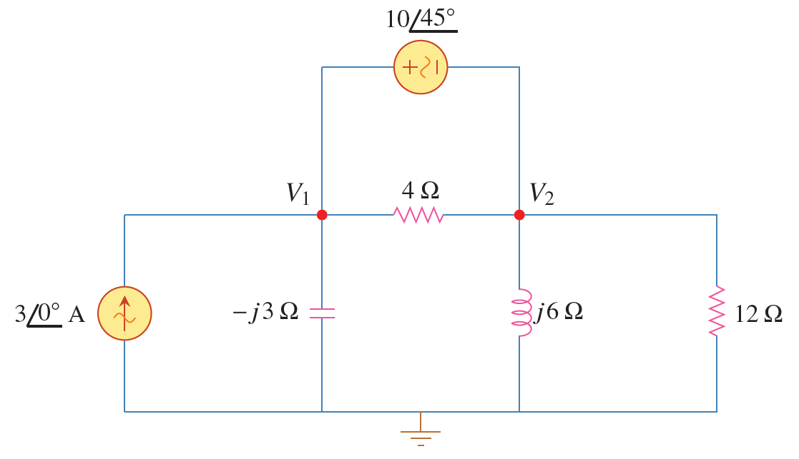

การวิเคราะห์วงจรกระแสสลับใช้ทฤษฏีต่างๆ ที่ใช้วิเคราะห์วงจรกระแสตรง แต่มีขั้นตอนเพิ่มขึ้นคือการแปลงเป็นเฟสเซอร์ซึ่งช่วยให้การวิเคราะห์วงจรกระแสสลับทำได้ง่ายขึ้น

## ตัวอย่าง 6.1


จงหา $\mathbf{V}_1$ และ $\mathbf{V}_2$

<figure>

  

  <figcaption style='text-align:center'>รูปที่ 6.1 วงจรสำหรับตัวอย่าง 6.1</figcaption>
</figure>

คำตอบ

เนื่องจากมีแหล่งจ่ายแรงดันอยู่ระหว่างโหนด 1 และ โหนด 2 ดังนั้นพิจารณาเป็น supernode
โดยใช้ KCL
\begin{align}
    3&=\dfrac{\mathbf{V}_1}{-j3}+\dfrac{\mathbf{V}_2}{j6}+\dfrac{\mathbf{V}_2}{12}\notag\\\\
    \text{จัดรูปได้เป็น}\notag\\\\
    36&=j4\mathbf{V}_1+(1-j2)\mathbf{V}_2 \tag{6.1} \label{eq6:ex1-1}
\end{align}
แหล่งจ่ายบอกความสัมพันธ์ระหว่างโหนดดังนี้
\begin{align}
    \mathbf{V}_1-\mathbf{V}_2=10\angle{45^{\circ}} \tag{6.2} \label{eq6:ex1-2}
\end{align}
แทนค่าจากสมการ \eqref{eq6:ex1-2} ใน \eqref{eq6:ex1-1}
\begin{align}
    36-40\angle{135^{\circ}}=(1+j2)\mathbf{V}_2\qquad \Rightarrow \qquad \mathbf{V}_2=31.41\angle{-87.18^{\circ}}\mathrm{V} \tag{6.3}
\end{align}
และจากสมการ \eqref{eq6:ex1-2}
\begin{align*}
    \mathbf{V}_1=\mathbf{V}_2+10\angle{45^{\circ}}=25.78\angle{-70.48^{\circ}}\mathrm{V}
\end{align*}


