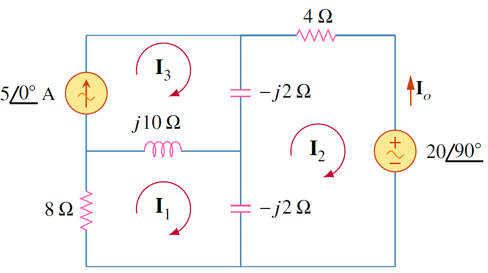

## ตัวอย่าง 6.2


จงหากระแส $\mathbf{I}_o$

<figure>

  

  <figcaption style='text-align:center'>รูปที่ 6.2 วงจรสำหรับตัวอย่าง 6.2</figcaption>
</figure>

คำตอบ

ใช้ KVL ที่แมช 1
\begin{align}
    (8+j10-j2)\mathbf{I}_1-(-j2)\mathbf{I}_2-j10\mathbf{I}_3=0 \tag{6.4} \label{eq6:ex-mesh-1-1}
\end{align}
สำหรับแมช 2
\begin{align}
    (4-j2-j2)\mathbf{I}_2-(-j2)\mathbf{I}_1-(-j2)\mathbf{I}_3+20\angle{90^{\circ}}=0 \tag{6.5}\label{eq6:ex-mesh-1-2}
\end{align}
สำหรับแมช 3  $\mathbf{I}_3=5$ แทนค่าในสมการ \eqref{eq6:ex-mesh-1-1} และ \eqref{eq6:ex-mesh-1-2}
\begin{align}
    (8+j8)\mathbf{I}_1+j2\mathbf{I}_2&=j50 \tag{6.6}\\\\
    j2\mathbf{I}_1+(4-j4)\mathbf{I}_2&=-j20-j10 \tag{6.7}
\end{align}
แก้สมการได้
\begin{align*}
    \mathbf{I}_2=6.12\angle{-35.22^{\circ}}\mathrm{A}
    \end{align*}
\begin{align*}
    \mathbf{I}_o=-\mathbf{I}_2=6.12\angle{144.78^{\circ}}\mathrm{V}
\end{align*}

