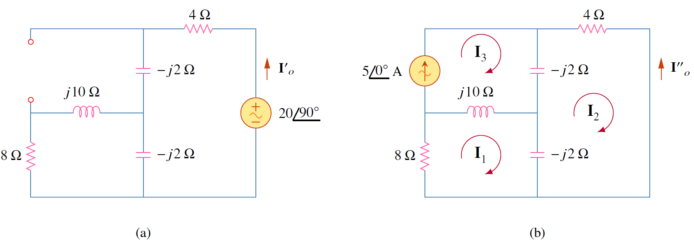
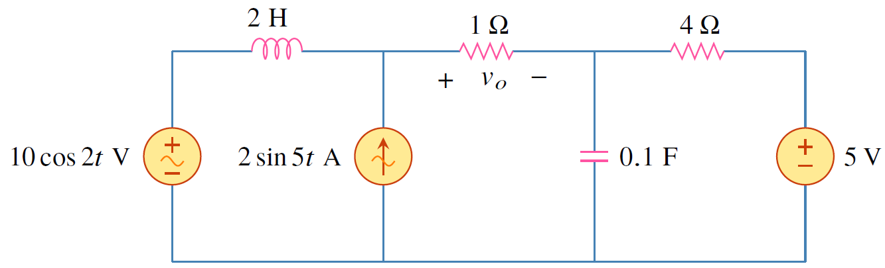
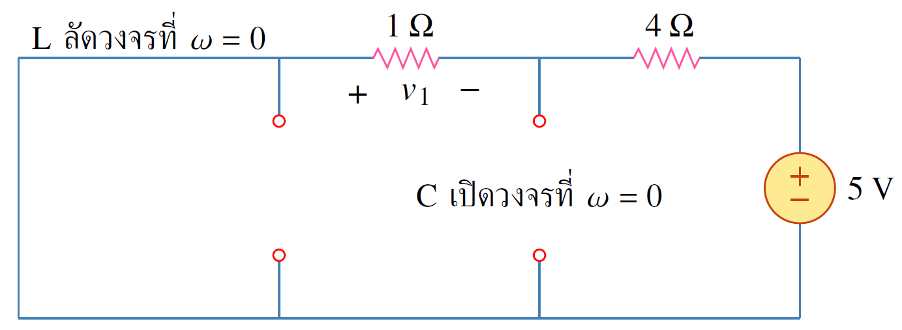
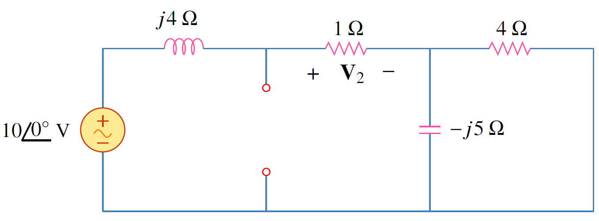
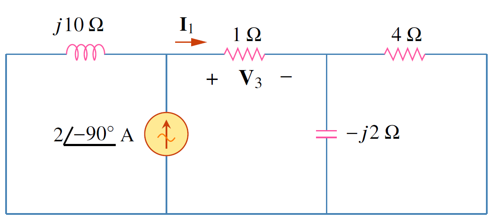

## ตัวอย่าง 6.3
จงหากระแส $\mathbf{I}_o$

<figure>

  

  <figcaption style='text-align:center'>รูปที่ 6.3 วงจรสำหรับตัวอย่าง 6.3</figcaption>
</figure>

คำตอบ

เนื่องจากมี 2 แหล่งจ่าย ดังนั้นพิจารณาทีละแหล่งจ่าย

กำหนดให้
\begin{align}
    \mathbf{I}_o=\mathbf{I^\prime}_o+\mathbf{I^{\prime\prime}}_o \tag{6.8}
\end{align}

โดยที่  $\mathbf{I^\prime}_o+\mathbf{I^{\prime\prime}}_o$ เป็นผลจากแหล่งจ่ายแรงดันและแหล่งจ่ายกระแสตามลำดับ

เริ่มหา $\mathbf{I^\prime}_o$ จากรูปที่ 6.3(a)  โดยกำหนดให้ อิมพีแดนซ์ $\mathbf{Z}$ เป็นการต่อขนานของ $-j2$ และ $8+j10$ ดังนั้น
\begin{align*}
    \mathbf{Z}&=\dfrac{-j2(8+j10)}{-j2+8+j10}=0.25-j2.25
\end{align*}

และกระแส $\mathbf{I^\prime}_o$ คือ

\begin{align*}
    \mathbf{I^\prime}_o&=\dfrac{j20}{4-j2+\mathbf{Z}}=\dfrac{j20}{4.25-j4.25}
\end{align*}

 หรือ
 
\begin{align*}
    \mathbf{I^\prime}_o&=-2.353+j2.353
\end{align*}
\
หา $\mathbf{I^{\prime\prime}}_o$ จากรูปที่ 6.3(b) 

พิจารณา แมช 1

\begin{align}
(8+j8)\mathbf{I}_1-j10\mathbf{I}_3+j2\mathbf{I}_2&=0 \label{eq6:ex-super-1} \tag{6.9}
\end{align}

สำหรับแมช 2

\begin{align}
(4-j4)\mathbf{I}_2+j2\mathbf{I}_1+j2\mathbf{I}_3&=0 \label{eq6:ex-super-2}\tag{6.10}
\end{align}

สำหรับแมช 3

\begin{align}
\mathbf{I}_3&=5 \label{eq6:ex-super-3} \tag{6.11}
\end{align}

แทนค่า $\mathbf{I}_3$ ลงใน \eqref{eq6:ex-super-2}}
\begin{align*}
(4-j4)\mathbf{I}_2+j2\mathbf{I}_1+j10&=0 \nonumber
\end{align*}

ย้ายข้างเพื่อหา $\mathbf{I}_1$ ในรูปของ $\mathbf{I}_2$

\begin{align}
\mathbf{I}_1=(2+j2)\mathbf{I}_2&-5 \tag{6.12}\label{eq6:ex-super-4}
\end{align}

แทนค่า สมการ \eqref{eq6:ex-super-3} และ \eqref{eq6:ex-super-4} ลงใน \eqref{eq6:ex-super-1} ได้

\begin{align}
(8+j8)[(2+j2)\mathbf{I}_2-5]-j50+j2\mathbf{I}_2&=0 \tag{6.13}
\end{align}

หรือ

\begin{align}
\mathbf{I}_2=\dfrac{90-j40}{34}=2.647-j1.176 \tag{6.14}
\end{align} 

ดังนั้น

\begin{align}
\mathbf{I^{\prime\prime}}_o=\mathbf{I}_2=-2.647+j1.176 \tag{6.15}
\end{align}

และจาก superposition

\begin{align}
\mathbf{I}_o=\mathbf{I^\prime}_o+\mathbf{I^{\prime\prime}}_o=-5+j3.529=6.12\angle{144.78^{\circ}}\mathrm{A} \tag{6.16}
\end{align}

## ตัวอย่าง 6.4
จงหา $v_o$ โดยใช้ทฤษฏีการวางทับซ้อน

<figure>

  

  <figcaption style='text-align:center'>รูปที่ 6.4 วงจรสำหรับตัวอย่าง 6.4</figcaption>
</figure>

คำตอบ

ในข้อนี้แหล่งจ่ายมีความถี่ต่างกันหมด (คือที่ $\omega_1 = 0, \omega_2 =2, \omega_3= 5$) ซึ่งวิธีการวิเคราะห์โหนดหรือแมชไม่สามารถแก้ปัญหานี้ได้ แต่ทฤษฏีการวางทับซ้อนสามารถแก้ได้โดยแยกพิจารณาทีละแหล่งจ่ายซึ่ง
\begin{align*}
    v_o=v_1+v_2+v_3
\end{align*}
โดยที่ $v_1$ เป็นผลจากแหล่งจ่ายไฟตรง 5 V และ $v_2$ เป็นผลของแหล่งจ่ายแรงดัน $10\cos 2t\\;\mathrm{V}$ และ $v_3$ เป็นผลจากแหล่งจ่ายกระแส $2\sin 5t\\;\mathrm{A}$

พิจารณาแหล่งจ่ายแรงดัน $5\\;\mathrm{V}$ ซึ่งเป็นแรงดันไฟตรง (ความถี่เป็น 0) 

<figure>

  

  <figcaption style='text-align:center'>รูปที่ 6.5</figcaption>
</figure>

จากรูปที่ 6.5 จะเห็นว่าที่ความถี่เป็น 0 ตัวเก็บประจุจะเปิดวงจรเนื่องจาก $X_C=\dfrac{1}{j \omega C}=\dfrac{1}{j(0)C}=\infty$
 แต่ตัวเหนี่ยวนำจะลัดวงจรเนื่องจาก $X_L=j\omega L=j(0)L=0\\;\Omega$

จากการแบ่งแรงดัน
    
\begin{align}
    -v_1=\dfrac{1}{1+4}(5)=1\\;\mathrm{V}
\end{align}

พิจารณาแหล่งจ่ายแรงดัน $10\cos 2t$ โดยการแปลงค่าเป็นเฟสเซอร์
\begin{align*}
    10\cos 2t\qquad &\Rightarrow \qquad 10\angle{0^{\circ}}, \qquad \omega=2\\;\mathrm{rad/s}\\\\
    2\\;\mathrm{H}\qquad &\Rightarrow \qquad j\omega L=j4\\;\Omega\\\\
    0.1\\;\mathrm{F} \qquad &\Rightarrow \qquad \dfrac{1}{j\omega C}=-j5\\;\Omega
\end{align*}

<figure>

  

  <figcaption style='text-align:center'>รูปที่ 6.6</figcaption>
</figure>

แสดงถึงผลการแปลงค่าทั้งหมดเป็นเฟสเซอร์

กำหนดให้
    
\begin{align*}
    \mathbf{Z}&=-j5||4=\dfrac{-j5\times4}{-j5+4}=2.439-j1.951
\end{align*}

และจากการแบ่งแรงดัน

\begin{align*}
    \mathbf{V}_2=\dfrac{1}{1+j4+\mathbf{Z}}(10\angle{10^{\circ}})&=\dfrac{10}{3.439+j2.049}=2.498\angle{-30.79^{\circ}}
\end{align*}

แปลงกลับไปในรูปเวลาได้

\begin{align*}
    v_2&=2.498\cos (2t-30.79^{\circ})
\end{align*}

หา $v_3$ โดยแปลงเป็นเฟสเซอร์

\begin{align*}
    2\sin5t\qquad &\Rightarrow \qquad 2\angle{-90^{\circ}}, \qquad \omega=5\\;\mathrm{rad/s}\\\\
2\\;\mathrm{H} \qquad &\Rightarrow \qquad  j\omega L=j10\\;\Omega \\
0.1\\;\mathrm{F}\qquad &\Rightarrow \qquad \dfrac{1}{j \omega C}=-j2\\;\Omega 
\end{align*}

<figure>

  

  <figcaption style='text-align:center'>รูปที่ 6.7</figcaption>
</figure>

รูปที่ 6.7 แสดงถึงผลการแปลงค่าทั้งหมดเป็นเฟสเซอร์

กำหนดให้
    
\begin{align*}
    \mathbf{Z}_1=-j2||4=\dfrac{-j2\times4}{-j2+4}=0.8-j1.6 \\;\Omega
\end{align*}

และจากการแบ่งกระแส

\begin{align*}
    \mathbf{I}_1=\dfrac{j10}{j10+1+\mathbf{Z}_1}(2\angle{-90^{\circ}})\\;\mathrm{A}\\\\
    \mathbf{V}_3=\mathbf{I}_1\times1=\dfrac{j10}{1.8+j8.4}(-j2)=2.328\angle{-80^{\circ}}\\;\mathrm{V}
\end{align*}

แปลงกลับไปในรูปเวลาได้

\begin{align*}
        v_3=2.33\cos (5t-80^{\circ})=2.33\sin (5t +10^{\circ})\\;\mathrm{V}
\end{align*}

ดังนั้น

\begin{align*}
    v_o=-1+2.498\cos (2t-30.79^{\circ})+2.33\sin (5t+10^{\circ})\\;\mathrm{V}
\end{align*}