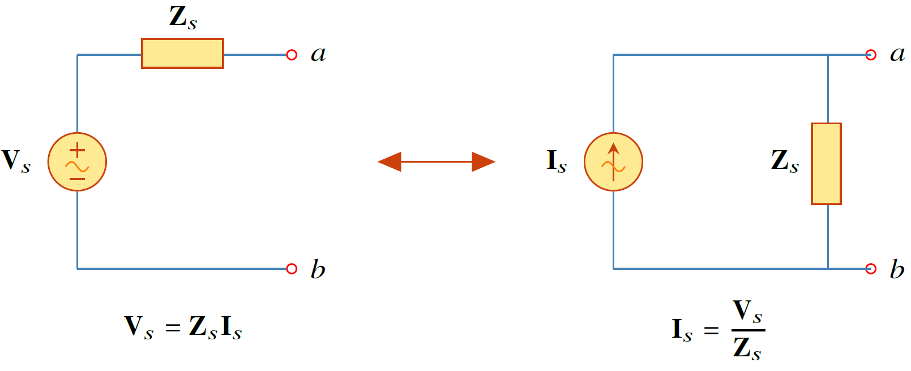
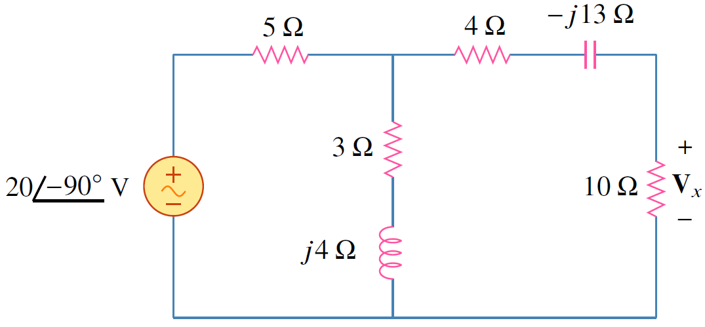
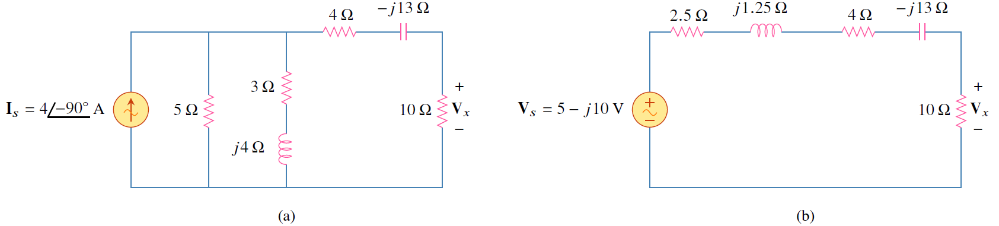

การแปลงแหล่งจ่ายของไฟกระแสสลับก็เหมือนกับกรณีไฟตรงดังแสดงในรูปที่ 6.8 ซึ่งความสัมพันธ์ของการแปลงแสดงได้ดังสมการ
\begin{align}
    \mathbf{V}_s=\mathbf{Z}_s\mathbf{I}_s\qquad \iff \qquad \mathbf{I}_s=\dfrac{\mathbf{V}_s}{\mathbf{Z}_s} \tag{6.18}
\end{align}

<figure>

  

  <figcaption style='text-align:center'>รูปที่ 6.8 การแปลงแหล่งจ่าย</figcaption>
</figure>

## ตัวอย่าง 6.5
จงหา $\mathbf{V}_x$ โดยทฤษฏีการวางทับซ้อน

<figure>

  

  <figcaption style='text-align:center'>รูปที่ 6.9 วงจรสำหรับตัวอย่าง 6.5</figcaption>
</figure>

คำตอบ

แปลงแหล่งจ่ายแรงดันที่อนุกรมกับตัวต้านทาน $5\\;\Omega$ เป็นแหล่งจ่ายกระแสต่อขนานกับตัวต้านทาน $5\\;\Omega$ ดังรูปที่ 6.10(a) โดยที่
\begin{align*}
    \mathbf{I}_s=\dfrac{20\angle{-90^{\circ}}}{5}=4\angle{-90^{\circ}}=-j4\\;\mathrm{A}
\end{align*}
หาอิมพีแดนซ์รวมของตัวต้านทาน $5\;\Omega$ ขนานกับ $(3+j4)$ ได้เป็น
\begin{align*}
    \mathbf{Z}_1=\dfrac{5(3+j4)}{8+j4}=2.5+j1.25\\;\Omega
\end{align*}
แปลงจ่ายกระแสกลับไปเป็นแหล่งจ่ายแรงดัน
\begin{align*}
    \mathbf{V}_s=\mathbf{I}_s\mathbf{Z}_1=-j4(2.5+j1.25)=5-j10\\;\mathrm{A}
\end{align*}
และจากการแบ่งแรงดัน
\begin{align*}
    \mathbf{V}_x=\dfrac{10}{10+2.5+j1.25+4-j13}(5-j10)=5.519\angle{-28^{\circ}}\\;\mathrm{V}
\end{align*}

<figure>

  

  <figcaption style='text-align:center'>รูปที่ 6.10</figcaption>
</figure>

