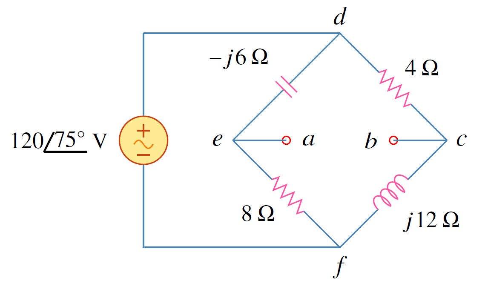

ทฤษฏีเทเวนินและนอร์ตันใช้ได้กับวงจรกระแสสลับ เพียงแค่เปลี่ยนจากตัวต้านทานเป็นอิมพีแดนซ์ สมการแสดงความสัมพันธ์ระหว่างนอร์ตันและเทเวนินคือ

$$
\begin{equation*}
    \mathbf{V}_\text{Th}=\mathbf{Z}_N\mathbf{I}_N 
\end{equation*}
$$

$$
\begin{align}
    \mathbf{Z}_\text{Th}&=\mathbf{Z}_N \tag{6.19}
\end{align}
$$

ในกรณีที่แหล่งจ่ายมีหลายตัวและแต่ละตัวมีความถี่ที่ต่างกันดังเช่นตัวอย่าง 6.5 การหาวงจรสมมูลเทเวนินหรือนอร์ตันต้องทำที่แต่ละความถี่ ดังนั้นจะมีวงจรสมมูลหนึ่งวงจรต่อหนึ่งความถี่

<figure>

  

  <figcaption style='text-align:center'>รูปที่ 6.11 วงจรสมมูลเทเวนิน</figcaption>
</figure>

<figure>

  

  <figcaption style='text-align:center'>รูปที่ 6.12 วงจรสมมูลนอร์ตัน</figcaption>
</figure>

## ตัวอย่าง 6.6


จงหาวงจรสมมูลเทเวนินที่ขั้ว a-b

<figure>

  

  <figcaption style='text-align:center'>รูปที่ 6.13 วงจรสำหรับตัวอย่าง 6.6</figcaption>
</figure>

คำตอบ

หาอิมพีแดนซ์ $\mathbf{Z}_\text{Th}$ โดยการกำหนดให้แหล่งจ่ายแรงดันเป็นศูนย์ จากรูปที่ 6.14(a) ตัวต้านทาน $8\\;\Omega$ ขนานกับ ตัวเก็บประจุที่มีค่ารีแอคแตนซ์ $-j6\\;\Omega$ ดังนั้น
\begin{align*}
    \mathbf{Z}_1=-j6||8=\dfrac{-j6\times8}{8-j6}=2.88-j3.84\\;\Omega
\end{align*}
และตัวต้านทาน $4\\;\Omega$ ต่อขนานกับตัวเหนี่ยวนำที่มีค่ารีแอคแตนซ์ $j12\\;\Omega$ ดังนั้น
\begin{align*}
    \mathbf{Z}_2=4||j12=\dfrac{4\times j12}{4+j12}=3.6+j1.2\\;\Omega
\end{align*}

อิมพีแดนซ์เทเวนินคือผลรวมของอิมพีแดนซ์ $\mathbf{Z}_1$ และ $\mathbf{Z}_2$

\begin{align*}
    \mathbf{Z}_\text{Th}=\mathbf{Z}_1+\mathbf{Z}_2
\end{align*}

<figure>

  

  <figcaption style='text-align:center'>รูปที่ 6.14</figcaption>
</figure>

หาแรงดันเทเวนินจากรูปที่ 6.15 กระแส $\mathbf{I}_1$ และ $\mathbf{I}_2$ หาจาก

\begin{align*}
    \mathbf{I}_1=\dfrac{120\angle{75^{\circ}}}{8-j6}\\;\mathrm{A}  \qquad \mathbf{I}_2=\dfrac{120\angle{75^{\circ}}}{4+j12}\\;\mathrm{A} 
\end{align*}

เขียน KVL ได้เป็น

\begin{align*}
    \mathbf{V}_\text{Th}-4\mathbf{I}_2+(-j6)\mathbf{I}_1=0
\end{align*}

หรือ

\begin{align*}
    \mathbf{V}_\text{Th}=4\mathbf{I}_2+j6\mathbf{I}_1&=\dfrac{480\angle{75^{\circ}}}{4+j12}+\dfrac{720\angle{75^{\circ}+90^{\circ}}}{8-j6}\\\\
    &=37.95\angle{3.43^{\circ}}+72\angle{201.87^{\circ}}\\\\
    &=-28.936-j24.55=37.95\angle{220.32^{\circ}}\\;\mathrm{V}
\end{align*}

<figure>

  

  <figcaption style='text-align:center'>รูปที่ 6.15</figcaption>
</figure>



## ตัวอย่าง 6.7

จงหากระแส $\mathbf{I}_o$ โดยใช้ทฤษฏีนอร์ตัน

<figure>

  

  <figcaption style='text-align:center'>รูปที่ 6.16 วงจรสำหรับตัวอย่าง 6.7</figcaption>
</figure>

คำตอบ

การหาอิมพีแดนซ์นอร์ตันทำเหมือนกับการหาอิมพีแดนซ์เทเวนิน โดยการกำจัดแหล่งจ่าย ได้ดังรูปที่ 6.17(a)  และจากรูปจะเห็นว่าอิมพีแดนซ์ $(8-j2)$ และ $(10+j4)$ ถูกลัดวงจร ดังนั้น
\begin{align*}
    \mathbf{Z}_N=5\\;\Omega
\end{align*}

<figure>

  

  <figcaption style='text-align:center'>รูปที่ 6.17</figcaption>
</figure>

การหากระแสนอร์ตัน $\mathbf{I}_N$ ให้ลัดขั้ว a-b ดังรูปที่ 6.17(b) และใช้การวิเคราะห์แมช สังเกตว่าแมช 2 และ แมช 3 เป็น supermesh 
พิจารณา แมช 1

\begin{align}
    -j40+(18+j2)\mathbf{I}_1-(8-j2)\mathbf{I}_2-(10+j4)\mathbf{I}_3&=0 \tag{6.20} \label{ex6-in-1}
\end{align}

พิจารณา supermesh

\begin{align}
(13-j2)\mathbf{I}_2+(10+j4)\mathbf{I}_3-(18+j2)\mathbf{I}_1&=0 \tag{6.21}\label{ex6-in-2}
\end{align}

และความสัมพันธ์กระแสแมช 2 และกระแสแมช 3 คือ

\begin{align}
\mathbf{I}_3-\mathbf{I}_2=3 \tag{6.22} \label{ex6-in-3}
\end{align}

บวกสมการ \eqref{ex6-in-1} กับสมการ \eqref{ex6-in-2} ได้เป็น

\begin{align}
-j40+5\mathbf{I}_2=0\quad \Rightarrow \quad \mathbf{I}_2=j8 \tag{6.23}
\end{align}

และจากสมการ \eqref{ex6-in-3}

\begin{align*}
\mathbf{I}_3=\mathbf{I}_2+3=3+j8 \nonumber
\end{align*}

กระแสนอร์ตันคือ

\begin{align*}
\mathbf{I}_N=\mathbf{I}_3=(3+j8)\\;\mathrm{A} \nonumber
\end{align*}

ใช้การแบ่งกระแสหา $\mathbf{I}_o$

\begin{align}
\mathbf{I}_o=\dfrac{5}{5+20+j15}\mathbf{I}_N=\dfrac{3+j8}{5+j3}=1.465\angle{38.48^{\circ}}\\;\mathrm{A} \tag{6.24}
\end{align}

วงจรสมมูลนอร์ตันแสดงในรูปที่ 6.18

<figure>

  

  <figcaption style='text-align:center'>รูปที่ 6.18</figcaption>
</figure>


