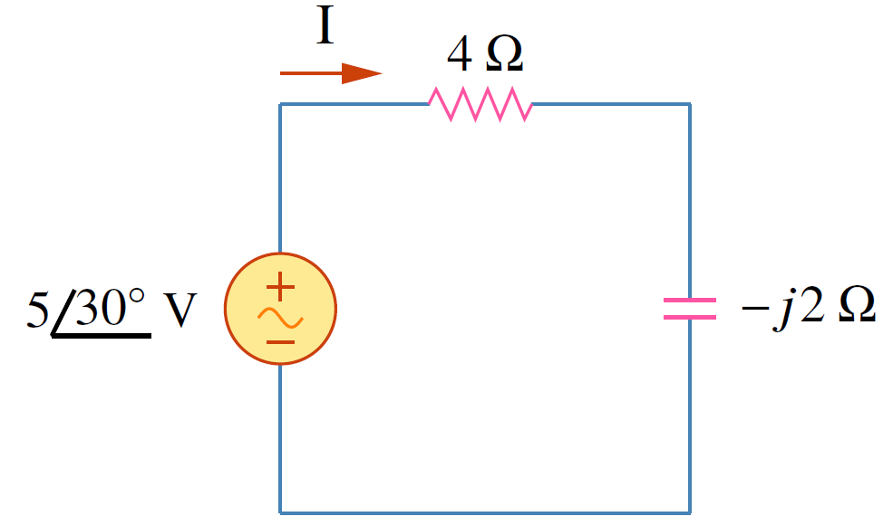
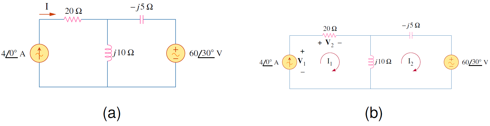

  กำลังไฟฟ้าเป็นปริมาณวัดที่สำคัญ เครื่องใช้ไฟฟ้าทุกชนิดบอกความต้องการกำลังที่จำเป็นสำหรับการทำงาน แต่ถ้ากำลังมีมากกว่าความต้องการที่ระบุอาจทำให้เครื่องใช้ไฟฟ้าเสียหายและอาจถึงขั้นไฟไหม้ได้

## **กำลังปัจจุบัน (instantaneous power)**
เป็นการวัดกำลัง ณ เวลาใดๆ ซึ่งมีสมการคำนวณดังนี้
\begin{align}
    p(t)=v(t)i(t) \tag{7.1}
\end{align}


กำลังปัจจุบัน (หน่วยเป็นวัตต์) คือกำลังในเวลา $t$ ใดๆ


มันเป็นค่าที่บอกอัตราการใช้พลังงานของอุปกรณ์ไฟฟ้า กำหนดให้

\begin{align} \label{eq7:vi}
v(t)&=V_m\cos (\omega t + \theta_v) \tag{7.2}\\\\
i(t)&=I_m\cos (\omega t + \theta_i) \tag{7.3}
\end{align}

โดยที่ $V_m$ และ $I_m$ เป็นขนาด (หรือค่าสูงสุด) และ $\theta_v$ และ $\theta_i$ เป็นมุมเฟสของแรงดันและกระแสตามลำดับ ค่ากำลังปัจจุบันที่อุปกรณ์ไฟฟ้าใช้คือ

\begin{align}
p(t)=v(t)i(t)=V_m I_m\cos (\omega t + \theta_v)\cos (\omega t + \theta_i) \tag{7.4}\label{eq7:p-int}
\end{align}
จากคุณสมบัติของตรีโกณมิติ
\begin{align}
\cos A \cos B = \dfrac{1}{2}[\cos (A-B)+\cos (A+B)] \tag{7.5}
\end{align}
สมการ \eqref{eq7:p-int} เขียนใหม่ได้เป็น
\begin{align}
p(t)=\dfrac{1}{2}V_mI_m\cos (\theta_v-\theta_i) + \dfrac{1}{2}V_mI_m\cos  (2\omega t+ \theta_v + \theta_i) \tag{7.6} \label{eq7:p-int-2}
\end{align}
สมการนี้บอกเราว่า กำลังปัจจุบันมีสองส่วน ส่วนแรกเป็นค่าคงที่ไม่ขึ้นกับเวลา ค่าของมันขึ้นอยู่กับผลต่างมุมเฟสของแรงดันและกระแส ส่วนที่สองเป็นฟังก์ชันตระกูลซายน์โดยมีความถี่เป็นสองเท่าของความถี่ของแรงดันหรือกระแส

## **กำลังเฉลี่ย**

เนื่องจากกำลังปัจจุบันมีค่าเปลี่ยนตามเวลา ดังนั้นทำให้ยากต่อการวัด การใช้ค่ากำลังเฉลี่ยจึงเหมาะสมกว่าซึ่งเป็นค่าคงที่ 


กำลังเฉลี่ย คือค่าเฉลี่ยของกำลังปัจจุบันในหนึ่งคาบเวลา
\begin{equation}
    P=\dfrac{1}{T}\int_{0}^{T}p(t)dt \tag{7.7} \label{eq7:pav}
\end{equation}


เมื่อแทน $p(t)$ จากสมการ \eqref{eq7:p-int-2} ในสมการ \eqref{eq7:pav} ได้เป็น

\begin{align*}
P&=\dfrac{1}{T}\int_{0}^{T}\dfrac{1}{2}V_mI_m\cos (\theta_v-\theta_i)dt+\dfrac{1}{T}\int_{0}^{T}\dfrac{1}{2}V_mI_m\cos (2\omega t+\theta_v+\theta_i)dt \nonumber\\\\
&=\dfrac{1}{2}V_mI_m\cos (\theta_v-\theta_i)\dfrac{1}{T}\int_{0}^{T}dt+\dfrac{1}{2}V_mI_m\dfrac{1}{T}\int_{0}^{T}\cos (2\omega t+\theta_v+\theta_i)dt \nonumber\\\\
&=\dfrac{1}{2}V_mI_m\cos (\theta_v-\theta_i)\dfrac{1}{T}(T)\quad\\:\\:+\dfrac{1}{2}V_mI_m\dfrac{1}{T}(0) \nonumber
\end{align*}

\begin{equation}
P=\dfrac{1}{2}V_mI_m\cos (\theta_v-\theta_i) \tag{7.8} \label{eq7:pav2}
\end{equation}

ในการหากำลังปัจจุบันต้องหาในรูปเวลาเท่านั้น แต่กำลังเฉลี่ยสามารถหาได้ทั้งรูปเวลาและรูปเฟสเซอร์ กระแสและแรงดันจากสมการ \eqref{eq7:vi} มีรูปเฟสเซอร์เป็น $\mathbf{V}=V_m\angle{\theta_v}$ และ $\mathbf{I}=I_m\angle{\theta_i}$
ดังนั้นการคำนวณกำลังเฉลี่ยจากสมการ \eqref{eq7:pav2} สามารถคำนวณจากเฟสเซอร์ดังนี้

เนื่องจาก
\begin{align}
    \dfrac{1}{2}\mathbf{V}\mathbf{I}^\ast&=\dfrac{1}{2}V_mI_m\angle{\theta_v-\theta_i}\nonumber\\\\
    &=\dfrac{1}{2}V_mI_m[\cos(\theta_v-\theta_i)+j\sin(\theta_v-\theta_i) ] \tag{7.9}\label{eq7:pav-phasor}
\end{align}
สังเกตในพจน์แรกของสมการ \eqref{eq7:pav-phasor} คือค่ากำลังเฉลี่ย ดังนั้น
\begin{equation}
    P=\dfrac{1}{2}\text{Re}[\mathbf{V}\mathbf{I}^\ast]=\dfrac{1}{2}V_mI_m\cos (\theta_v-\theta_i)\tag{7.10}
\end{equation}

### กำลังเฉลี่ยในโหลดที่เป็นตัวต้านทาน
ในกรณีนี้ค่า  $\theta_v =\theta_i$ กระแสและแรงดันมีมุมเฟสเหมือนกัน ดังนั้นกำลังเฉลี่ยจะมีค่าเป็น
\begin{equation}
    P=\dfrac{1}{2}V_mI_m=\dfrac{1}{2}I_m^2R=\dfrac{1}{2}|\mathbf{I}|^2R \label{eq7:pav-r} \tag{7.11}
\end{equation}
โดยที่  $|\mathbf{I}|^2=\mathbf{I}\times \mathbf{I}^\ast$
สมการ \eqref{eq7:pav-r} แสดงให้เห็นว่าวงจรที่มีแต่ตัวต้านทานจะใช้พลังงานเสมอ (ค่ากำลังเฉลี่ยมากกว่า 0)

### กำลังเฉลี่ยในโหลดที่เป็นตัวเหนี่ยวนำหรือตัวเก็บประจุ
ในกรณีนี้ค่า  $\theta_v-\theta_i \pm90^{\circ}$ ดังนั้นกำลังเฉลี่ยจะมีค่าเป็น
\begin{equation}
    P=\dfrac{1}{2}V_mI_m\cos 90^{\circ} =0 \label{eq7:pav-lc} \tag{7.12}
\end{equation}
ซึ่งหมายความว่าวงจรที่มีเฉพาะตัว L หรือตัว C มีค่ากำลังเฉลี่ยเป็น 0


1. วงจรที่มีแต่ตัวต้านทานจะใช้กำลังตลอด 
2. วงจรที่มีเฉพาะตัว L หรือ C มีค่ากำลังเฉลี่ยเป็น 0



กำหนดให้ 
\begin{align*}
    v(t)=120\cos (377t+45^{\circ})\\;\mathrm{V}\quad \text{และ}\quad i(t)=10\cos (377t-10^{\circ})\\;\mathrm{A}
\end{align*}
จงหากำลังปัจจุบันและกำลังเฉลี่ย

คำตอบ

กำลังปัจจุบันหาจาก
\begin{align*}
    p(t)=v(t)i(t)=1200\cos (377t+45^{\circ})\cos (377t-10^{\circ})
\end{align*}
ใช้คุณสมบัติ
\begin{equation*}
    \cos A \cos B = \dfrac{1}{2}[\cos (A+B) + \cos (A-B)]
\end{equation*}
ได้
\begin{equation*}
    p(t)=600[\cos (754t+35^{\circ})+\cos (55^{\circ})]
\end{equation*}
หรือ
\begin{equation*}
    p(t)=344.2+600\cos (754t+35^{\circ})\\;\mathrm{W}
\end{equation*}
กำลังเฉลี่ยคือ
\begin{align*}
    P=\dfrac{1}{2}V_mI_m\cos (\theta_v-\theta_i) &=\dfrac{1}{2}120(10)\cos (45^{\circ} - (-10^{\circ})) \\\\
    &=600 \cos 55^{\circ} =344.2 \\;\mathrm{W}
\end{align*}



จงหากำลังเฉลี่ยที่ใช้โดยอิมพีแดนซ์ $\mathbf{Z}=30-j70\\;\Omega$ โดยมีแหล่งจ่ายแรงดัน $\mathbf{V}=120\angle{0^{\circ}}$ จ่ายกำลังให้

คำตอบ

กระแสที่ไหลผ่านอิมพีแดนซ์ $\mathbf{Z}$ คือ
\begin{align*}
    \mathbf{I}=\dfrac{\mathbf{V}}{\mathbf{Z}}=\dfrac{120\angle{0^{\circ}}}{76.16\angle{-66.8^{\circ}}}=1.576\angle{66.8^{\circ}}\\;\mathrm{A}
\end{align*}
กำลังเฉลี่ยคือ
\begin{align*}
    P=\dfrac{1}{2}V_mI_m\cos (\theta_v-\theta_i)=\dfrac{1}{2}(120)(1.576)\cos (0^{\circ}-66.8^{\circ})=37.24\\;\mathrm{W}
\end{align*}



จงหากำลังเฉลี่ยที่ใช้โดยตัวต้านทาน และตัวเหนี่ยวนำ และหากำลังเฉลี่ยที่จ่ายโดยแหล่งจ่ายแรงดัน

<figure>

  

  <figcaption style='text-align:center'>รูปที่ 7.1 วงจรสำหรับตัวอย่าง 7.3</figcaption>
</figure>



คำตอบ

หากระแส $\mathbf{I}$
\begin{equation*}
    \mathbf{I}=\dfrac{5\angle{30^{\circ}}}{4-j2}=\dfrac{5\angle{30^{\circ}}}{4.472\angle{-26.57^{\circ}}}=1.118\angle{56.57^{\circ}} \\;\mathrm{A}
\end{equation*}
กำลังเฉลี่ยที่จ่ายโดยแหล่งจ่ายแรงดันคือ
\begin{align*}
    P=\dfrac{1}{2}(5)(1.118)\cos (30^{\circ} -56.57^{\circ})=2.5\\;\mathrm{W}
\end{align*}
กระแสที่ผ่านตัวต้านทานคือ
\begin{align*}
    \mathbf{I}_R=\mathbf{I}=1.118\angle{56.57^{\circ}} \\;\mathrm{A}
\end{align*}
และแรงดันตกคร่อมตัวต้านทานคือ
\begin{align*}
    \mathbf{V}_R=4\mathbf{I}_R=4.472\angle{56.57^{\circ}} \\;\mathrm{V}
\end{align*}
กำลังเฉลี่ยที่ตัวต้านทานใช้คือ
\begin{align*}
    P=\dfrac{1}{2}(4.472)(1.118)=2.5\\;\mathrm{W}
\end{align*}
ซึ่งเท่ากับค่ากำลังเฉลี่ยที่จ่ายโดยแหล่งจ่ายแรงดัน ขณะที่กำลังเฉลี่ยที่ตัวเก็บประจุเป็น 0



จงหากำลังเฉลี่ยของแต่ละอุปกรณ์ไฟฟ้า

<figure>

  

  <figcaption style='text-align:center'>รูปที่ 7.2 วงจรสำหรับตัวอย่าง 7.4</figcaption>
</figure>


คำตอบ

ใช้การวิเคราะห์แมชดังรูปที่ 7.2(a) สำหรับแมช 1
\begin{align*}
    \mathbf{I}_1=4\\;\mathrm{A}
\end{align*}
สำหรับแมช 2
\begin{align*}
    (j10-j5)\mathbf{I}_2-j10\mathbf{I}_1+60\angle{30^{\circ}}
=0
\end{align*}
แทนค่า $\mathbf{I}_1$ ได้
\begin{align*}
    j5\mathbf{I}_2=-60\angle{30^{\circ}}+j40\qquad \Rightarrow \quad \mathbf{I}_2=-12\angle{-60^{\circ}}+8=10.58\angle{79.1^{\circ}}\\;\mathrm{A}
\end{align*}
หากำลังที่จ่ายโดยแหล่งจ่ายแรงดันได้เป็น
\begin{equation*}
    P_V=\dfrac{1}{2}(60)(10.58)\cos (30^{\circ}-79.1^{\circ})=207.8\\;\mathrm{W}
\end{equation*}
ได้ค่าเป็นบวกนั่นหมายความว่าแหล่งจ่ายแรงดันเป็นตัวใช้กำลัง

สำหรับแหล่งจ่ายกระแส มีแรงดันตกคร่อมเท่ากับ
\begin{align*}
    \mathbf{V}_1&=20\mathbf{I}_1+j10(\mathbf{I}_1-\mathbf{I}_2)\\\\&=20(4)+j10(4-2-j10.39)=183.9+j20=184.984\angle{6.21^{\circ}}\\;\mathrm{V}
\end{align*}
กำลังเฉลี่ยที่จ่ายโดยแหล่งจ่ายกระแสคือ
\begin{align*}
    P_I=-\dfrac{1}{2}(184.984)(4)\cos(6.21^{\circ} -0^{\circ})=-367.8\\;\mathrm{W}
\end{align*}
จากเครื่องหมายที่เป็นลบยืนยันว่าแหล่งจ่ายกระแสจ่ายกำลังให้กับวงจร

สำหรับตัวต้านทาน กระแสไหลผ่านคือ $\mathbf{I}_1=4\angle{0^{\circ}}$ และแรงดันตกคร่อมตัวต้านทานคือ $20\mathbf{I}_1=80\angle{0^{\circ}}$ ดังนั้นกำลังเฉลี่ยที่ใช้โดยตัวต้านทานเท่ากับ
\begin{align*}
    P_R=\dfrac{1}{2}(80)(4)=160\\;\mathrm{W}
\end{align*}
สำหรับตัวเก็บประจุและตัวเหนี่ยวนำ ค่ากำลังเฉลี่ยเป็น 0

และเพื่อเป็นการตรวจคำตอบ จากกฏอนุรักษ์พลังงาน ผลรวมกำลังในวงจรต้องเป็นศูนย์
\begin{equation*}
    P_I+P_V+P_R=-367.8+207.8+160=0
\end{equation*}
ดังนั้นแสดงว่าการคำนวณถูกต้อง
