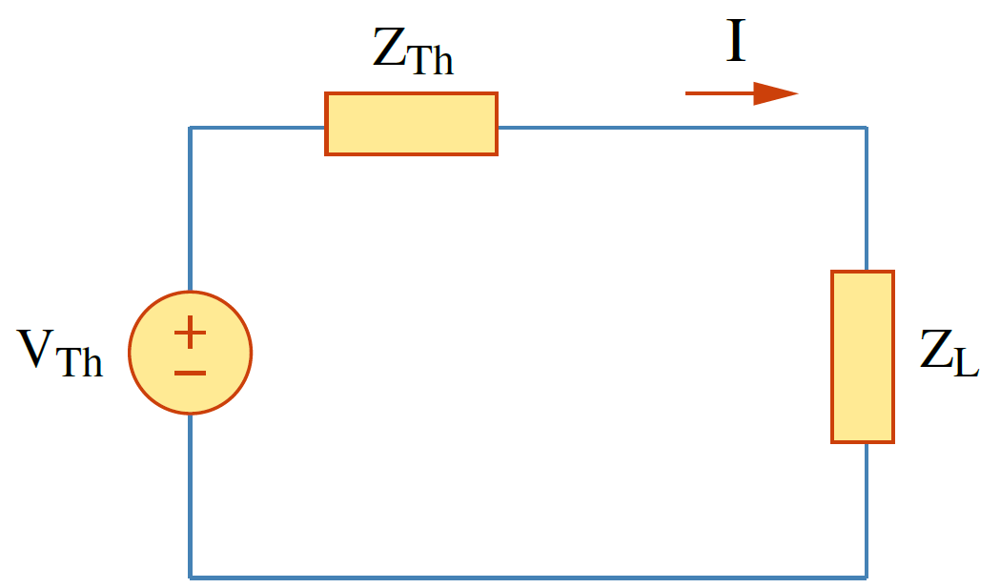
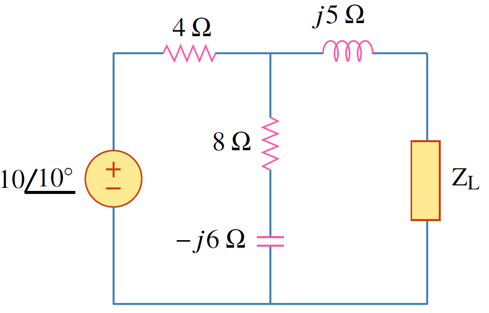
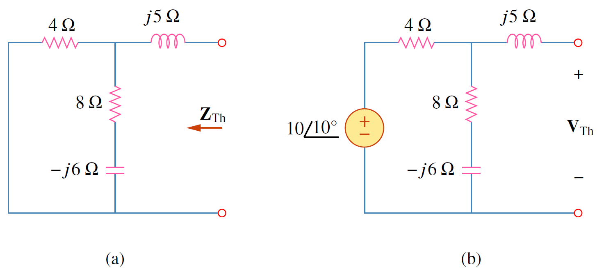
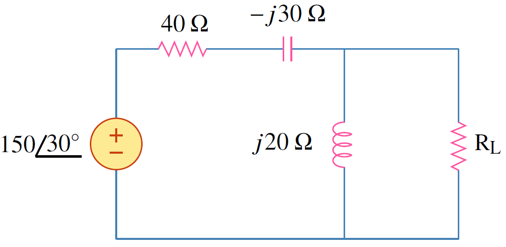

พิจารณารูปที่ 7.3 อิมพีแดนซ์ $\mathbf{Z}_\text{Th}$ และ $\mathbf{Z}_L$ เขียนได้เป็น

$$
\begin{align}
  \mathbf{Z}\_\mathrm{Th}&=R_\text{Th}+jX_\text{Th} \tag{7.13}\\\\
  \mathbf{Z}_L&=R_L+jX_L \tag{7.14}
\end{align}
$$

กระแสที่ไหลผ่านโหลดคือ

$$
\begin{equation}
  \mathbf{I}=\dfrac{\mathbf{V}_\mathrm{Th}}{\mathbf{Z}\_\mathrm{Th}+\mathbf{Z}_L}=\dfrac{\mathbf{V}\_\mathrm{Th}}{(R\_\mathrm{Th}+jX\_\mathrm{Th})+(R_L+jX_L)} \tag{7.15}
\end{equation}
$$

<figure>

  

  <figcaption style='text-align:center'>รูปที่ 7.3 วงจรสำหรับการพิจารณาการถ่ายโอนกำลังสูงสุด</figcaption>
</figure>

กำลังเฉลี่ยที่จ่ายให้โหลดคือ
$$
\begin{align}
    P=\dfrac{1}{2}|\mathbf{I}|^2R_L=\dfrac{|\mathbf{V}\_\text{Th}|^2R_L/2}{(R\_\text{Th}+R_L)^2+(X\_\text{Th}+X_L)^2} \tag{7.16}
\end{align}
$$
เนื่องจากเป้าหมายคือต้องการหาค่า $R_L$ และ $X_L$ ที่ทำให้ได้กำลังสูงสุด ดังนั้น
$$
\begin{align}
    \frac{\partial P}{\partial X_L}&=-\dfrac{|\mathbf{V}\_\text{Th}|^2R_L(X\_\text{Th}+X_L)}{[(R\_\text{Th}+R_L)^2+(X\_\text{Th}+X_L)^2]^2}\tag{7.17}\\\\
    \frac{\partial P}{\partial R_L}&=\dfrac{|\mathbf{V}\_\text{Th}|^2[(R\_\text{Th}+R_L)^2+(X\_\text{Th}+X_L)^2-2R_L(R\_\text{Th}+R_L)]}{2[(R\_\text{Th}+R_L)^2+(X\_\text{Th}+X_L)^2]^2} \tag{7.18}
\end{align}
$$

กำหนดให้ $\partial P/\partial X_L$ เท่ากับศูนย์
\begin{equation}
    X_L=-X_\text{Th} \label{eq7:pmax-cond-1} \tag{7.19}
\end{equation}
และ กำหนดให้ $\partial P/\partial R_L$ เท่ากับศูนย์ จะได้
\begin{align}
    R_L=\sqrt{R_\text{Th}^2+(X_\text{Th}+X_L)^2} \label{eq7:pmax-cond-2} \tag{7.20}
\end{align}
จากสมการ \eqref{eq7:pmax-cond-1} และ \eqref{eq7:pmax-cond-2} สรุปได้ว่า
การถ่ายกำลังสูงสุดเกิดขึ้นเมื่อเลือกอิมพีแดนซ์ $\mathbf{Z}_L$ ที่ทำให้ $X_L=-X\_\text{Th}$ และ $R_L=R\_\text{Th}$  ดังสมการ
\begin{align}
    Z_L=R_L=jX_L=R\_\text{Th}-jX\_\text{Th}=\mathbf{Z}\_\text{Th}^\ast \tag{7.21}
\end{align}


การถ่ายกำลังสูงสุดเกิดขึ้นเมื่อ $\mathbf{Z}_L = \mathbf{Z\_\text{Th}}^\ast$


ค่ากำลังสูงสุดคือ
\begin{align}
    P_{max}=\dfrac{|\mathbf{V}\_\text{Th}|^2}{8R\_\text{Th}} \tag{7.22}
\end{align}
ในกรณีที่โหลดเป็นตัวต้านทาน เงื่อนไขการถ่ายกำลังสูงสุดจากสมการ \eqref{eq7:pmax-cond-2} จะลดเหลือ
\begin{align}
     R_L=\sqrt{R\_\text{Th}^2+(X\_\text{Th})^2} =|\mathbf{Z}\_\text{Th}| \tag{7.23}
\end{align}
นั่นหมายความว่าในกรณีที่โหลดมีเฉพาะตัวต้านทาน การถ่ายกำลังสูงสุดเกิดเมื่อ ตัวต้านทานมีขนาดเท่ากับขนาดของอิมพีแดนซ์เทเวนิน


ในกรณีที่โหลดมีเฉพาะตัวต้านทาน การถ่ายกำลังสูงสุดเกิดเมื่อตัวต้านทานมีขนาดเท่ากับขนาดของอิมพีแดนซ์เทเวนิน



จงหาค่าอิมพีแดนซ์ $\mathbf{Z}_L$ ที่ทำให้เกิดการถ่ายกำลังสูงสุด

<figure>

  

  <figcaption style='text-align:center'>รูปที่ 7.4 วงจรสำหรับตัวอย่าง 7.5</figcaption>
</figure>



คำตอบ

หา $\mathbf{Z}\_\mathrm{Th}$ ด้วยการปลดโหลดดังรูปที่ 7.5(a) 
\begin{align}
    \mathbf{Z}\_\mathrm{Th}=j5+4||(8-j6)=j5+\dfrac{4(8-j6)}{4+8-j6}=2.933+j4.467\\;\Omega \tag{7.24}
\end{align}
หา $\mathbf{V}\_\mathrm{Th}$ จากรูปที่ 7.5(b) โดยการแบ่งแรงดัน
\begin{align}
    \mathbf{V}\_\mathrm{Th}=\dfrac{8-j6}{4+8-j6}(10)=7.454\angle{-10.3^{\circ}}\\;\mathrm{V} \tag{7.25}
\end{align}
โหลดอิมพีแดนซ์ $Z_L$ ที่ทำให้เกิดการถ่ายกำลังสูงสุดคือ

\begin{align}
    \mathbf{Z}_L=\mathbf{Z}\_\mathrm{Th}^\ast =2.933-j4.467\\;\Omega \tag{7.26}
\end{align}

และค่ากำลังสูงสุดคือ
\begin{align}
    P_{max}=\dfrac{|\mathbf{V}\_\mathrm{Th}|^2}{8R\_\text{Th}}=\dfrac{(7.454)^2}{8(2.933)}=2.368\\;\mathrm{W} \tag{7.27}
\end{align}


<figure>

  

  <figcaption style='text-align:center'>รูปที่ 7.5</figcaption>
</figure>


จงหาค่า $R_L$ ที่ทำให้เกิดการถ่ายกำลังสูงสุด และหาค่ากำลังสูงสุด

<figure>

  

  <figcaption style='text-align:center'>รูปที่ 7.6 วงจรสำหรับตัวอย่าง 7.6</figcaption>
</figure>



คำตอบ

เริ่มจากการหาวงจรสมมูลเทเวนินที่ขั้วของ $R_L$
\begin{align}
    \mathbf{Z}\_\mathrm{Th}=(40-j30)||j20=\dfrac{j20(40-j30)}{j20+40-j30}=9.412+j22.35\\;\Omega \tag{7.28}
\end{align}
จากการแบ่งแรงดัน
\begin{align}
    \mathbf{V}\_\mathrm{Th}=\dfrac{j20}{j20+40-j30}(150\angle{30^{\circ}})=72.76\angle{134^{\circ}} \tag{7.29}
\end{align}
ค่าของ $R_L$ ที่ทำให้เกิดการถ่ายกำลังสูงสุดคือ
\begin{align}
    R_L=|\mathbf{Z}\_\mathrm{Th}|=\sqrt{9.412^2+22.35^2}=24.25\\;\Omega \tag{7.30}
\end{align}
กระแสที่ผ่านตัวต้านทาน $R_L$ คือ
\begin{align}
    \mathbf{I}=\dfrac{\mathbf{V}\_\mathrm{Th}}{\mathbf{Z}\_\mathrm{Th}+R_L}=\dfrac{72.76\angle{134^{\circ}}}{33.66+j22.35}=1.8\angle{100.42^{\circ}}\\;\mathrm{A} \tag{7.31}
\end{align}
กำลังสูงสุดที่จ่ายให้กับตัวต้านทาน $R_L$ คือ
\begin{align}
    P_{max}=\dfrac{1}{2}|\mathbf{I}|^2R_L=\dfrac{1}{2}(1.8)^2(24.25)=39.29\\;\mathrm{W} \tag{7.32}
\end{align}

