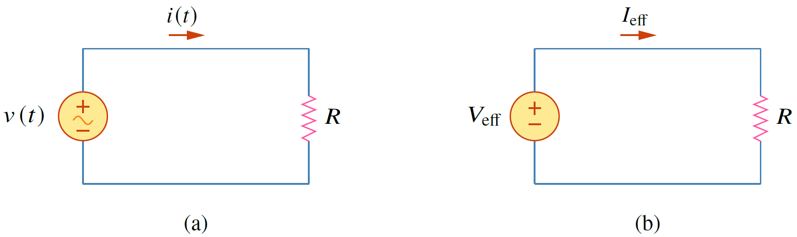


ค่าแอฟแฟคทีฟของกระแสสลับคือค่ากระแสตรงที่ให้ค่ากำลังเฉลี่ยของตัวต้านทานเทียบเท่ากับค่ากำลังเฉลี่ยที่เกิดจากกระแสไฟสลับ


<figure>

  

  <figcaption style='text-align:center'>รูปที่ 7.7 (a) วงจรไฟสลับ (b) วงจรไฟตรงที่มีค่ากระแส $I_\mathrm{eff}$ เทียบเท่ากับกระแสสลับ $i(t)$</figcaption>
</figure>

ในรูปที่ 7.7(a) เป็นวงจรกระแสสลับ ขณะที่รูปที่ 7.7(b) เป็นวงจรกระแสตรง สิ่งสำคัญคือทั้งสองวงจรจ่ายกำลังเฉลี่ยให้กับตัวต้านทานเท่ากัน ดังนั้นการหาค่าแอฟแฟคทีฟ ก็คือการหาค่า $I_\text{eff}$ ที่จะทำให้การจ่ายกำลังเฉลี่ยให้กับตัวต้านทานมีค่าเท่ากับกระแสสลับ $i(t)$
ค่ากำลังเฉลี่ยที่ใช้โดยตัวต้านทานในวงจรกระแสสลับคือ
\begin{align}
    P=\dfrac{1}{T}\int_{0}^{T}i^2Rdt=\dfrac{R}{T}\int_{0}^{T}i^2dt \label{eq7:ac}\tag{7.33}
\end{align}
ขณะที่ในวงจรกระแสตรงค่ากำลังที่ตัวต้านทานใช้คือ
\begin{align}
    P=I_\text{eff}^2R \label{eq7:dc}\tag{7.34}
\end{align}
สมการ \eqref{eq7:ac} เท่ากับสมการ \eqref{eq7:dc}
\begin{align}
    I_\text{eff}^2R=\dfrac{R}{T}\int_{0}^{T}i^2dt \nonumber\\
    I_\text{eff}=\sqrt{\dfrac{1}{T}\int_{0}^{T}i^2dt}\tag{7.35}
\end{align}
การหาค่าแอฟแฟคทีฟของแรงดันทำได้เหมือนกันคือ
\begin{align}
    V_\text{eff}^2R=\dfrac{R}{T}\int_{0}^{T}v^2dt \nonumber\\
    V_\text{eff}=\sqrt{\dfrac{1}{T}\int_{0}^{T}v^2dt}\tag{7.36}
\end{align}
สังเกตว่าค่าแอฟแฟคทีฟหาจากการหาค่าเฉลี่ยของกำลังสองแล้วถอดรากที่สอง ซึ่งตรงกับคำว่า root mean square (rms) ดังนั้นค่าแอฟแฟคทีฟจึงเรียกอีกอย่างว่าเป็นค่า rms ดังนั้น
\begin{align}
    I_\text{eff}=I_\text{rms}\qquad V_\text{eff}=V_\text{rms}\tag{7.37}
\end{align}
ในกรณีทั่วไป ถ้า $x(t)$ เป็นฟังก์ชันคาบเวลาใดๆ ค่า rms หาได้จาก
\begin{align}
    X_\text{rms}=\sqrt{\dfrac{1}{T}\int_{0}^{T}x^2dt}\tag{7.38}
\end{align}
สำหรับกระแส $i(t)=I_m\cos \omega t$ ค่าแอฟแฟคทีหรือค่า rms คือ
\begin{align}
    I_\text{rms}&=\sqrt{\dfrac{1}{T}\int_{0}^{T}I_m^2 \cos ^2 \omega t dt}\notag\\\\&=\sqrt{\dfrac{I_m^2}{T}\int_{0}^{T}\dfrac{1}{2}(1+\cos 2\omega t)dt}=\dfrac{I_m}{\sqrt{2}}\tag{7.39}
\end{align}
ค่า rms ของแรงดัน $v(t)=V_m\cos \omega t$ หาได้เช่นเดียวกันคือ
\begin{align}
    V_\text{rms}=\dfrac{V_m}{\sqrt{2}}\tag{7.40}
\end{align}


สำหรับไฟกระแสสลับ $v(t)=V_m\cos \omega t$ และ $i(t)=I_m \cos \omega t$ 
\begin{align*}
    V_\text{rms}=\dfrac{V_m}{\sqrt{2}}\qquad I_\text{rms}=\dfrac{I_m}{\sqrt{2}}
\end{align*}


กำลังไฟฟ้าเฉลี่ยสามารถเขียนอยู่ในรูปของค่า rms ดังนี้
\begin{align}
    P=\dfrac{1}{2}V_mI_m\cos (\theta_v - \theta_i)&=\dfrac{V_m}{\sqrt{2}}\dfrac{I_m}{\sqrt{2}}\cos (\theta_v - \theta_i)\nonumber\\\\
    &=V_\text{rms}I_\text{rms}\cos (\theta_v - \theta_i) \label{eq7:prms}\tag{7.41}
\end{align}
และกำลังเฉลี่ยของตัวต้านทานเขียนในรูป rms คือ
\begin{align}
    P=V_\text{rms}I_\text{rms}=I_\text{rms}^2R=\dfrac{V_\text{rms}^2}{R}\tag{7.42}
\end{align}
อย่างที่เราทราบว่าไฟฟ้าที่ใช้ตามบ้านมีค่าแรงดัน 220V ซึ่งค่านี้เป็นค่า rms  และค่าที่อ่านได้จากมิเตอร์ที่ใช้ในห้องปฏิบัติการก็เป็นค่า rms เช่นกัน นอกจากนี้ในการวิเคราะห์ด้วยเฟสเซอร์ก็นิยมใช้ค่า rms เป็นขนาดของเฟสเซอร์
