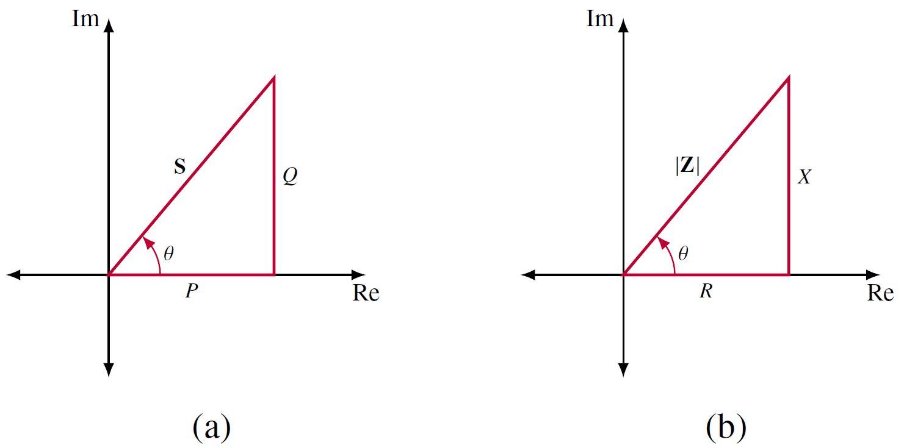

<figure>

  

  <figcaption style='text-align:center'>รูปที่ 7.8 รูปวงจรสำหรับหากำลังเชิงซ้อน</figcaption>
</figure>

พิจารณารูปที่ 7.8 กำหนดให้เฟสเซอร์ของ $v(t)$ และ $i(t)$ คือ $\mathbf{V}=V_m\angle{\theta_v}$ และ $\mathbf{I}=I_m\angle{\theta_i}$ กำลังเชิงซ้อน $S$ ที่โหลดได้รับคือ
\begin{align}
    \mathbf{S}=\dfrac{1}{2}\mathbf{V}\mathbf{I}^\ast \tag{7.48}
\end{align}
หรือถ้าแสดงในรูป rms
\begin{align}
    \mathbf{S}=\mathbf{V}\_\text{rms}\mathbf{I}\_\text{rms}^\ast \label{eq7:s}\tag{7.49}
\end{align}
โดยที่
\begin{align}
    \mathbf{V}\_\text{rms}&=\dfrac{\mathbf{V}}{\sqrt{2}}=V\_\text{rms}\angle{\theta_v} \tag{7.50}\\\\ 
    \mathbf{I}\_\text{rms}&=\dfrac{\mathbf{I}}{\sqrt{2}}=I\_\text{rms} \angle{\theta_i} \tag{7.51}
\end{align}
กำลังเชิงซ้อนในรูปของ rms สามารถกระจายพจน์เป็นส่วนจริงและส่วนจินตภาพดังนี้
\begin{align}
    \mathbf{S}&=\mathbf{V}\_\text{rms}\mathbf{I}\_\text{rms}^\ast\nonumber\\\\
    &=V\_\text{rms}I\_\text{rms}\angle{\theta_v-\theta_i}\nonumber\\\\
    &=V\_\text{rms}I\_\text{rms}\cos (\theta_v-\theta_i) +jV_\text{rms}I_\text{rms}\sin (\theta_v-\theta_i) \tag{7.52}\\\\
\end{align}

โดยที่ $\mathbf{I}\_\text{rms}^\ast=I\_\text{rms}\angle{-\theta_i}$

ขนาดของกำลังเชิงซ้อน $\mathbf{S}$ คือกำลังปรากฏ $S$ ดังนั้นหน่วยวัดกำลังเชิงซ้อนคือ volt-amperes (VA)

## **กำลังเชิงซ้อนในรูปของอิมพีแดนซ์** ##

เนื่องจากอิมพีแดนซ์ $\mathbf{Z}$ คือ

\begin{equation}
    \mathbf{Z}=\dfrac{\mathbf{V}}{\mathbf{I}}=\dfrac{\mathbf{V}\_\text{rms}}{\mathbf{I}\_\text{rms}}=\dfrac{V\_{rms}}{I\_{rms}}\angle{(\theta_v-\theta_i)} \tag{7.53}
\end{equation}

ดังนั้น $\mathbf{V}\_\text{rms}=\mathbf{Z}\mathbf{I}\_\text{rms}$
แทนค่านี้ลงใน \eqref{eq7:s} 

\begin{equation}
    \mathbf{S}=\mathbf{V}\_\text{rms}\mathbf{I}\_\text{rms}^\ast=\mathbf{Z}\mathbf{I}\_\text{rms}\mathbf{I}\_\text{rms}^\ast \tag{7.54}
\end{equation}

และเนื่องจาก

\begin{align*}
    \mathbf{I}\_\text{rms}\mathbf{I}\_\text{rms}^\ast=(I\_\text{rms}\angle{\theta_i})(I\_\text{rms}\angle{-\theta_i})=I\_\text{rms}^2
\end{align*}

ดังนั้น

\begin{align}
    \mathbf{S}=\mathbf{Z}I\_\text{rms}^2 \tag{7.55}
\end{align}

หรือถ้าต้องการแสดงสมการกำลังเชิงซ้อนในรูปของแรงดันและอิมพีแดนซ์ ให้แทนค่า $\mathbf{I}\_\text{rms}^\ast=\dfrac{\mathbf{V}\_\text{rms}^\ast}{\mathbf{Z}_\text{rms}^\ast}$ ลงในสมการ \eqref{eq7:s}

\begin{align}
        \mathbf{S}=\mathbf{V}\_\text{rms}\mathbf{I}\_\text{rms}^\ast=\mathbf{V}\_\text{rms}\dfrac{\mathbf{V}\_\text{rms}^\ast}{\mathbf{Z}\_\text{rms}^\ast}=\dfrac{V\_\text{rms}^2}{\mathbf{Z}\_\text{rms}^\ast} \tag{7.56}
\end{align}

เนื่องจาก

\begin{align*}
    \mathbf{V}\_\text{rms}\mathbf{V}\_\text{rms}^\ast=(V\_\text{rms}\angle{\theta_v})(V\_\text{rms}\angle{-\theta_v})=V\_\text{rms}^2 
\end{align*}

สรุปสมการแสดงความสัมพันธ์กำลังเชิงซ้อนกับอิมพีแดนซ์คือ

\begin{align}
    \mathbf{S}=I\_\text{rms}^2\mathbf{Z}=\dfrac{V\_\text{rms}^2}{\mathbf{Z}\_\text{rms}^\ast}=\mathbf{V}\_\text{rms}\mathbf{I}\_\text{rms}^\ast \tag{7.57}
\end{align}

และเนื่องจาก $\mathbf{Z}=R+jX$ ดังนั้น

\begin{align}
    \mathbf{S}=I\_\text{rms}^2(R+jX)=P+jQ \tag{7.58}
\end{align}

โดยที่ $P$ เป็นส่วนจริง และ $Q$ เป็นส่วนจินตภาพของกำลังเชิงซ้อน $\mathbf{S}$ 

\begin{align}
    P&=\text{Re}(\mathbf{S})=I\_\text{rms}^2R \tag{7.59}\\\\
    Q&=\text{Im}(\mathbf{S})=I\_\text{rms}^2X \tag{7.60}
\end{align}

$P$ เป็นกำลังเฉลี่ยหรือกำลังจริงและขึ้นกับค่าความต้านทานของโหลด $Q$ ขึ้นกับค่ารีแอคแตนซ์ $X$ ของโหลด และมีชื่อเรียกเป็นกำลังรีแอคทีฟ 

\begin{align}
    P=V_\text{rms}I\_\text{rms}\cos (\theta_v-\theta_i), \qquad Q=V_\text{rms}I\_\text{rms}\sin (\theta_v-\theta_i)  \tag{7.61}
\end{align}

ค่า $P$ เป็นกำลังที่ถูกใช้งานจริงโดยโหลด มีหน่วยเป็น watts ส่วน $Q$ เป็นการวัดพลังงานที่ถ่ายโอนกลับไปกลับมาระหว่างแหล่งจ่ายกับส่วนรีแอคทีฟของโหลด มีหน่วยวัดเป็น VAR (volt-ampere reactive)


ค่า $Q$ คือกำลังรีแอคทีฟที่ถ่ายโอนกลับไปกลับมาระหว่างแหล่งจ่ายกับส่วนรีแอคทีฟของโหลด

    - Q = 0 แสดงว่าโหลดเป็นตัวต้านทาน และค่า pf=1

    - Q < 0 แสดงว่าโหลดเป็นตัวเก็บประจุ และค่า pf เป็น leading

    - Q > 0 แสดงว่าโหลดเป็นตัวเหนี่ยวนำ และค่า pf เป็น lagging



### ตารางสรุปสมการหากำลัง ###

| ชนิดกำลัง     | สมการ |
| :---        | :---- |
| กำลังเชิงซ้อน  | $\mathbf{S}=P+jQ=\mathbf{V}\_\text{rms}\mathbf{I}\_\text{rms}^\ast = \|\mathbf{V}\_\text{rms} \mathbf{I}\_\text{rms}\|\angle{(\theta_v-\theta_i)}$ |
| กำลังปรากฏ   | $ S=\|\mathbf{S}\|=\|\mathbf{V}\_\text{rms}\|\|\mathbf{I}\_\text{rms}\|=\sqrt{P^2+Q^2}$ |
| กำลังจริง      | $P=\text{Re}(\mathbf{S})=S\cos(\theta_v-\theta_i)$ |
| กำลังรีแอคทีฟ      | $Q=\text{Im}(\mathbf{S})=S\sin(\theta_v-\theta_i)$ |
| ตัวประกอบกำลัง (pf)      | $\dfrac{P}{S}=\cos(\theta_v-\theta_i)$ |

## **สามเหลี่ยมกำลัง** ##

สามเหลี่ยมกำลังในรูปที่ 7.9(a) แสดงความสัมพันธ์ระหว่าง กำลังเชิงซ้อน $\mathbf{S}$ (หรือกำลังปรากฏ $S$) กำลังจริง $P$ กำลังรีแอคทีฟ $Q$ และมุมตัวประกอบกำลัง โดยที่ถ้าทราบสองค่า จะหาอีกสองค่าที่เหลือได้ เช่นถ้าทราบมุมตัวประกอบกำลัง กับ กำลังรีแอคทีฟ ก็จะสามารถหา กำลังปรากฏ กับ กำลังจริงได้ ซึ่งสามเหลี่ยมกำลังจะมีลักษณะคล้ายกับสามเหลี่ยมอิมพีแดนซ์ในรูปที่ 7.9(b) ซึ่งถ้าทราบค่า $R$ กับ $X$ ก็สามารถหาขนาดอิมพีแดนซ์ $|\mathbf{Z}|$ และมุมของอิมพีแดนซ์ $\theta$ ได้

<figure>

  

  <figcaption style='text-align:center'>รูปที่ 7.9 สามเหลี่ยมกำลัง</figcaption>
</figure>

จากรูปที่ 7.10 สามารถสรุปได้ดังนี้
1. ถ้า $|\mathbf{S}|$ อยู่ฝั่งบวกของแกน $\text{Re}$ และ $\text{Im}$  (quadrant ที่ 1) โหลดเป็นตัวเหนี่ยวนำ (inductive load) ค่ากำลังรีแอคทีฟ $Q$ เป็นบวก และ ตัวประกอบกำลังเป็นค่าตาม (lagging pf)

2. ถ้า $|\mathbf{S}|$ อยู่ฝั่งบวกของแกน $\text{Re}$ และ ฝั่งลบของแกน $\text{Im}$  (quadrant ที่ 4) โหลดเป็นตัวเก็บประจุ (capacitive load) ค่ากำลังรีแอคทีฟ $Q$ เป็นลบ และ ตัวประกอบกำลังเป็นค่านำ (leading pf)

<figure>

  

  <figcaption style='text-align:center'>รูปที่ 7.10 สามเหลี่ยมกำลังสำหรับ leading pf และ lagging pf</figcaption>
</figure>

กำลังเชิงซ้อนอาจอยู่ใน quadrant ที่ 2 และ 3 ได้ ถ้าค่าตัวต้านทานเป็นลบ ซึ่งเป็นไปได้ในวงจรที่มีตัวทรานซิสเตอร์ (active circuit)


กำหนดให้แรงดันตกคร่อมโหลดเป็น $v(t)=60\cos (\omega t-10^{\circ})\\;\mathrm{V}$ และกระแสที่ไหลผ่านโหลดเป็น $i(t)=1.5\cos (\omega t+50^{\circ})\\;\mathrm{A}$ จงหา 

(a) กำลังเชิงซ้อนและกำลังปรากฏ 

(b) กำลังจริงและกำลังรีแอคทีฟ 

(c) ตัวประกอบกำลังและอิมพีแดนซ์ของโหลด

คำตอบ

$(a)$ แปลงกระแสและแรงดันเป็นค่า rms
\begin{align*}
    \mathbf{V}\_\text{rms}=\dfrac{60}{\sqrt{2}}\angle{-10^{\circ}},\quad \mathbf{I}\_\text{rms}=\dfrac{1.5}{\sqrt{2}}\angle{+50^{\circ}}
\end{align*}
กำลังเชิงซ้อน คือ
\begin{align*}
    \mathbf{S}=\mathbf{V}\_\text{rms}\mathbf{I}\_\text{rms}^\ast=\left(\dfrac{60}{\sqrt{2}}\angle{-10^{\circ}}\right)\left(\dfrac{1.5}{\sqrt{2}}\angle{+50^{\circ}}\right)=45\angle{-60^{\circ}}\\;\mathrm{VA}
\end{align*}
กำลังปรากฏคือ
\begin{align*}
    S=|\mathbf{S}|=45\\;\mathrm{VA}
\end{align*}

(b) เมื่อทราบกำลังเชิงซ้อน $\mathbf{S}$ สามารถหากำลังจริงและกำลังรีแอคทีฟดังนี้

\begin{align*}
    \mathbf{S}=45\angle{-60^{\circ}}=45[\cos (-60^{\circ})+j\sin(-60)]=22.5-j38.97
\end{align*}
และเนื่องจาก $\mathbf{S}=P+jQ$ ค่ากำลังจริง $P=22.5\\;\mathrm{W}$ และค่ากำลังรีแอคทีฟ $Q=-38.97\\;\mathrm{VAR}$

(c) ค่าตัวประกอบกำลังคือ 
\begin{align*}
    pf = \cos(-60^{\circ})=0.5 (\text{leading})
\end{align*}
ค่า pf เป็นค่า leading เนื่องจาก กำลังรีแอคทีฟเป็นลบ ค่าอิมพีแดนซ์โหลดคือ
\begin{align*}
    \mathbf{Z}=\dfrac{\mathbf{V}}{\mathbf{I}}=\dfrac{60\angle{-10^{\circ}}}{1.5\angle{+50^{\circ}}}=40\angle{60^{\circ}}\\;\Omega
\end{align*}
ซึ่งเป็นค่าอิมพีแดนซ์ตัวเก็บประจุเนื่องจากค่ามุมของอิมพีแดนซ์เป็นลบ




อิมพีแดนซ์ $\mathbf{Z}$ ใช้กำลัง $12\\;\mathrm{kVA}$ ที่ pf=0.856 ($\text{lagging}$) จากแหล่งจ่ายแรงดันขนาด $120\\;\mathbf{V}\_\text{rms}$ จงหา 

(a) กำลังเฉลี่ยและกำลังรีแอคทีฟที่จ่ายให้อิมพีแดนซ์ $\mathbf{Z}$ 

(b) ค่ายอด (peak) ของกระแส 

(c) ค่าของ $\mathbf{Z}$

คำตอบ

(a) จากค่า pf=$\cos \theta=0.856$ หาค่ามุม $\theta$
\begin{align*}
    \theta=\cos^{-1} (0.856)=31.13^{\circ}
\end{align*}
และโจทย์ให้ค่ากำลังปรากฏคือ $S=12,000\\;\mathrm{VA}$ ดังนั้นกำลังจริง $P$ คือ
\begin{align*}
    P=S\cos (31.13^{\circ})=12,000\times 0.856=10,272\\;\mathrm{W}=10.272\\:\mathrm{kW}
\end{align*}
ส่วนกำลังรีแอคทีฟ $Q$ คือ
\begin{align*}
    Q=S\sin (31.13^{\circ}) =12,000\times 0.517=6,204\\;\mathrm{VA}=6.204\\:\mathrm{kVA}
\end{align*}
(b) เนื่องจาก ค่า pf เป็น lagging ดังนั้นกำลังเชิงซ้อน $\mathbf{S}$ คือ
\begin{align*}
    \mathbf{S}=P+jQ=10.272+j6.204\\:\mathrm{kVA}
\end{align*}
และจาก $\mathbf{S}=\mathbf{V}\_\text{rms}\mathbf{I}\_\text{rms}^\ast$ 
\begin{align*}
    \mathbf{I}\_\text{rms}^\ast=\dfrac{\mathbf{S}}{\mathbf{V}\_\text{rms}}=\dfrac{10,272+j6,024}{120\angle{0^{\circ}}}=85.6+j57.1\\;\mathrm{A}  =100\angle{31.13^{\circ}}\\;\mathrm{A}
\end{align*}
ดังน้้นค่า $\mathbf{I}\_\text{rms}=100\angle{-31.13^{\circ}}$ และค่ายอดคือ
\begin{align*}
    I_m=\sqrt{2}I_\text{rms}=\sqrt{2}(100)=141.4\\;\mathrm{A}
\end{align*}
(c) ค่าอิมพีแดนซ์ $\mathbf{Z}$ คือ
\begin{align*}
    \mathbf{Z}=\dfrac{\mathbf{V}\_\text{rms}}{\mathbf{I}\_\text{rms}}=\dfrac{120\angle{0^{\circ}}}{100\angle{-31.13^{\circ}}}=1.2\angle{31.13^{\circ}}\\;\Omega
\end{align*}
เนื่องจากมุมของอิมพีแดนซ์เป็นบวกดังนั้นอิมพีแดนซ์มีตัวเหนี่ยวนำอยู่ภายใน


