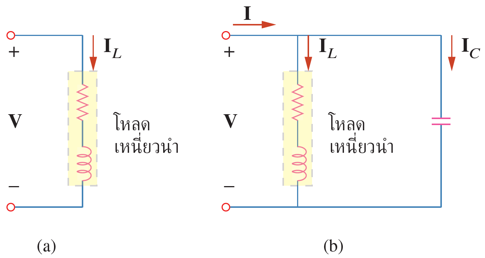
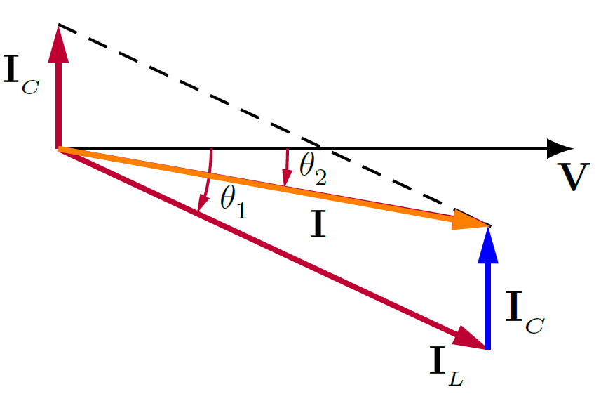
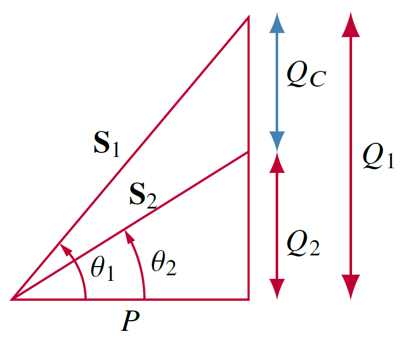

เครื่องใช้ไฟฟ้าภายในครัวเรือนเช่นเครื่องซักผ้า เครื่องปรับอากาศ พัดลม หรือเครื่องจักรในโรงงานอุตสาหกรรมเช่นมอเตอร์ เป็นโหลดที่มีตัวเหนี่ยวนำอยู่ภายใน (ขดลวดที่อยู่ในมอเตอร์) ซึ่งมีค่า pf เป็น laggin และมีค่าต่ำ แม้ว่าเราไม่สามารถปรับเปลี่ยนค่าความเหนี่ยวนำของเครื่องใช้ไฟฟ้าเหล่านี้แต่เราสามารถปรับให้ค่า pf มีค่าสูงขึ้นได้โดยการต่อตัวเก็บประจุขนานกับโหลดเหล่านี้


กระบวนการที่เพิ่มค่าตัวประกอบกำลังให้มีค่าสูงขึ้น (เข้าใกล้ 1) โดยไม่ได้ปรับเปลี่ยนกระแสหรือแรงดันของโหลดเรียกว่า $\textbf{การปรับตัวประกอบกำลัง}$ ซึ่งโดยปกติกระทำโดยการต่อตัวเก็บประจุขนานกับโหลดเหนี่ยวนำ (inductive load) หรือในกรณีที่โหลดเป็นโหลดเก็บประจุ (พบได้น้อย) ให้ต่อตัวเหนี่ยวนำขนานกับโหลดเก็บประจุ (capacitive load)



โหลดในวงจรกระแสสลับมีสองประเภทคือ
1. โหลดเหนี่ยวนำ (inductive load) ซึ่งในการวิเคราะห์จะแทนโหลดเหนี่ยวนำด้วยตัวต้านทานต่ออนุกรมกับตัวเหนี่ยวนำ
2. โหลดเก็บประจุ (capacitive load) ซี่งในการวิเคราะห์จะแทนโหลดเก็บประจุด้วยตัวต้านทานต่ออนุกรมกับตัวเก็บประจุ


เนื่องจากโหลดส่วนใหญ่เป็นโหลดเหนี่ยวนำ ดังในรูปที่ 7.11(a) การปรับปรุงตัวประกอบกำลังทำได้โดยการต่อตัวเก็บประจุขนานกับโหลดเหนี่ยวนำ ดังรูปที่ 7.11(b) สมมติว่าตัวประกอบกำลังในรูป ที่ 7.11(a) เป็น $\cos \theta_1$ และตัวประกอบกำลังในรูปที่ 7.11(a) เป็น $\cos \theta_2$

<figure>

  

  <figcaption style='text-align:center'>รูปที่ 7.11 (a) โหลดที่มีตัวเหนี่ยวนำ (b) แก้ตัวประกอบกำลังโดยการต่อตัวเก็บประจุ ขนานกับโหลดเดิม</figcaption>
</figure>

ผลการต่อตัวเก็บประจุแสดงในรูปเฟสเซอร์ดังรูปที่ 7.12 ซึ่งเห็นได้ว่ามุมเฟสระหว่าง $\mathbf{V}$ และกระแส $\mathbf{I}$ ลดลงจาก $\theta_1$ เป็น $\theta_2$ ซึ่งส่งผลให้ค่าตัวประกอบกำลังมีค่าสูงขึ้น และเมื่อเทียบขนาดของกระแส $\mathbf{I}_L$ ซึ่งเป็นค่าก่อนต่อตัวเก็บประจุ และขนาดของกระแส $\mathbf{I}$ จะเห็นได้ชัดว่า กระแส $\mathbf{I}$ มีขนาดลดลง ซึ่งเป็นผลดีเพราะการไฟฟ้าคิดค่าไฟตามปริมาณกระแสที่ใช้

<figure>

  

  <figcaption style='text-align:center'>รูปที่ 7.12 ผลจากการต่อตัวเก็บประจุ ทำให้ค่าตัวประกอบกำลังมีค่าเพิ่มขึ้น</figcaption>
</figure>

### การคำนวณขนาดตัวเก็บประจุเพื่อใช้ปรับค่า pf ###

<figure>

  

  <figcaption style='text-align:center'>รูปที่ 7.13 การใช้ตัวเก็บประจุช่วยในการลดกำลัง VAR ในวงจรที่โหลดเป็นตัวเหนี่ยวนำ</figcaption>
</figure>

พิจารณาสามเหลี่ยมกำลังในรูปที่ 7.13 ถ้าโหลดเหนี่ยวนำเดิมมีกำลังปรากฎเป็น $S_1$
\begin{align}
    P=S_1\cos \theta_1,\qquad Q_1=S_1\sin \theta_1 = P\tan \theta_1 \tag{7.62}
\end{align}
และถ้าต้องการเพิ่มตัวประกอบกำลังจาก $\cos\theta_1$ เป็น $\cos\theta_2$ โดยที่ค่ากำลังจริง $P$ ยังเท่าเดิม ($P=S_2\cos\theta_2$)  ดังนั้นค่ากำลังรีแอคทีฟค่าใหม่ ($Q_2$) คือ
\begin{align}
    Q_2=P\tan\theta_2 \tag{7.63}
\end{align}
ซึ่งการลดลงของกำลังรีแอคทีฟเป็นผลจากการต่อตัวเก็บประจุขนานกับโหลดเดิม
\begin{align}
    Q_C=Q_1-Q_2=P(\tan\theta_1-\tan\theta_2) \tag{7.64}
\end{align}
และเนื่องจาก
\begin{align}
    Q_C=\dfrac{V\_\text{rms}^2}{X_C}=\omega CV\_\text{rms}^2 \tag{7.65}
\end{align}
ดังนั้นค่าตัวเก็บประจุที่ต้องการคือ
\begin{align}
    C=\dfrac{Q_C}{\omega V\_\text{rms}^2}=\dfrac{P(\tan\theta_1-\tan\theta_2)}{\omega V\_\text{rms}^2} \tag{7.66}
\end{align}


การปรับตัวประกอบกำลังไม่มีผลต่อกำลังจริง $P$ เนื่องจากตัวเก็บประจุมีกำลังเฉลี่ยเป็นศูนย์


### การคำนวณขนาดตัวเหนี่ยวนำเพื่อใช้ปรับค่า pf ###
อย่างที่กล่าวแล้วว่าโหลดส่วนใหญ่ที่พบเป็นโหลดเหนี่ยวนำ ส่วนกรณีที่โหลดเป็นโหลดเก็บประจุ การปรับปรุงตัวประกอบกำลังทำได้โดยต่อตัวเหนี่ยวนำขนานกับโหลดเก็บประจุ ซึ่งสมการหาขนาดตัวเหนี่ยวนำคือ
\begin{align}
    Q_L=\dfrac{V\_\text{rms}^2}{X_L}=\dfrac{V\_\text{rms}^2}{\omega L}\qquad \Rightarrow \qquad L=\dfrac{V\_\text{rms}^2}{\omega Q_L} \tag{7.67}
\end{align}
โดยที่ $Q_L=Q_1-Q_2$ ซึ่งเป็นผลต่างระหว่างค่ากำลังรีแอคทีฟใหม่ กับ กำลังรีแอคทีฟเดิม


กำหนดให้แรงดันแหล่งจ่ายเป็น $220\mathrm{V}\_\text{rms}$ และความถี่เป็น 50 Hz ถ้าโหลดใช้กำลัง $4\;\mathrm{kW}$ ที่ค่า lagging pf เป็น 0.8 จงหาขนาดของตัวเก็บประจุที่ทำให้ค่า lagging pf เป็น 0.95

คำตอบ

ถ้า pf=0.8
\begin{align*}
    \cos \theta_1=0.8\qquad\Rightarrow \qquad \theta_1=36.87^{\circ}
\end{align*}
ค่ากำลังปรากฎคือ
\begin{align*}
    S_1=\dfrac{P}{\cos\theta_1}=\dfrac{4000}{0.8}=5000\\;\mathrm{VA}
\end{align*}
ค่ากำลังรีแอคทีฟคือ
\begin{align*}
    Q_1=S_1\sin\theta_1=5000\sin 36.87^{\circ} =3000\\;\mathrm{VAR}
\end{align*}
เมื่อค่า pf=0.95
\begin{align*}
    \cos \theta_2=0.95\qquad\Rightarrow \qquad \theta_1=18.19^{\circ}
\end{align*}
ค่ากำลัง $P$ ไม่เปลี่ยน แต่กำลังปรากฎเปลี่ยนเป็น
\begin{align*}
    S_2=\dfrac{P}{\cos\theta_2}=4210.5\\;\mathrm{VA}
\end{align*}
ค่ากำลังรีแอคทีฟใหม่คือ
\begin{align*}
    Q_2=S_2\sin\theta_2=1314.4\\;\mathrm{VAR}
\end{align*}
ผลต่างของกำลังรีแอคทีฟใหม่กับเก่าเป็นผลจากการต่อตัวเก็บประจุขนานกับโหลด ซึ่งค่ากำลังรีแอคทีฟที่เกิดจากตัวเก็บประจุคือ
\begin{align*}
    Q_C=Q_1-Q_2=3000-1314.4=1685.6\\;\mathrm{VAR}
\end{align*}
และค่าตัวเกํบประจุคือ
\begin{align*}
    C=\dfrac{Q_C}{\omega V\_\text{rms}^2}=\dfrac{1685.6}{2\pi\times50\times220^2}=110.86\\;\mu\mathrm{F}
\end{align*}

