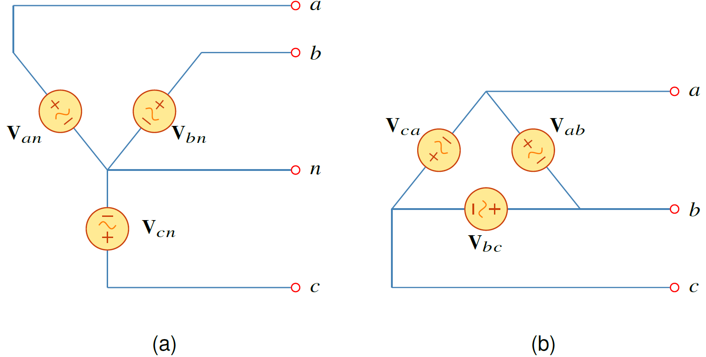
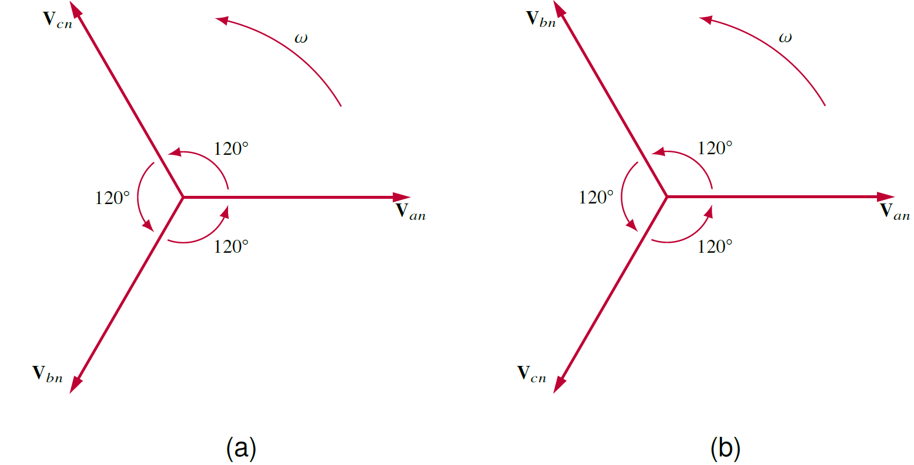

ระบบไฟฟ้าที่ผลิตและส่งให้กับบ้านพักอาศัยหรือโรงงานอุตสาหกรรมเป็นระบบ 3 เฟส ในความถี่ 50 Hz $(\omega=314 \mathrm{rad/s})$ ในประเทศไทย หรือ 60 Hz $(\omega=377 \mathrm{rad/s})$ ในประเทศอื่นๆ ข้อดีของระบบสามเฟสคือ 

1. ปริมาณสายไฟที่ใช้ ใช้น้อยกว่าในระบบหนึ่งเฟสที่กำลังเท่ากัน
2. เนื่องจากกำลังเฉลี่ยในระบบ 3 เฟสเป็นค่าคงที่ ดังนั้นเครื่องจักรในระบบ 3 เฟสสั่นน้อยกว่า

ในบทนี้เป็นการศึกษาแรงดันและกระแสในระบบ 3 เฟส และรูปแบบการต่อแหล่งจ่ายและโหลดในแบบต่างๆ 

## **แรงดันสามเฟสสมดุล** ##

ระบบสามเฟสมีแหล่งจ่ายแรงดัน 3 ตัวที่เกิดจากเครื่องกำเนิดไฟฟ้าสามเฟส โดยที่แต่ละแหล่งจ่ายแรงดันมีมุมเฟสต่างกัน $120^{\circ}$ โดยการต่อกันของแหล่งจ่ายแรงดันต่อได้ 2 แบบคือ ต่อแบบ Y ดังในรูปที่ 8.1(a) และต่อแบบ $\Delta$ ดังรูปที่ 8.1(b)  

<figure>

  

  <figcaption style='text-align:center'>รูปที่ 8.1 การต่อแหล่งจ่ายแรงดันสามเฟส (a) ต่อแบบ Y (b) ต่อแบบ $\Delta$</figcaption>
</figure>

### การต่อของแหล่งจ่าย
พิจารณาการต่อแบบ Y ในรูปที่ 8.1(a) แรงดัน $\mathbf{V}_{an}$, $\mathbf{V}\_{bn}$ และ $\mathbf{V}\_{cn}$

ซึ่งเป็นแรงดันระหว่าง lines a, b, และ c กับ line n แรงดันเหล่านี้เรียกว่าแรงดันเฟส ถ้าแหล่งจ่ายแรงดันทุกตัวมีขนาดเท่ากันและมีความถี่เท่ากันแต่มีมุมเฟสต่างกัน $120^{\circ}$ แรงดันทั้งสามตัวนี้เรียกว่าเป็นแรงดันสมดุล ซึ่งจะทำให้

\begin{align}
    \mathbf{V}\_{an} +\mathbf{V}\_{bn}+\mathbf{V}\_{cn}=0 \tag{8.1}\\\\
    |\mathbf{V}\_{an}|=|\mathbf{V}\_{bn}|=|\mathbf{V}\_{cn}| \tag{8.2}
\end{align}


แรงดันสามเฟสสมดุล คือแรงดันทุกตัวมีขนาดและความถี่เท่ากัน และมีมุมต่างกัน $120^{\circ}$ 


## **ลำดับมุมเฟส**

เนื่องจากแรงดันทั้งสามตัวมีมุมต่างกัน $120^{\circ}$ ดังนั้นการเรียงลำดับมุมเฟสของแรงดันมีสองแบบ ในการหาลำดับมุมเฟสของแรงดันให้วนตามเข็มนาฬิกา

1. ลำดับบวก หรือลำดับ abc ซึ่งแสดงเป็นสมการดังนี้
    \begin{align}
            \mathbf{V}\_{an}&=V\_\text{p}\angle{0^{\circ}}\nonumber\\\\
            \mathbf{V}\_{bn}&=V\_\text{p}\angle{-120^{\circ}}\nonumber\\\\
            \mathbf{V}\_{cn}&=V\_\text{p}\angle{-240^{\circ}}=V\_\text{p}\angle{+120^{\circ}} \tag{8.3}
    \end{align}
  
โดยที่ $V\_\text{p}$ เป็นค่า rms ของแรงดันเฟส

2. ลำดับลบ หรือลำดับ acb ซึ่งแสดงเป็นสมการดังนี้
    \begin{align}
            \mathbf{V}\_{an}&=V\_\text{p}\angle{0^{\circ}}\nonumber\\\\
            \mathbf{V}\_{cn}&=V\_\text{p}\angle{-120^{\circ}}\nonumber\\\\
            \mathbf{V}\_{bn}&=V\_\text{p}\angle{-240^{\circ}}=V\_\text{p}\angle{+120^{\circ}} \tag{8.4}
    \end{align}

 
 
 

<figure>

  

  <figcaption style='text-align:center'>รูปที่ 8.2 ลำดับมุมเฟส (a) ลำดับบวก (b) ลำดับลบ</figcaption>
</figure>


ลำดับมุมเฟส คือลำดับเวลาที่แรงดันแต่ละตัวผ่านค่าสูงสุด 


## **การต่อของโหลด**

เช่นเดียวกับแหล่งจ่ายแรงดัน โหลดสามารถต่อได้สองแบบเช่นกันดังรูปที่ 8.3


โหลดสมดุล คือการที่อิมพีแดนซ์ของโหลดทั้งสามตัวมีขนาดเท่ากันและมีมุมเท่ากันทั้งสามตัว 


สำหรับการต่อโหลดแบบ Y โหลดสมดุลเมื่อ
\begin{align}
    \mathbf{Z}_1=\mathbf{Z}_2=\mathbf{Z}_3=\mathbf{Z}_Y \tag{8.5}
\end{align}
โดยที่ $\mathbf{Z}_Y$ เป็นอิมพีแดนซ์โหลดต่อเฟส 

สำหรับการต่อแบบ $\Delta$ โหลดสมดุลเมื่อ

\begin{align}
    \mathbf{Z}_a=\mathbf{Z}_b=\mathbf{Z}_c=\mathbf{Z}\_{\Delta} \tag{8.6}
\end{align}
โดยที่ $\mathbf{Z}\_{\Delta}$ เป็นอิมพีแดนซ์โหลดต่อเฟส 


จงหาลำดับเฟสของชุดแรงดันต่อไปนี้
\begin{align*}
    v\_{an}&=200\cos (\omega t + 10^{\circ})\\\\
    v\_{bn}&=200\cos (\omega t -230^{\circ})\\\\
    v\_{cn}&=200\cos (\omega t -110^{\circ})
\end{align*}

คำตอบ

แรงดันแสดงในรูปของเฟสเซอร์ดังนี้ 

\begin{align}
    \mathbf{V}\_{an}&=\dfrac{200}{\sqrt{2}}\angle{10^{\circ}}\notag\\\\ \mathbf{V}\_{bn}&=\dfrac{200}{\sqrt{2}}\angle{-230^{\circ}}\notag\\\\ \mathbf{V}\_{cn}&=\dfrac{200}{\sqrt{2}}\angle{-110^{\circ}} \tag{8.7}
\end{align}
จากการสังเกตเห็นว่าแรงดัน $\mathbf{V}\_{an}$ นำ $\mathbf{V}\_{cn}$ เป็นมุม $120^{\circ}$ (ซึ่งมาจากนำมุมเฟส $a$ ลบกับ มุมเฟส $c$ ซึ่งคือ $10^{\circ} - (-110)^{\circ}$) และ แรงดัน $\mathbf{V}\_{cn}$ นำ $\mathbf{V}\_{bn}$ เป็นมุม $120^{\circ}$ ดังนั้นลำดับเฟสเป็นลำดับ acb หรือ ลำดับลบ


