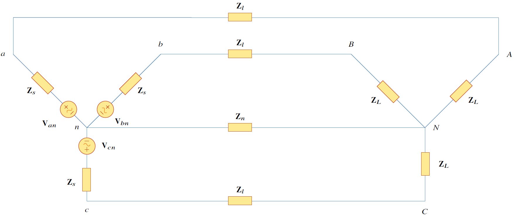
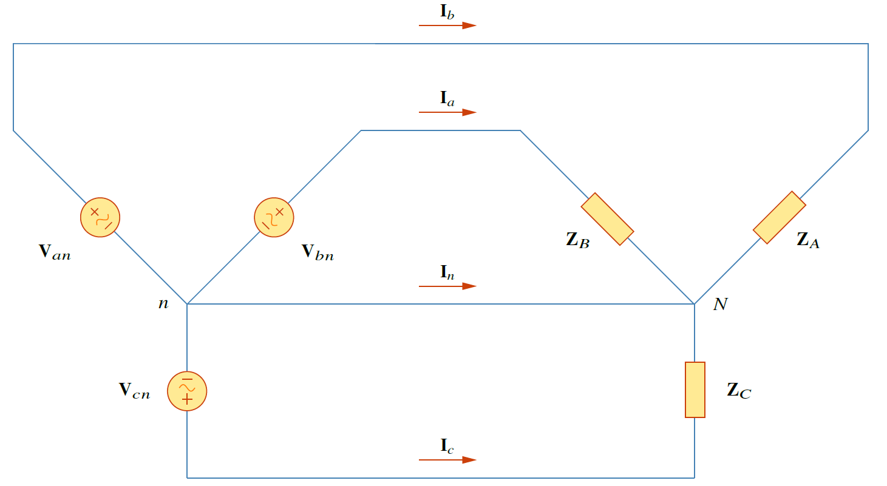
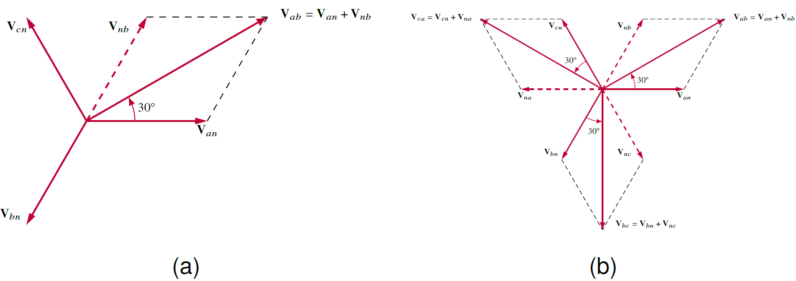
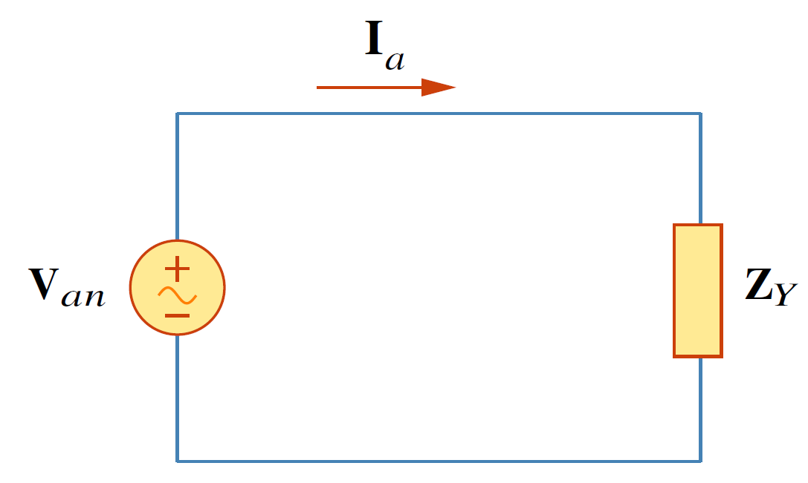
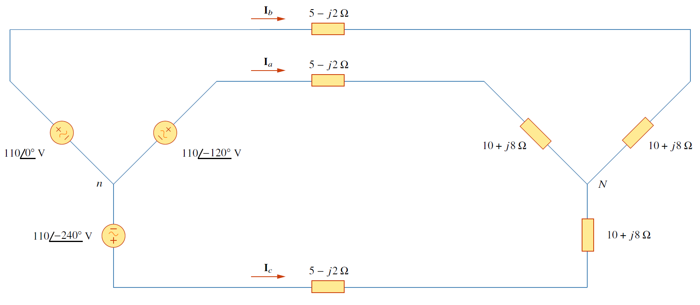

## **การต่อ Y-Y แบบสมดุล**


ระบบ Y-Y แบบสมดุล คือระบบที่แหล่งจ่ายแรงดันสามเฟสต่อแบบ Y และอิมพีแดนซ์โหลดสามเฟสต่อแบบ Y

ซึ่งระบบสมดุลต้องประกอบด้วย

1. ขนาดของแรงดันทุกเฟสเท่ากัน ขนาดของอิมพีแดนซ์โหลดทุกเฟสเท่ากัน
2. มุมของแรงดันแต่ละเฟสต่างกัน $120^{\circ}$ ส่วนมุมของอิมพีแดนซ์โหลดแต่ละเฟสเท่ากัน


<figure>

  

  <figcaption style='text-align:center'>รูปที่ 8.4 ระบบ Y-Y สมดุล</figcaption>
</figure>

จากรูปที่ 8.4 กำหนดให้ $\mathbf{Z}_Y$ เป็นอิมพีแดนซ์ทั้งหมดต่อเฟสซึ่งรวมถึงอิมพีแดนซ์ของแหล่งจ่าย $\mathbf{Z}_s$ อิมพีแดนซ์ของสายส่ง $\mathbf{Z}_l$ และอิมพีแดนซ์ของโหลด $\mathbf{Z}_L$ ดังสมการ
\begin{align}
    \mathbf{Z}_Y=\mathbf{Z}_s+\mathbf{Z}_l+\mathbf{Z}_L \tag{8.8}
\end{align}
แต่ค่าของ $\mathbf{Z}_s$ และ $\mathbf{Z}_l$ มีค่าน้อยกว่า $
\mathbf{Z}_L$ มากดังนั้น
\begin{align}
    \mathbf{Z}_Y=\mathbf{Z}_L \tag{8.9}
\end{align}
ดังนั้นระบบ Y-Y สมดุลที่คิดเฉพาะอิมพีแดนซ์ของโหลดแสดงดังรูปที่ 8.5

<figure>

  

  <figcaption style='text-align:center'>รูปที่ 8.5 ระบบ Y-Y สมดุลที่คิดเฉพาะอิมพีแดนซ์ของโหลด</figcaption>
</figure>

### แรงดันไลน์ (หรือ แรงดันไลน์ถึงไลน์)

กำหนดให้ระบบมีลำดับเฟสเป็นบวก (ลำดับ abc) แรงดันเฟส (หรือแรงดันไลน์ถึงนิวทรอล) คือ
  \begin{align}
    \mathbf{V}\_\mathrm{an}&=V\_\text{p}\angle{0^{\circ}}\notag\\\\
    \mathbf{V}\_\mathrm{bn}&=V\_\text{p}\angle{-120^{\circ}}\tag{8.10}\\\\
    \mathbf{V}\_\mathrm{cn}&=V\_\text{p}\angle{+120^{\circ}}\notag
  \end{align}

แรงดันไลน์ถึงไลน์ (line-to-line voltage) หรือสั้นๆแค่แรงดันไลน์ $\mathbf{V}\_\mathrm{ab}, \mathbf{V}\_\mathrm{bc}$ และ $\mathbf{V}\_\mathrm{ca}$ สัมพันธ์กับแรงดันเฟส ดังนี้
  \begin{align}
    \mathbf{V}\_\mathrm{ab}=\mathbf{V}\_\mathrm{an}+\mathbf{V}\_\mathrm{nb} &=\mathbf{V}\_\mathrm{an} -\mathbf{V}\_\mathrm{bn} \notag\\\\
    &=V\_\text{p}\angle{0^{\circ}}-V\_\text{p}\angle{-120^{\circ}}\tag{8.11}\\\\&=V\_\text{p}(1+\dfrac{1}{2}+j\dfrac{\sqrt{3}}{2})=\sqrt{3}V\_\text{p}\angle{30^{\circ}}\notag
  \end{align}
และหาเหมือนกันสำหรับ $\mathbf{V}\_\mathrm{bc}, \mathbf{V}\_\mathrm{ca}$
\begin{align}
    \mathbf{V}\_\mathrm{bc}&=\mathbf{V}\_\mathrm{bn}-\mathbf{V}\_\mathrm{cn}=\sqrt{3}V\_\text{p}\angle{-90^{\circ}}\tag{8.12}\\\\
    \mathbf{V}\_\mathrm{ca}&=\mathbf{V}\_\mathrm{cn}-\mathbf{V}\_\mathrm{an}=\sqrt{3}V\_\text{p}\angle{-210^{\circ}}\tag{8.13}
\end{align}


ขนาดของแรงดันไลน์เป็น $\sqrt{3}$ เท่าของแรงดันเฟส
\begin{align*}
    V_{L}=\sqrt{3}V_{P}
\end{align*}
มุมของแรงดันไลน์นำมุมของแรงดันเฟสอยู่ $30^{\circ}$

โดยที่ 
\begin{align}
    V_p=|\mathbf{V}\_\mathrm{an}|=|\mathbf{V}\_\mathrm{bn}|=|\mathbf{V}\_\mathrm{cn}| \tag{8.14}
\end{align}
และ
\begin{align}
    V_L=|\mathbf{V}\_\mathrm{ab}|=|\mathbf{V}\_\mathrm{bc}|=|\mathbf{V}\_\mathrm{ca}| \tag{8.15}
\end{align}


มุมของแรงดันไลน์นำมุมของแรงดันเฟสอยู่ $30^{\circ}$ ดังแสดงในรูปที่ 8.6

<figure>

  

  <figcaption style='text-align:center'>รูปที่ 8.6 เฟสเซอร์แสดงความสัมพันธ์ระหว่างแรงดันไลน์และแรงดันเฟส</figcaption>
</figure>

### กระแสไลน์ และ กระแสเฟส 

หากระแสไลน์โดยใช้ KCL กับรูปที่ 8.5

$$
  \begin{align}
    \mathbf{I}\_{a}&=\dfrac{\mathbf{V}\_\mathrm{an}}{\mathbf{Z}\_{Y}}\notag\\\\
    \mathbf{I}\_{b}&=\dfrac{\mathbf{V}\_\mathrm{bn}}{\mathbf{Z}\_{Y}}=\dfrac{\mathbf{V}\_\mathrm{an}\angle{-120^{\circ}}}{\mathbf{Z}\_{Y}}=\mathbf{I}\_{a}\angle{-120^{\circ}}\tag{8.16}\\\\
    \mathbf{I}\_{c}&=\dfrac{\mathbf{V}\_\mathrm{cn}}{\mathbf{Z}\_{Y}}=\dfrac{\mathbf{V}\_\mathrm{an}\angle{-240^{\circ}}}{\mathbf{Z}\_{Y}}=\mathbf{I}\_{a}\angle{-240^{\circ}}\notag
  \end{align}
$$

ซึ่งเมื่อรวมกระแสไลน์ทุกตัวเข้ากันจะได้ศูนย์
\begin{align}
    \mathbf{I}\_{a}+\mathbf{I}\_{b}+\mathbf{I}\_{c}=0 \tag{8.17}
\end{align}
จาก KCL ค่า $\mathbf{I}\_{N}$ คือ
\begin{align}
    \mathbf{I}\_{N}=-(\mathbf{I}\_{a}+\mathbf{I}\_{b}+\mathbf{I}\_{c})=0 \tag{8.18}
\end{align}
ดังนั้น
\begin{align}
    \mathbf{V}\_\mathrm{nN}=\mathbf{Z}\_{n}\mathbf{I}\_{N}=0 \tag{8.19}
\end{align}
ซึ่งในระบบสมดุลแรงดันในเส้นนิวทรอลเป็นศูนย์ นั่นหมายความว่าเส้นนิวทรอลสามารถเอาออกจากระบบได้โดยไม่มีผลใดๆต่อระบบ


ชนิดของแรงดันและกระแสในระบบ 3 เฟส
1. กระแสไลน์ หรือกระแสในสายส่ง คือกระแสที่ไหลในสายส่ง ซึ่งสายส่งเป็นเชื่อมต่อระหว่างแหล่งจ่ายแรงดันกับโหลด
2. กระแสเฟส คือ กระแส ที่ไหลในแหล่งจ่าย หรือกระแสที่ไหลในโหลด
3. แรงดันไลน์แบ่งเป็น
   - แรงดันไลน์ถึงไลน์ (line-to-line voltage)  คือแรงดันที่วัดระหว่างสายส่งของเฟสหนึ่งเทียบกับสายส่งอีกเฟส
   - แรงดันไลน์ถึงนิวทรอล (line-to-neutral voltage) คือแรงดันที่วัดระหว่างสายส่งของเฟสหนึ่งเทียบกับสายนิวทรอล
4. แรงดันเฟส คือแรงดันที่วัดคร่อมแหล่งกำเนิดหรือ แรงดันที่วัดคร่อมโหลด


ในระบบ Y กระแสเฟสและกระแสไลน์คือตัวเดียวกัน  ในการเขียนกระแสไลน์ให้เขียนโดยใช้ตัวห้อยตัวเดียวเช่น $\mathbf{I}_{a}$ 

ในการวิเคราะห์ระบบ 3 เฟส สามารถแยกวิเคราะห์เพียงเฟสเดียว แล้วใช้ความสัมพันธ์ของเฟสในการหาค่าที่เหลือดังนี้

<figure>

  

  <figcaption style='text-align:center'>รูปที่ 8.7 รูปวงจรหนึ่งเฟส</figcaption>
</figure>

จากรูปที่ 8.7 ค่ากระแสไลน์ $\mathbf{I}\_{a}$ คือ
\begin{equation}
    \mathbf{I}\_{a}=\dfrac{\mathbf{V}\_{an}}{\mathbf{Z}\_{Y}} \tag{8.20}
\end{equation}
เมื่อได้ค่ากระแสไลน์ $\mathbf{I}\_{a}$ กระแสไลน์ตัวอื่นๆหาได้โดยอาศัยคุณสมบัติของระบบที่สมดุล


จงหากระแสไลน์

<figure>

  

  <figcaption style='text-align:center'>รูปที่ 8.8 วงจรสำหรับตัวอย่าง 8.2</figcaption>
</figure>

คำตอบ

เนื่องจากเป็นระบบสมดุล สามารถแทนรูปวงจรด้วยรูปสมมูลของวงจร 1 เฟสดังรูปที่ 8.7 หาค่ากระแส $\mathbf{I}\_{a}$
\begin{align*}
    \mathbf{I}\_{a}=\dfrac{\mathbf{V}\_{an}}{\mathbf{Z}\_{Y}}
\end{align*}
โดยที่ $\mathbf{Z}\_{Y}=(5-j2)+(10+j8)=15+j6=16.155\angle{21.8^{\circ}}$
\begin{align*}
    \mathbf{I}\_{a}=\dfrac{110\angle{0^{\circ}}}{16.155\angle{21.8^{\circ}}}=6.81\angle{-21.8^{\circ}}\\;\mathrm{A}
\end{align*}
เนื่องจากแหล่งจ่ายอยู่ในลำดับบวก ดังนั้นกระแสไลน์จึงเป็นลำดับบวกเช่นกัน
\begin{align*}
    \mathbf{I}\_{b}&=\mathbf{I}\_{a}\angle{-120^{\circ}}=6.81\angle{-21.8^{\circ}-120^{\circ}}=6.81\angle{-141.8^{\circ}}\\;\mathrm{A} \\\\
    \mathbf{I}\_{c}&=\mathbf{I}\_{a}\angle{-240^{\circ}}=6.81\angle{-21.8^{\circ}-240^{\circ}}=6.81\angle{-261.8^{\circ}}=6.81\angle{98.2^{\circ}}\\;\mathrm{A}
\end{align*}

