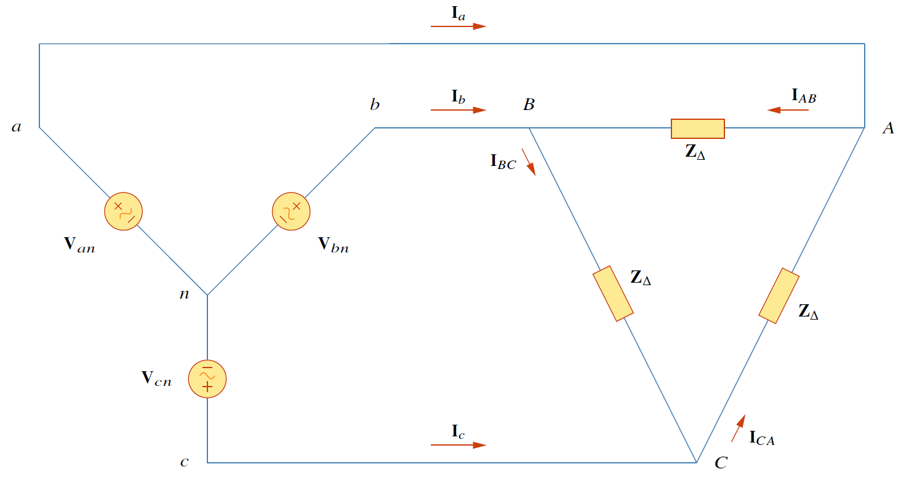
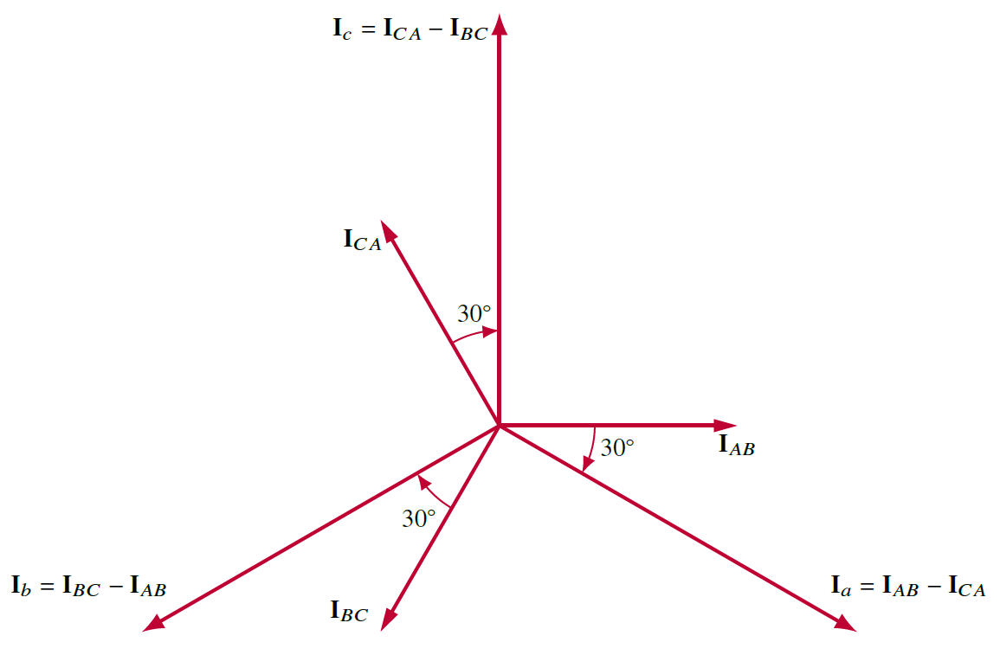
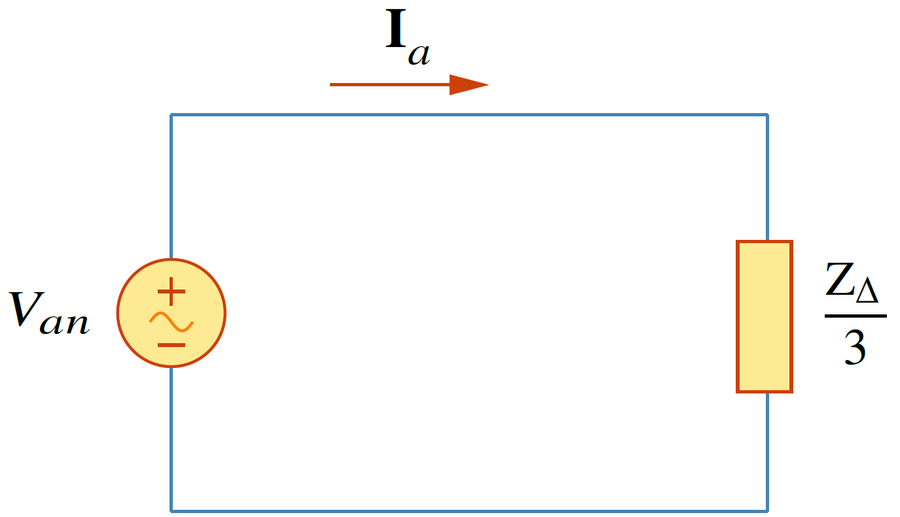

การต่อ $Y-\Delta$ เป็นระบบที่แหล่งจ่ายต่อ $Y$ และโหลดต่อเป็น $\Delta$ ดังรูปที่ 8.9 กำหนดให้ระบบเป็นลำดับบวก ดังนั้น
\begin{align}
    \mathbf{V}\_{an}&=\mathbf{V}_p\angle{0^{\circ}}\notag\\\\
    \mathbf{V}\_{bn}&=\mathbf{V}_p\angle{-120^{\circ}}\tag{8.21}\\\\
    \mathbf{V}\_{cn}&=\mathbf{V}_p\angle{+120^{\circ}}\notag
\end{align}

<figure>

  

  <figcaption style='text-align:center'>รูปที่ 8.9 วงจร Y-$\Delta$</figcaption>
</figure>

จากความสัมพันธ์
\begin{align*}
    V_{line}&=\sqrt{3}V_{phase}\\\\
    \angle{V_{line}}&=\angle{V_{phase}+30^{\circ}}
\end{align*}
แรงดันไลน์คือ
\begin{align}
       \mathbf{V}\_{ab}&=\sqrt{3}\mathbf{V}_p\angle{30^{\circ}}&=\mathbf{V}\_{AB}\notag\\\\
       \mathbf{V}\_{bc}&=\sqrt{3}\mathbf{V}_p\angle{-90^{\circ}}&=\mathbf{V}\_{BC}\tag{8.22}\\\\
       \mathbf{V}\_{ca}&=\sqrt{3}\mathbf{V}_p\angle{-150^{\circ}}&=\mathbf{V}\_{CA}\notag
\end{align}
ซึ่งแสดงให้เห็นว่าแรงดันไลน์เท่ากับแรงดันที่ตกคร่อมอิมพีแดนซ์โหลด (ตัวอักษรห้อยตัวเล็กหมายถึงฝั่งแหล่งจ่าย และตัวอักษรห้อยตัวใหญ่หมายถึงฝั่งโหลด) 

ดังนั้นสามารถหากระแสเฟสดังนี้
\begin{align}
    \mathbf{I}\_{AB}=\dfrac{\mathbf{V}\_{AB}}{\mathbf{Z}\_{\Delta}}\quad \mathbf{I}\_{BC}=\dfrac{\mathbf{V}\_{BC}}{\mathbf{Z}\_{\Delta}}\quad \mathbf{I}\_{CA}=\dfrac{\mathbf{V}\_{CA}}{\mathbf{Z}\_{\Delta}} \tag{8.23}
\end{align}
กระแสเฟสทุกตัวมีขนาดเท่ากันแต่ต่างเฟส $120^{\circ}$ ในเฟสที่ติดกัน

อีกวิธีในการหากระแสคือการใช้ KVL รอบ aABbna ซึ่งได้
\begin{align*}
-\mathbf{V}\_{an}+\mathbf{Z}_d\mathbf{I}\_{AB}+\mathbf{V}\_{bn}=0\nonumber
\end{align*}

หรือ

\begin{equation}
  \mathbf{I}\_{AB}= \dfrac{\mathbf{V}\_{an}-\mathbf{V}\_{bn}}{\mathbf{Z}\_{\Delta}}=\dfrac{\mathbf{V}\_{ab}}{\mathbf{Z}\_{\Delta}}=\dfrac{\mathbf{V}\_{AB}}{\mathbf{Z}\_{\Delta}} \tag{8.24}
\end{equation}

กระแสไลน์หาจากกระแสเฟสโดยใช้กฏ KCL ที่โหนด A,B, และ C
\begin{align}
    \mathbf{I}_a&=\mathbf{I}\_{AB}-\mathbf{I}\_{CA}\notag\\\\ \mathbf{I}_b&=\mathbf{I}\_{BC}-\mathbf{I}\_{AB}\tag{8.25}\\\\\ \mathbf{I}_c&=\mathbf{I}\_{CA}-\mathbf{I}\_{BC} \notag
\end{align}
เนื่องจาก $\mathbf{I}\_{CA}=\mathbf{I}\_{AB}\angle{-240^{\circ}}$
\begin{align}
    \mathbf{I}_a=\mathbf{I}\_{AB}-\mathbf{I}\_{CA}&=\mathbf{I}\_{AB}(1-1\angle{-240^{\circ}})\nonumber\\\\
    &=\mathbf{I}\_{AB}(1+0.5-j0.866)=\mathbf{I}\_{AB}\sqrt{3}\angle{-30^{\circ}} \tag{8.26}
\end{align}
ซึ่งแสดงให้เห็นว่าขนาดของกระแสไลน์ $I_L$ เป็น $\sqrt{3}$ เท่าของขนาดกระแสเฟส $I_p$
\begin{align}
    I_L=\sqrt{3}I_p \tag{8.27}
\end{align}
โดยที่
\begin{align}
    I_L=|\mathbf{I}_a|=|\mathbf{I}_b|=|\mathbf{I}_c| \tag{8.28}
\end{align}
และ
\begin{align}
    I_p=|\mathbf{I}\_{AB}|=|\mathbf{I}\_{BC}|=|\mathbf{I}\_{CA}| \tag{8.29}
\end{align}
และกระแสไลน์ตามกระแสเฟสอยู่ $30^{\circ}$ (สำหรับลำดับบวก) รูปที่ 8.10  เป็นการแสดงเฟสเซอร์ความสัมพันธ์ระหว่างกระแสไลน์และกระแสเฟส

<figure>

  

  <figcaption style='text-align:center'>รูปที่ 8.10 ความสัมพันธ์เฟสเซอร์ระหว่างกระแสและกระแสเฟส</figcaption>
</figure>

อีกวิธีในการวิเคราะห์วงจร $Y-\Delta$ คือใช้การแปลง $\Delta$ เป็น Y ดังนี้
\begin{align}
    \mathbf{Z}\_\{Y}=\dfrac{\mathbf{Z}_\{\Delta}}{3} \tag{8.30}
\end{align}
จากนั้นก็วิเคราะห์วงจร $Y-Y$ ดังรูปที่ 8.11

<figure>

  

  <figcaption style='text-align:center'>รูปที่ 8.11 วงจรเฟสเดียวที่มาจากการแปลง $Y$ เป็น $\Delta$</figcaption>
</figure>


แหล่งจ่ายในลำดับบวกที่ต่อเป็น Y ที่มีแรงดัน $\mathbf{V}\_\{an}=100\angle{10^{\circ}}$\V ต่อกับโหลดที่ต่อแบบ $\Delta$ โดยมีอิมพีแดนซ์ต่อเฟสเป็น $8+j4\\;\Omega$ จงหากระแสไลน์และกระแสเฟส

คำตอบ

สามารถหาคำตอบได้ 2 วิธี 

วิธีที่ 1  อิมพีแดนซ์โหลดคือ $\mathbf{Z}_\{\Delta}=8+j4\\;\Omega =8.944\angle{26.57^{\circ}}\\;\Omega$

โจทย์ให้แรงดันเฟส $\mathbf{V}\_\{an}=100\angle{10^{\circ}}$ ดังแรงดันไลน์คือ

\begin{align*}
    \mathbf{V}\_\{ab}=\mathbf{V}\_\{an}\sqrt{3}\angle{30^{\circ}}=100\sqrt{3}\angle{10^{\circ}+30^{\circ}}=\mathbf{V}\_\{AB}
\end{align*}

หรือ

\begin{align*}
    \mathbf{V}\_\{AB}=173.2\angle{40^{\circ}}\\;\mathrm{V}
\end{align*}
กระแสเฟสคือ
\begin{align*}
    \mathbf{I}\_\{AB}&=\dfrac{\mathbf{V}\_\{AB}}{\mathbf{Z}\_\{\Delta}}=\dfrac{173.2\angle{40^{\circ}}}{8.9444\angle{26.57^{\circ}}}=19.36\angle{13.43^{\circ}}\\;\mathrm{A}\\\\
    \mathbf{I}\_\{BC}&=\mathbf{I}\_\{AB}\angle{-120^{\circ}}=19.36\angle{-106.57^{\circ}}\\;\mathrm{A}\\\\
    \mathbf{I}\_\{CA}&=\mathbf{I}\_\{AB}\angle{+120^{\circ}}=19.36\angle{133.43^{\circ}}\\;\mathrm{A}
\end{align*}
กระแสไลน์คือ
\begin{align*}
    \mathbf{I}\_\{a}&=\mathbf{I}_\{AB}\sqrt{3}\angle{-30^{\circ}}=\sqrt{3}(19.36)\angle{13.43^{\circ}-30^{\circ}}=33.53\angle{-16.57^{\circ}}\\;\mathrm{A}\\\\
    \mathbf{I}\_\{b}&=\mathbf{I}\_\{a}\angle{-120^{\circ}}=33.53\angle{-136.57^{\circ}}\\;\mathrm{A}\\\\
    \mathbf{I}\_\{c}&=\mathbf{I}\_\{a}\angle{+120^{\circ}}=33.53\angle{103.43^{\circ}}\\;\mathrm{A}
\end{align*}

วิธีที่ 2 ใช้การวิเคราะห์หนึ่งเฟส
\begin{align*}
    \mathbf{I}\_\{a}=\dfrac{\mathbf{V}\_\{an}}{\mathbf{Z}_\{\Delta}/3}=\dfrac{100\angle{10^{\circ}}}{2.981\angle{26.57^{\circ}}}=33.54\angle{-16.57^{\circ}}\\;\mathrm{A}
\end{align*}
ได้ค่าเท่ากัน ส่วนกระแสไลน์หาจากลำดับบวก abc


