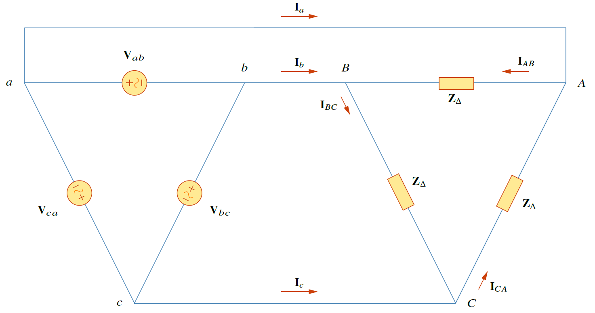

## การต่อ $\Delta$-$\Delta$

ระบบ $\Delta-\Delta$ คือระบบที่ทั้งแหล่งจ่ายและโหลดต่อเป็น $\Delta$

<figure>

  

  <figcaption style='text-align:center'>รูปที่ 8.12 วงจรสามเฟสที่ต่อแบบ $\Delta$-$\Delta$</figcaption>
</figure>

กำหนดเป็นลำดับบวก แรงดันสำหรับโหลดที่ต่อแบบ $\Delta$ คือ
    \begin{align}
       \mathbf{V}\_\{ab}&=V_p\angle{0^{\circ}}\notag\\\\
       \mathbf{V}\_\{bc}&=V_p\angle{-120^{\circ}}\tag{8.31}\\\\
       \mathbf{V}\_\{ca}&=V_p\angle{+120^{\circ}}\notag
    \end{align}
แรงดันไลน์เท่ากับแรงดันเฟส จากรูปที่ 8.12 สมมติให้ไม่มีอิมพีแดนซ์ไลน์ ดังนั้นแรงดันเฟสของแหล่งจ่ายเท่ากับแรงดันเฟสของโหลด ดังนั้น
\begin{align}
    \mathbf{V}\_\{ab}=\mathbf{V}\_\{AB}\qquad \mathbf{V}\_\{bc}=\mathbf{V}\_\{BC}\qquad \mathbf{V}\_\{ca}=\mathbf{V}\_\{CA} \tag{8.32}
\end{align}
ดังนั้นกระแสเฟสเท่ากับ
\begin{align}
       \mathbf{I}\_\{AB}&=\dfrac{\mathbf{V}\_\{AB}}{\mathbf{Z}\_\{\Delta}}=\dfrac{\mathbf{V}\_\{ab}}{\mathbf{Z}\_\{\Delta}}\notag\\\\
       \mathbf{I}\_\{BC}&=\dfrac{\mathbf{V}\_\{BC}}{\mathbf{Z}\_\{\Delta}}=\dfrac{\mathbf{V}\_\{bc}}{\mathbf{Z}\_\{\Delta}}\\tag{8.33}\\\
       \mathbf{I}\_\{CA}&=\dfrac{\mathbf{V}\_\{CA}}{\mathbf{Z}\_\{\Delta}}=\dfrac{\mathbf{V}\_\{ca}}{\mathbf{Z}\_\{\Delta}}\notag
\end{align}
เนื่องจากโหลดต่อแบบ $\Delta$ สามารถนำผลจากหัวข้อที่แล้วมาใช้ ดังนั้นกระแสไลน์คือ
\begin{align}
    \mathbf{I}\_\{a}=\mathbf{I}\_\{AB}-\mathbf{I}\_\{CA} \qquad \mathbf{I}\_\{b}=\mathbf{I}\_\{BC}-\mathbf{I}\_\{AB} \qquad \mathbf{I}\_\{c}=\mathbf{I}\_\{CA}-\mathbf{I}\_\{BC} \tag{8.34}
\end{align}
และกระแสไลน์ตามกระแสเฟสเป็นมุม $30^{\circ}$ และขนาดของกระแสไลน์เป็น $\sqrt{3}$ เท่าของขนาดกระแสเฟส 
\begin{align}
    I_L=\sqrt{3}I_p \tag{8.35}
\end{align}
อีกวิธีในการวิเคราะห์คือแปลงทั้งแหล่งจ่ายและโหลดเป็น Y แล้ววิเคราะห์ระบบ Y-Y ซึ่งตามที่ทราบค่าอิมพีแดนซ์ $\mathbf{Z}\_\{Y}=\mathbf{Z}\_\{\Delta}/3$

## ตัวอย่าง 8.4


อิมพีแดนซ์โหลดต่อแบบ $\Delta$ มีค่า $20-j15\\;\Omega$ ต่อเฟส ต่อกับแหล่งจ่ายแรงดันที่ต่อแบบ $\Delta$ โดยมีแรงดัน $\mathbf{V}\_\{ab}=330\angle{0^{\circ}}\\;\mathrm{V}$ และลำดับเป็นบวก จงหากระแสเฟสของโหลดและกระแสไลน์

คำตอบ

อิมพีแดนซืโหลดต่อเฟสคือ

\begin{equation*}
    \mathbf{Z}\_{\Delta}=20-j15=25\angle{-36.87^{\circ}}\\;\Omega
\end{equation*}

เนื่องจาก $\mathbf{V}\_\{AB}=\mathbf{V}\_\{ab}$ กระแสเฟสคือ   
\begin{align*}
    \mathbf{I}\_{AB}&=\dfrac{\mathbf{V}\_\{AB}}{\mathbf{Z}\_\{\Delta}}=\dfrac{330\angle{0^{\circ}}}{25\angle{-36.87^{\circ}}}=13.2\angle{36.87^{\circ}}\\;\mathrm{A}\\\\
    \mathbf{I}\_{BC}&=\mathbf{I}\_{AB}\angle{-120^{\circ}}=13.2\angle{-83.13^{\circ}}\\;\mathrm{A}\\\\
    \mathbf{I}\_{CA}&=\mathbf{I}\_{AB}\angle{+120^{\circ}}=13.2\angle{156.87^{\circ}}\\;\mathrm{A}
\end{align*}
สำหรับโหลดที่ต่อแบบ $\Delta$ กระแสไลน์มีมุมเฟสตามกระแสเฟสอยู่ $30^{\circ}$ และมีขนาดเป็น $\sqrt{3}$ เท่าของขนาดของกระแสเฟส ดังนั้นกระแสไลน์คือ
\begin{align*}
    \mathbf{I}\_{a}&=\mathbf{I}\_{AB}\sqrt{3}\angle{-30^{\circ}}=(13.2\angle{36.87^{\circ})(\sqrt{3}\angle{-30^{\circ}})}=22.86\angle{6.87^{\circ}}\\;\mathrm{A}\\\\
    \mathbf{I}\_{b}&=\mathbf{I}\_{a}\angle{-120^{\circ}}=22.86\angle{-113.13^{\circ}}\\;\mathrm{A}\\\\
    \mathbf{I}\_{c}&=\mathbf{I}\_{a}\angle{+120^{\circ}}=22.86\angle{126.87^{\circ}}\\;\mathrm{A}
\end{align*}

