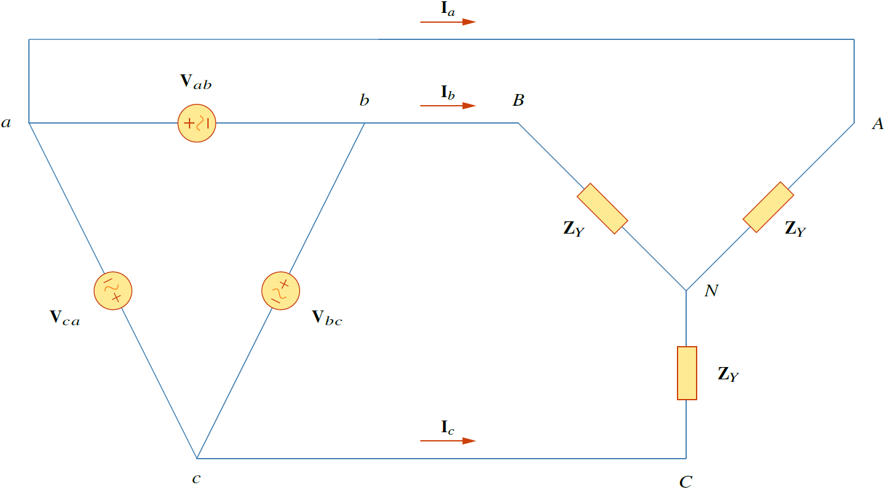

## การต่อ $\Delta$-Y
ระบบ $\Delta-Y$ คือระบบที่แหล่งจ่ายต่อเป็น $\Delta$ และโหลดต่อเป็น Y

<figure>

  

  <figcaption style='text-align:center'>รูปที่ 8.13 วงจรสามเฟสที่ต่อแบบ $\Delta$-$Y$</figcaption>
</figure>

จากรูปที่ 8.13 กำหนดให้เป็นลำด้บบวก แรงดันเฟสของแหล่งจ่ายที่ต่อแบบ $\Delta$ คือ
\begin{align}
       \mathbf{V}\_{ab}&=V_p\angle{0^{\circ}}\notag\\\\
       \mathbf{V}\_{bc}&=V_p\angle{-120^{\circ}}\tag{8.36}\\\\
       \mathbf{V}\_{ca}&=V_p\angle{+120^{\circ}}\notag
   \end{align}
ซี่งเป็นแรงดันเฟสเท่ากับแรงดันไลน์  ในการหากระแสไลน์ให้เขียน KVL สำหรับลูป aANBba
\begin{align}
    -\mathbf{V}\_{ab}+\mathbf{Z}\_{Y}\mathbf{I}\_{a}-\mathbf{Z}\_{Y}\mathbf{I}\_{b}=0\tag{8.37}
\end{align}

หรือ

\begin{align}
    \mathbf{Z}\_{Y}(\mathbf{I}\_{a}-\mathbf{I}\_{b})=\mathbf{V}\_{ab}=V_p\angle{0^{\circ}} \tag{8.38}
\end{align}

ดังนั้น

\begin{align}
\mathbf{I}\_{a}-\mathbf{I}\_{b}=\dfrac{V_p\angle{0^{\circ}}}{\mathbf{Z}\_{Y}} \label{eq8:ia-ib}\tag{8.39}
\end{align}
แต่ $\mathbf{I}\_{b}$ ตาม $\mathbf{I}\_{a}$ อยู่ $120^{\circ}$ และเนื่องจากเป็นลำดับบวกดังนั้น $\mathbf{I}\_{b}=\mathbf{I}\_{a}\angle{-120^{\circ}}$ ดังนั้น
\begin{align}
    \mathbf{I}\_{a}-\mathbf{I}\_{b}&=\mathbf{I}\_{a}(1-1\angle{-120^{\circ})}\nonumber\\\\
    &=\mathbf{I}\_{a}(1+\dfrac{1}{2}+j\dfrac{\sqrt{3}}{2})=\mathbf{I}\_{a}\sqrt{3}\angle{30^{\circ}} \label{eq8:ia}\tag{8.40}
\end{align}
แทนค่า \eqref{eq8:ia} ใน \eqref{eq8:ia-ib}
\begin{align}
    \mathbf{I}\_{a}=\dfrac{V_p/\sqrt{3}\angle{-30^{\circ}}}{\mathbf{Z}\_{Y}}\tag{8.41}
\end{align}
ส่วนค่า $\mathbf{I}\_{b}$ และ $\mathbf{I}\_{c}$ หาจากลำดับบวก ซึ่งก็คือ
\begin{align}
    \mathbf{I}\_{b}=\mathbf{I}\_{a}\angle{-120^{\circ}}\qquad\mathbf{I}\_{c}=\mathbf{I}\_{a}\angle{+120^{\circ}}\tag{8.42}
\end{align}

## ตัวอย่าง 8.5

อิมพีแดนซ์โหลดที่ต่อแบบ Y มีค่า $40+j25\\;\Omega$ ต่อเฟส ต่อกับแหล่งจ่ายแรงดันลำดับบวกที่ต่อแบบ $\Delta$ โดยแหล่งจ่ายมีแรงดันไลน์เท่ากับ $210\\;\mathrm{V}$  จงหากระแสเฟส กำหนดให้ใช้ $\mathbf{V}\_{ab}$ เป็นแรงดันอ้างอิง

คำตอบ

อิมพีแดนซ์โหลดคือ
\begin{align*}
    \mathbf{Z}\_{Y}=40+j25=47.17\angle{32^{\circ}}\\;\Omega
\end{align*}
และแรงดันของแหล่งจ่ายคือ
\begin{align*}
    \mathbf{V}\_{ab}=210\angle{0^{\circ}}\\;\mathrm{V}
\end{align*}
เมื่อแหล่งจ่ายแปลงจาก $\Delta$ เป็น $Y$ แรงดันคือ
\begin{align*}
    \mathbf{V}\_{an}=\dfrac{\mathbf{V}\_{ab}}{\sqrt{3}}\angle{-30^{\circ}}=121.2\angle{-30^{\circ}}\\;\mathrm{V}
\end{align*}
กระแสไลน์คือ
\begin{align*}
    \mathbf{I}\_{a}&=\dfrac{\mathbf{V}\_{an}}{\mathbf{Z}\_{Y}}=\dfrac{121.2\angle{-30^{\circ}}}{47.12\angle{32^{\circ}}}=2.57\angle{-62^{\circ}}\\;\mathrm{A}\\\\
    \mathbf{I}\_{b}&=\mathbf{I}\_{a}\angle{-120^{\circ}}=2.57\angle{-178^{\circ}}\\;\mathrm{A}\\\\
    \mathbf{I}\_{c}&=\mathbf{I}\_{a}\angle{+120^{\circ}}=2.57\angle{58^{\circ}}\\;\mathrm{A}
\end{align*}


